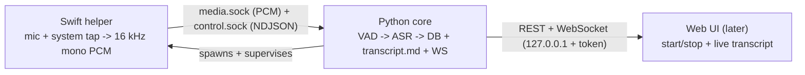

# hearsay

Local-first macOS meeting-note transcriber. Captures your microphone and the system
audio output as **separate** streams ("Me" vs "Them"), transcribes in real time,
identifies the remote speakers, and streams notes to Markdown. Transcription,
diarization, and the LLM run **locally by default**; AWS Bedrock is configurable.

## Architecture

A hybrid, three-process app (Apple Silicon, macOS 14.4+):

- **Swift helper** (`helper/`) — the only process touching guarded native APIs: a Core
  Audio process tap (system audio) + `AVAudioEngine` (mic), resampled to 16 kHz mono and
  stamped with one monotonic clock. Later phases add calendar + on-screen OCR name hints.
- **Python core** (`src/hearsay/`) — VAD, ASR, the transcript pipeline, persistence,
  Markdown output, and a loopback FastAPI + WebSocket API. Spawns and supervises the helper.
- **Web UI in a native window** — a typed React frontend served by the core (not yet built).

The helper and core talk over two Unix sockets; the binary/NDJSON contract is in
[`shared/protocol/ipc.md`](shared/protocol/ipc.md), pinned by golden fixtures that both
languages validate in CI.



## Status

**Phase 1 backend MVP is complete and validated on-device.** Capture (Me/Them
separation), Silero VAD segmentation, whisper.cpp transcription, SQLite persistence,
live `transcript.md`, and the loopback REST + WebSocket API all work end to end on a
real call. The React UI is the remaining Phase 1 piece. See [`docs/TODO.md`](docs/TODO.md)
for the phase-by-phase tracker.

## Quickstart

Prereqs: [`uv`](https://docs.astral.sh/uv/) and Swift (Command Line Tools is enough).

```sh
make sync                            # create the venv + base deps (Python 3.14)
uv sync --extra asr                  # transcription stack (whisper.cpp + onnxruntime VAD; torch-free)
swift build --package-path helper    # build the capture helper
uv run hearsay fetch-models          # download the Silero VAD model (~2 MB)
```

Run the real pipeline and watch live transcripts (the on-device validation path):

```sh
uv run hearsay live --model base --seconds 60   # join a call first; talk + play remote audio
```

Or run the API server (the UI consumes this):

```sh
uv run hearsay serve                 # prints the loopback URL + per-session token
```

## Documentation

| Doc | Contents |
|---|---|
| [docs/architecture.md](docs/architecture.md) | The three-process design and a module-by-module tour of the Python core — what each piece does and why. |
| [docs/pipeline.md](docs/pipeline.md) | The real-time transcription data flow: capture -> IPC -> VAD/segmenter -> ASR -> DB + `transcript.md` + WebSocket. |
| [docs/api.md](docs/api.md) | REST + WebSocket reference: auth model, endpoints, request/response examples. |
| [docs/development.md](docs/development.md) | Setup, `make` targets, running (`serve`/`live`), model management, testing, troubleshooting. |
| [shared/protocol/ipc.md](shared/protocol/ipc.md) | The helper <-> core IPC contract (source of truth). |
| [docs/TODO.md](docs/TODO.md) | Durable, resumable progress tracker. |

## Repo layout

```
src/hearsay/
  config/      typed settings (pydantic-settings); the single config source
  enums.py     StrEnums for DB + JSON serialization
  log.py       common structured (JSON) logger
  helper/      core-side IPC: frame codec, control/media channels, supervisor, capture-debug
  db/ models/  async SQLAlchemy engine/session + ORM models + Alembic migrations
  schemas/     Pydantic request/response models (the API boundary)
  services/    business logic (routers stay thin)
  transcript/  orchestration: MeetingSession, capture seam, the transcription pipeline, broadcaster
  vad/         VAD seam + streaming Segmenter + Silero (onnxruntime) backend
  asr/         ASRBackend seam + whisper.cpp / mlx backends + model manager
  export/      output Sink seam + local Markdown writer
  api/         FastAPI app, routers, WebSocket, loopback security, DI
  cli.py       the `hearsay` command (serve, live, fetch-models, capture-debug)
helper/        SwiftPM: hearsay-helper executable + HearsayIPC library
shared/        IPC contract (ipc.md) + golden frame fixtures
tests/         pytest suite (SAVEPOINT-isolated DB tests; guarded on-device tests)
```

## Conventions

uv for everything; `mypy --strict` + `ruff` clean; `StrEnum` for DB/JSON; thin routers +
a service layer; Pydantic schemas; permissive licenses only (MIT/BSD/Apache, gated in CI);
`pip-audit` clean. The `Makefile` is the task runner and `make ci` is the gate. Full
conventions are in [`CLAUDE.md`](CLAUDE.md).
