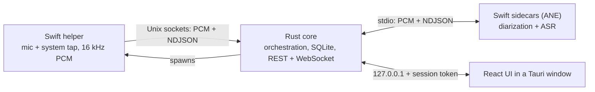

# hearsay

Local-first meeting-note transcriber for macOS (Apple Silicon, macOS 14.4+; Windows planned).
Hearsay captures your microphone and the system audio as separate streams ("Me" and "Them"),
transcribes both in real time, identifies the remote speakers, and writes Markdown notes.
Transcription, diarization, and the optional notes LLM all run on-device; audio never leaves the
machine. It ships as one Rust + Tauri app: a single installer, no interpreter to install.

The live path works end to end: capture, streaming captions with speaker labels, an offline
refine that improves diarization and recognizes returning speakers by voiceprint, full-text search,
transcript and notes editing, per-line speaker reassignment, nested meeting folders, and optional
local-LLM meeting notes.



The full picture (process topology, crate map, UML diagrams, data model, security model) is in
[docs/architecture.md](docs/architecture.md).

## Quickstart

Prerequisites: a Rust toolchain ([rustup](https://rustup.rs/)), Swift (Command Line Tools is
enough), and Node 22.

```sh
make swift-build                      # capture helper + FluidAudio/ANE sidecars
(cd web && npm ci && npm run build)   # React UI bundle, served by the core
make rust-serve                       # prints http://127.0.0.1:<port>/?token=...
```

Open the printed URL. `SYNTHETIC=1 make rust-serve` drives the whole pipeline with generated audio
(no permission prompts). See [docs/development.md](docs/development.md) for the dev-server flow,
model downloads, configuration, and troubleshooting.

## Packaging

`make dmg` builds an ad-hoc-signed `Hearsay.app` and `.dmg` with all models bundled; no Apple
Developer account required. Because the app is not notarized, recipients clear the quarantine flag
once after installing. Build steps, install instructions, data locations, and the uninstall flow
are in [docs/packaging.md](docs/packaging.md).

## Documentation

| Document | Contents |
|---|---|
| [docs/architecture.md](docs/architecture.md) | The whole product: processes, crates, trait seams, runtime behavior, data model, security, and the Windows roadmap. |
| [docs/pipeline.md](docs/pipeline.md) | The live transcription data flow, from audio frames to the finished transcript. |
| [docs/api.md](docs/api.md) | REST and WebSocket reference: auth model, endpoints, examples. |
| [docs/development.md](docs/development.md) | Build, run, test, configure, and troubleshoot from source. |
| [docs/packaging.md](docs/packaging.md) | Build and install the macOS bundle; uninstall and data erase. |
| [shared/protocol/ipc.md](shared/protocol/ipc.md) | The helper/core IPC contract (source of truth). |

## Repository layout

```
rust/crates/       nine Rust crates; hearsay-core is the app binary (see docs/architecture.md)
helper/            SwiftPM package: the capture helper + the FluidAudio sidecars
web/               React + TypeScript UI; web/src-tauri/ is the Tauri desktop shell
shared/            IPC contract + golden frame fixtures (generated from Rust)
docs/              project documentation
```

## Conventions

The `Makefile` is the task runner and `make ci` is the gate: clippy with warnings denied, rustfmt,
the Swift codec self-test, `cargo test`, codegen drift checks, and CVE/license audits. Full
conventions are in [CLAUDE.md](CLAUDE.md).

## License

Hearsay is source-available under the [PolyForm Noncommercial License 1.0.0](LICENSE): you may use,
modify, and share it for any noncommercial purpose. It is not an open-source license — commercial
use requires a separate license, and the author reserves all commercial rights. The bundled
machine-learning models and libraries keep their own licenses; see
[THIRD-PARTY-NOTICES.md](THIRD-PARTY-NOTICES.md).
