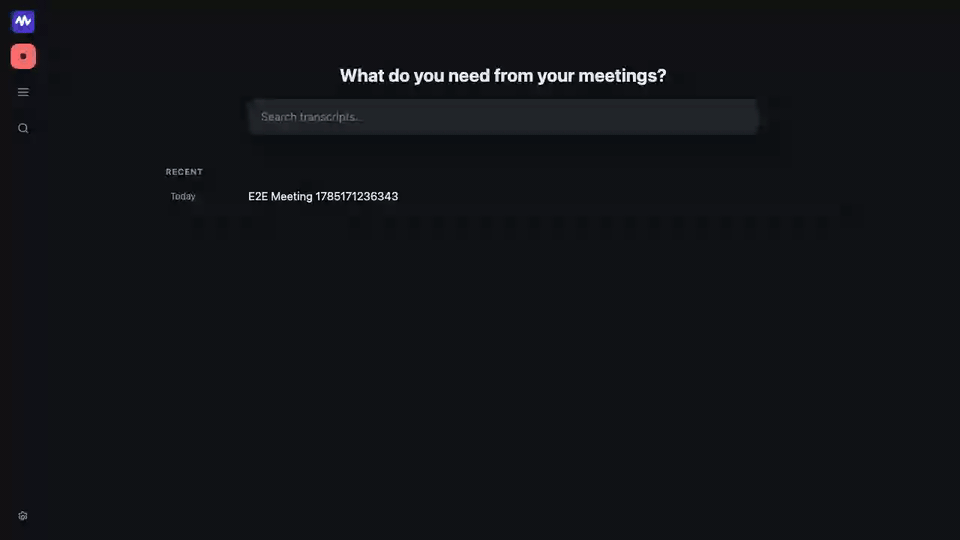
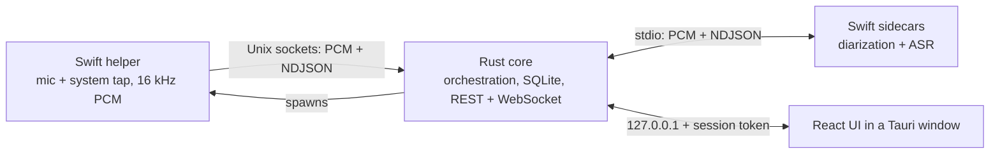

# Hearsay

A meeting transcriber that runs entirely on your own machine.

Hearsay records your microphone and your computer's audio output as two separate streams, transcribes
both as the meeting happens, works out who said what on the far end, and writes Markdown notes.
Transcription, speaker recognition, and the optional notes model all run on-device — no audio, and
no transcript, ever leaves the machine.

It ships as one application: a single installer, with no interpreter or runtime to install first.



## What it does

- **Separates you from everyone else.** Your mic is "Me"; the system audio is "Them". Because they
  are captured independently, the transcript never confuses the two.
- **Live captions with speaker labels**, streaming as people talk.
- **Names the other speakers**, and recognizes them again in later meetings once you have named them
  a first time.
- **Corrects easily** — rename a speaker, reassign a single misattributed line, merge two speakers
  the diarizer split apart, or re-run the whole pass with "Refine speakers".
- **Plays back in sync**, with the transcript highlighted and click-to-seek.
- **Searches every transcript** you have ever recorded, full text.
- **Writes meeting notes** with a local language model, if you want them. Off until you enable it.
- **Organizes** meetings into nested folders, with your own notes alongside the generated ones.

Runs on macOS (Apple Silicon, 14.4 or later) and Windows (x86_64, Windows 10 2004 or later).

## Install

There are no prebuilt downloads; you build the installer yourself.

```sh
make dmg    # macOS: an ad-hoc-signed Hearsay.app and .dmg (~50 MB; models download on first run)
```

No Apple Developer account is needed. Because the result is not notarized, recipients clear the
quarantine flag once after installing. Windows builds an NSIS installer via
`scripts\build-windows.ps1`, with its models bundled.

The macOS app downloads its speech models (about 2.6 GB) the first time it runs, and is fully
offline after that.

Full build, install, data-location, and uninstall steps: **[docs/packaging.md](docs/packaging.md)**.

## Run from source

Prerequisites: a Rust toolchain ([rustup](https://rustup.rs/)), Swift (Command Line Tools is
enough), and Node 20.19+.

```sh
make swift-build                      # capture helper + the audio-AI sidecars
(cd web && npm ci && npm run build)   # React UI bundle, served by the core
make rust-serve                       # prints http://127.0.0.1:<port>/?token=...
```

Open the printed URL. `SYNTHETIC=1 make rust-serve` drives the whole pipeline with generated audio,
so nothing prompts for permissions. Details, model downloads, and troubleshooting:
**[docs/development.md](docs/development.md)**.

## How it works



One lean Swift helper owns every permission-guarded audio API. The Rust core orchestrates
everything, stores it, and serves a loopback API to the UI. Each speech model runs in its own
sidecar process, so a model crash can never cost you the recording.

The full picture — process topology, crate map, data model, security model —
is in **[docs/architecture.md](docs/architecture.md)**.

## Documentation

**Using it**

| Document | Contents |
|---|---|
| [user-guide.md](docs/user-guide.md) | Recording, fixing speaker labels, search, notes, and every setting. |
| [packaging.md](docs/packaging.md) | Building the installer, installing, where your data lives, uninstalling. |

**Understanding it**

| Document | Contents |
|---|---|
| [architecture.md](docs/architecture.md) | Processes, crates, trait seams, runtime behavior, data model, security. |
| [design-decisions.md](docs/design-decisions.md) | Why each technology and model was chosen, and over what. |
| [pipeline.md](docs/pipeline.md) | The live transcription flow, from audio frames to a finished transcript. |
| [voiceprints.md](docs/voiceprints.md) | Cross-meeting speaker recognition, end to end. |
| [echo-cancellation.md](docs/echo-cancellation.md) | Cancelling the far end out of your microphone. |

**Building on it**

| Document | Contents |
|---|---|
| [development.md](docs/development.md) | Build, run, and troubleshoot from source. |
| [testing.md](docs/testing.md) | The test suite: every target, and what it covers. |

**Reference**

| Document | Contents |
|---|---|
| [api.md](docs/api.md) | Auth, conventions, meeting audio, and the live-transcript WebSocket. |
| [configuration.md](docs/configuration.md) | Every environment variable and runtime setting. |
| [ipc.md](shared/protocol/ipc.md) | The helper/core IPC contract. |

Every REST endpoint is documented in the OpenAPI document generated from the code itself: served at
`/openapi.json`, committed as `web/openapi.json`, and browsable at `/docs` when running
`make rust-serve`.

## Repository layout

```
rust/crates/       the Rust workspace; hearsay-core is the app binary
helper/            SwiftPM package: the capture helper + the audio-AI sidecars
web/               React + TypeScript UI; web/src-tauri/ is the Tauri desktop shell
shared/            IPC contract + golden frame fixtures (generated from Rust)
docs/              project documentation
```

## Conventions

The `Makefile` is the task runner and `make ci` is the pre-commit gate — run on demand, since there
is no hosted CI: clippy with warnings denied, rustfmt, the Swift codec self-test, `cargo test`, the
Tauri shell's lint and tests, codegen and app-version drift checks, dependency-advisory and license
audits, and the web gate. `make e2e` runs the browser suite separately. Full conventions are in
[CLAUDE.md](CLAUDE.md).

## License

Hearsay is source-available under the [Apache License 2.0 with the Commons Clause](LICENSE): you may
use, modify, and share it freely — including for your own work and inside a business — but you may
not Sell it. "Sell" means charging a third party for a product or service whose value derives
substantially from Hearsay (reselling it, hosting it as a paid service, or charging for support or
consulting built on it). It is not an open-source license; that use requires a separate commercial
license, and the author reserves those rights. The bundled machine-learning models and libraries
keep their own licenses; see [THIRD-PARTY-NOTICES.md](THIRD-PARTY-NOTICES.md).
