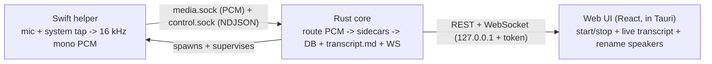

# hearsay

Local-first macOS meeting-note transcriber. Captures your microphone and the system
audio output as **separate** streams ("Me" vs "Them"), transcribes in real time,
identifies the remote speakers, and streams notes to Markdown. Transcription,
diarization, and the LLM run **locally by default**; AWS Bedrock is configurable.

Ships as **one Rust + Tauri app** — a signed installer per OS, no interpreter to install.

## Architecture

A multi-process, local-only app (Apple Silicon, macOS 14.4+; Windows planned):

- **Swift helper** (`helper/`) — the only process touching guarded native APIs: a Core
  Audio process tap (system audio) + `AVAudioEngine` (mic), resampled to 16 kHz mono and
  stamped with one monotonic clock. Later phases add calendar + on-screen OCR name hints.
- **Swift sidecars** (`helper/`, FluidAudio on the Apple Neural Engine) — live diarization +
  ASR (`hearsay-live`, `hearsay-me`) and the post-meeting refine (`hearsay-diarize`).
- **Rust core** (`rust/crates/`) — orchestration, speaker attribution, the whisper offline
  refine, optional local-LLM notes, persistence, Markdown output, and a loopback axum HTTP +
  WebSocket API. Spawns and supervises the helper + sidecars.
- **Web UI** (`web/`) — a typed React frontend (Vite + React 19 + TanStack Query) served by the
  core with the session token injected, shown in a Tauri WKWebView window.

The helper and core talk over two Unix sockets; the binary/NDJSON contract is in
[`shared/protocol/ipc.md`](shared/protocol/ipc.md), pinned by golden fixtures that both the Rust
codec and the Swift codec validate in CI.



## Status

**Phases 1-2 work end to end.** Capture (Me/Them separation) feeds the `hearsay-live` (Them:
streaming diarization + Parakeet ASR) and `hearsay-me` (Me: streaming VAD + Parakeet) sidecars on
the Apple Neural Engine → SQLite + live `transcript.md` + the loopback REST/WebSocket API + the
React UI. Remote speakers are labeled **Speaker 1..N** live and refined by a whole-track pass at
stop (`hearsay-diarize` + whisper), which also recognizes returning people by voiceprint; **rename
them to real people** in the UI — names persist and carry across meetings. Me is the mic channel
and is never diarized. Post-capture, the app also does **full-text search** across transcripts,
**transcript/notes editing**, **nested meeting folders** (drag-and-drop), and an optional
**local-LLM notes** step (summary + action items via llama.cpp, off by default).

## Quickstart

Prereqs: a Rust toolchain ([rustup](https://rustup.rs/)), Swift (Command Line Tools is enough),
and Node 22.

```sh
make swift-build                           # build the capture helper + the FluidAudio/ANE sidecars
(cd web && npm ci && npm run build)        # build the React UI bundle (web/dist), served by the core
make rust-serve                            # prints a loopback URL with the per-session ?token=
```

Open the printed `http://127.0.0.1:<port>/?token=...` link — the core serves the built UI with the
token injected. `SYNTHETIC=1 make rust-serve` drives the pipeline with generated audio (no
permission prompts). For frontend dev with hot reload: `cd web && npm run dev` (Vite proxies
`/api` + `/ws` to the core).

## Packaging (macOS .dmg)

Build an unsigned, ad-hoc-signed `Hearsay.app` + `.dmg` — no Apple Developer account, no
notarization required:

```sh
cargo install tauri-cli    # once
make dmg                    # -> web/src-tauri/target/release/bundle/dmg/Hearsay_<ver>_aarch64.dmg
```

Because the app isn't notarized, macOS quarantines it when it's moved to another Mac. After dragging
it to `/Applications`, clear the flag once (or use System Settings -> Privacy & Security -> Open Anyway):

```sh
xattr -dr com.apple.quarantine /Applications/Hearsay.app
```

To uninstall, open **Settings -> Data & Uninstall** to keep or erase your recordings and transcripts,
then drag `Hearsay.app` to the Trash. Full build/install/uninstall notes are in
[`docs/packaging.md`](docs/packaging.md).

## Documentation

| Doc | Contents |
|---|---|
| [docs/architecture-cross-platform.md](docs/architecture-cross-platform.md) | The one Rust + Tauri design, per-OS only at the edges, and the model strategy. |
| [docs/pipeline.md](docs/pipeline.md) | The real-time transcription data flow: capture -> IPC -> Swift sidecars (diarize + ASR on the ANE) -> DB + `transcript.md` + WebSocket. |
| [docs/api.md](docs/api.md) | REST + WebSocket reference: auth model, endpoints, request/response examples. |
| [docs/packaging.md](docs/packaging.md) | Build the unsigned macOS `.dmg` (no Apple account), install past Gatekeeper, and the in-app erase/uninstall flow. |
| [shared/protocol/ipc.md](shared/protocol/ipc.md) | The helper <-> core IPC contract (source of truth). |

## Repo layout

```
rust/crates/
  hearsay-core/         axum HTTP+WS API: config, routes/, schema (utoipa->TS), security, state; the app binary
  hearsay-db/           SQLite via SQLx: models, queries, forward-only migrations/
  hearsay-orchestrator/ capture routing + Transcriber/AudioSource seams + pipeline + markdown/recorder + notes seam
  hearsay-engine/       LiveEngine trait seam + DisabledEngine placeholder
  hearsay-backends/     per-OS backend wiring: MacBackend/MacRefiner + build_engine (rediarize/notes)
  hearsay-capture/      AudioSource trait + SwiftHelperSource (spawns hearsay-helper) + the TCC permissions probe
  hearsay-inference/    whisper offline ASR + the refine + optional local-LLM notes (llama-cpp-2)
  hearsay-attribution/  speaker clustering / voiceprint match / segment-speaker assignment (pure logic)
  hearsay-ipc/          binary frame codec + NDJSON control codec (IPC contract source of truth) + gen_fixtures
helper/                 SwiftPM: hearsay-{helper,live,me,diarize} executables + HearsayIPC + SidecarIO libraries
web/                    React UI (Vite + TS): typed fetch client, TanStack Query, OpenAPI-generated types
web/src-tauri/          the Tauri desktop shell (bundles + spawns the core + sidecars)
shared/                 IPC contract (ipc.md) + golden frame fixtures
```

## Conventions

Rust: `cargo clippy --all-targets -- -D warnings` + `cargo fmt --check` clean; thin routers over a
query/engine layer; utoipa OpenAPI -> generated TS types (drift-checked in CI). Permissive licenses
only (MIT/BSD/Apache, gated by `cargo deny`); `cargo audit` + `npm audit` clean. The `Makefile` is
the task runner and `make ci` is the gate. Full conventions are in [`CLAUDE.md`](CLAUDE.md).
