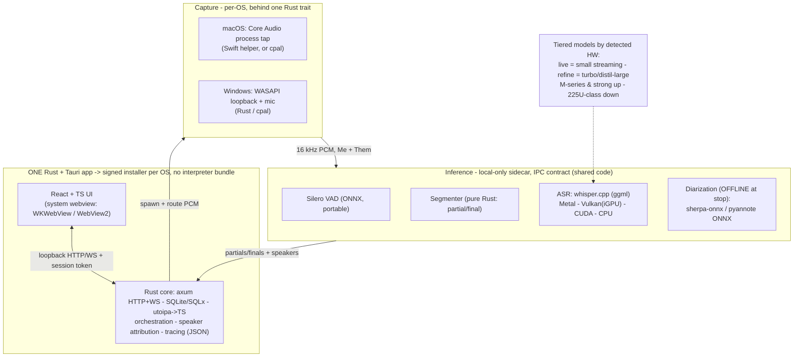

# Cross-platform architecture (macOS + Windows) — target

**Status:** the **macOS foundation is built and validated end-to-end** and lives on `main` (9 Rust
crates; `hearsay-core` runs the full live app on the Mac — capture + streaming captions + diarization
+ offline refine + optional local-LLM notes — confirmed in the frontend). The **Windows path is the
remaining work** (cpal capture + a pure-Rust streaming transcriber/diarizer). This document is the
agreed foundation for making Hearsay run on both macOS and Windows and ship as a single, signed,
one-click installer per OS to technical **and** non-technical users. It supersedes the macOS-only
assumptions in `CLAUDE.md` where they conflict. Canonical roadmap + progress: `docs/TODO.md`.

**Update (2026-07-14):** the Python backend has been removed — the Rust core is now the sole backend
and the source of truth for the OpenAPI + IPC-fixture codegen.

## Constraints this design is built to satisfy

- **Two OSes:** macOS (Apple Silicon, M-series 16GB+) and Windows.
- **Windows hardware floor:** a 16GB laptop with **integrated graphics** (reference SKU: Intel Core
  Ultra 5 225U — 12-core Meteor-Lake-refresh, ~12 TOPS NPU, 4-Xe-core Arc iGPU, 16GB shared). No
  discrete GPU assumed; NPU is a bonus, not a requirement.
- **Easy distribution:** signed, notarized, one-click installer + auto-update. No Python to install,
  no terminal, no cloud credentials.
- **Local-only inference:** audio never leaves the device. This is a privacy requirement (the "Them"
  stream is other people's voices/biometrics) and a distribution simplifier (single self-contained
  artifact, works offline).
- **Local-only triangle:** privacy + single distributable + cheap hardware — pick two. We take the
  first two and pay with a **published minimum spec**.

## The target: one Rust + Tauri app, per-OS only at the edges

## Layers: what is shared vs per-OS

| Layer | Tech | Shared or per-OS |
|---|---|---|
| Shell + distribution | Tauri v2: `.dmg`/`.app` + `.msi`/NSIS, system webview, signing, notarization, auto-updater | Shared (one config, two targets) |
| Frontend | React/TS, unchanged, talks HTTP/WS to the core | Shared (100%) |
| Core | Rust: axum + tower, SQLx + SQLite (WAL), utoipa (OpenAPI->TS), tracing, serde, `tokio::process` supervisor, `bytes` codec | Shared (100%) |
| Capture | Rust/cpal (WASAPI loopback on Win, Core Audio on Mac) behind a trait; Swift helper as the Mac fallback if cpal's loopback does not preserve Me/Them + the Teams workaround | Per-OS (thin, isolated) |
| Inference | whisper.cpp (ggml) + Silero VAD (ONNX) + sherpa-onnx/pyannote diarization + pure-Rust Segmenter; per-OS GPU backend (Metal/Vulkan/CUDA/CoreML) | Shared code, per-OS accel |

Roughly **90% of the codebase is shared.** Only the innermost capture calls and the ASR
acceleration backend differ per OS, and both sit behind a trait / the IPC contract.

## Why the ANE stops being load-bearing

The FluidAudio / Apple-Neural-Engine pivot existed to fix two things: **live diarization accuracy**
and **GPU (Metal) contention** between live whisper-large and live pyannote. The Windows floor forces
an architecture that designs both away:

- **Live = a light streaming model** (small, per stream), not whisper-large -> tiny live GPU load, no
  contention.
- **Diarization = offline at stop** (a burst over the recording), not live -> the hard live-diarization
  problem is deferred to where there is compute headroom, on both platforms.
- **Heavy ASR (turbo / distil-large) = the offline refine**, not competing with live.

Once live is light and diarization is offline, Metal contention on macOS is minor and the ANE's
efficiency edge is a nice-to-have, not essential. That is what makes **whisper.cpp a viable unified
engine on both OSes** — it is the proven pre-ANE stack (whisper.cpp + Silero VAD + Segmenter),
revived, now Metal on Mac and Vulkan on the Intel Arc iGPU from one codebase.

## Model strategy (tiered by hardware)

| Role | Model class | Real-time constraint |
|---|---|---|
| Live captions (both streams) | Light streaming (sherpa-onnx zipformer, or whisper-small INT8) | Must hold real-time, 2 streams |
| Offline refine (at stop) | whisper-large-v3-turbo / distil-large-v3 (INT8) | Burst, not real-time |
| Diarization | sherpa-onnx / pyannote-community-1 ONNX, offline | Burst, not real-time |
| VAD | Silero (ONNX) | Trivial |

Model **size** is selected by detected hardware tier (M-series and strong machines run larger refine
models; the 225U-class floor runs smaller) so the Mac is never sandbagged to match the Windows floor.

## Distribution

- One **signed installer per OS**, self-contained, **no CPython bundle** (Rust removes the hardest
  packaging step on both platforms).
- Tauri handles the bundler + Apple notarization + Windows Authenticode (Azure Trusted Signing) +
  cross-platform **auto-updater**.
- Models are bundled (~1-2GB installer, works offline immediately) or downloaded on first run.
- **Landmine:** Tauri `externalBin` sidecars currently break macOS notarization (open v2 bug). The
  whole app is sidecar-based, so validate a signed + notarized single-sidecar build early.
- **Published minimum spec** is the accepted cost of local-only.

## The one open decision (verification-gated)

**macOS inference: unify on whisper.cpp (preferred) vs keep FluidAudio/ANE as a Mac high-accuracy
tier.** Aim for unified (one stack, consistent output, simplest distribution); keep FluidAudio
slottable behind the same trait if verification shows the unified path regresses Mac accuracy or the
225U cannot clear the bar.

Verification path: Buzz (whisper.cpp + Vulkan) smoke test on the real 225U -> a cross-platform
`onnxruntime`/whisper.cpp benchmark harness (Intel Tiber AI Cloud provides free Core Ultra access) ->
WER / DER / RTFx / peak-memory / refine-wall-clock against the accuracy bar. Yes -> ship unified.
No -> FluidAudio stays the Mac tier and we carry two ASR backends (everything else still shared).

## Rust workspace layout

See `rust/` (`rust/README.md` for the crate map + status). **All 9 crates are implemented (gated by
`make ci`) and the macOS live path runs end-to-end** — validated in the frontend through
`hearsay-core`'s binary. The `LiveEngine` trait seam (with a `DisabledEngine` placeholder)
lives in the neutral `hearsay-engine` crate — `hearsay-core` consumes it for the capture-dependent routes
and `hearsay-orchestrator` implements it, without a dependency cycle. `hearsay-orchestrator` drives an
`AudioSource` + `Transcriber`s behind traits, tested with scripted fakes.

**macOS reuses the proven Swift stack** (the "FluidAudio as macOS tier" side of the fork below):
`hearsay-capture`'s `SwiftHelperSource` drives the Swift `hearsay-helper` over the `hearsay-ipc` sockets, and
the orchestrator's `ProcessTranscriber` spawns the built `hearsay-live`/`hearsay-me` FluidAudio sidecars
directly (identical stdio protocol) for live streaming + diarization; the offline refine reuses
`hearsay-diarize` + re-transcribes with `hearsay-inference` (whisper). **`hearsay-inference` = whisper offline
ASR (Mac-verified: jfk clip verbatim, ~50x RT CPU / ~25x RT Metal) + the refine.** The Windows path (cpal
capture + a pure-Rust streaming `Transcriber` + ONNX diarizer, no Swift) is the remaining work. Crate
dependencies are pinned to verified latest versions via `cargo add` as each crate is implemented.
