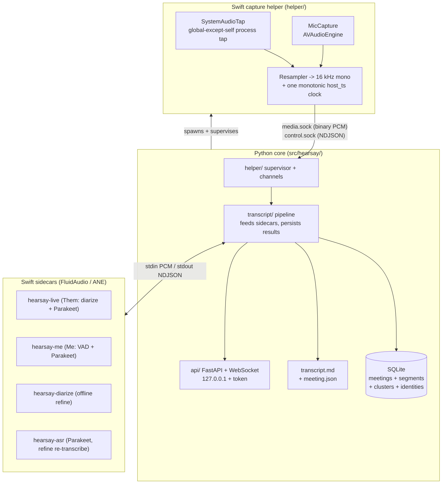

# Architecture

This document explains the implementation that exists today: the process boundaries, why the
system is split the way it is, and what each Python package does. The audio-AI (ASR +
diarization) has moved out of Python into Swift sidecars running FluidAudio on the Apple Neural
Engine; Python orchestrates capture, persistence, and the API but runs no ML models itself. For
the real-time data flow see [pipeline.md](pipeline.md); for the HTTP/WebSocket surface see
[api.md](api.md).

## Why this split

Three constraints shaped the design:

1. **Capturing mic and system audio as separate channels gives "Me vs Them" for free.**
   The only remaining hard problem is naming the *multiple* remote speakers inside the
   system-audio stream.
2. **Real-time audio capture cannot be done reliably from Python.** PyObjC cannot safely
   run Core Audio realtime callbacks. So a thin **Swift helper** owns native capture.
3. **On-device ASR + diarization belong on the Apple Neural Engine.** The earlier GPU path
   (whisper.cpp on Metal, pyannote on MPS) fought for the GPU and could wedge. FluidAudio runs
   both on the ANE, so the audio-AI lives in **Swift sidecars** the Python core feeds over
   stdio — leaving Python free of heavyweight ML dependencies.

The **core spawns and supervises the helper** (not the other way around), so capture
lifecycle and backpressure live in one place and survive helper restarts. The core likewise
spawns the sidecars as plain subprocesses and streams audio to them over pipes.

## Process boundary: the IPC contract

Two Unix-domain sockets in a per-session run directory carry capture, **owned (listened) by
the core** so they outlive helper restarts; the helper connects as a client.

- **`media.sock`** — binary framed PCM, helper -> core only. A fixed 28-byte little-endian
  header + payload. Both streams are multiplexed by a `stream` byte (0 = "me", 1 = "them").
  The load-bearing field is **`host_ts` (u64 ns, one monotonic clock)**: both streams are
  resampled to 16 kHz mono and stamped from the *same* clock at egress, so alignment is
  exact regardless of independent hardware clocks.
- **`control.sock`** — bidirectional NDJSON (one JSON object per line): core -> helper
  commands (with replies) and helper -> core events.

The frame layout and message schema are defined once in
[`shared/protocol/ipc.md`](../shared/protocol/ipc.md) and mirrored byte-for-byte by the
Swift `HearsayIPC.FrameCodec` and the Python `hearsay.helper.protocol`. Golden fixtures in
`shared/fixtures/frames.jsonl` pin the contract; both languages validate against them in
CI, so the two codecs cannot drift.

The **sidecars** use a simpler private contract, not the socket IPC: PCM on stdin, one JSON
object per emitted segment on stdout (`hearsay-asr` is request/response; `hearsay-diarize` is a
one-shot WAV-in / JSON-out). The Python owners live in `transcript/live_base.py`,
`asr/parakeet_backend.py`, and `diarization/offline.py`.

## The Python core, package by package

### `config/` — the single configuration source

`settings.py` is one `pydantic-settings` object loaded once and injected via DI. Every
tunable lives here: paths (`output_dir`, `models_dir`, `helper_path`), the database URL, the
server host/port, and nested `asr` / `diarization` groups. A model validator fills derived
paths (e.g. the default SQLite URL) so the rest of the code never computes them ad hoc. Reads
`HEARSAY_`-prefixed env vars (nested via `__`, e.g. `HEARSAY_ASR__BACKEND`,
`HEARSAY_DIARIZATION__REFINE`). Sidecar binaries are located relative to `helper_path`
(siblings in the same build dir).

### `enums.py`, `log.py` — shared primitives

`StrEnum`s used for DB columns and JSON (`Stream`, `MeetingStatus`, `SampleFormat`,
`ASRBackendKind`, ...). The binary IPC uses integer codes instead; that mapping is isolated
in `helper/protocol.py` so the wire format stays decoupled from these names. `log.py`
configures a stdlib JSON logger once and hands out named loggers via `get_logger`.

### `helper/` — the core side of the IPC

This is the client-of-the-contract, not the Swift helper. It turns the two raw sockets into
typed async streams:

- `protocol.py` — the `FrameCodec` mirror: encode/decode 28-byte media frames, plus
  `expected_payload_len()` (size the second read without decoding) and `audio_samples()`
  (int16/float32 payload -> float samples).
- `control.py` / `control_channel.py` — the NDJSON codec and an async read loop that
  correlates replies to in-flight commands by `id` (`call()`) and routes unsolicited events
  to a queue.
- `media_channel.py` — pumps frames into per-stream `asyncio.Queue`s of `AudioChunk`
  (samples + `host_ts`), counting `seq` gaps (dropped frames). A `None` item marks
  end-of-stream.
- `supervisor.py` — `HelperSupervisor` creates the run dir, listens on both sockets, spawns
  the helper, awaits its `hello`, and tears everything down cleanly.
- `capture_debug.py` — the truth-test harness behind `hearsay capture-debug`: drains both
  streams for N seconds and writes `me.wav` / `them.wav` with drift + skew diagnostics. This
  is how Me/Them separation was first proven on-device.

### `db/` + `models/` — persistence

Local-first **SQLite** via **async SQLAlchemy 2.0** (`sqlite+aiosqlite`), portable to
PostgreSQL by swapping the URL.

- `db/engine.py` — `create_engine()` sets SQLite pragmas on connect (`journal_mode=WAL`,
  `busy_timeout`, `foreign_keys=ON`) and explicit pool settings.
- `db/session.py` + `db/__init__.py` — the async sessionmaker and a small `Database` holder
  (engine + sessionmaker) that the app keeps in `app.state` and tests build against a temp file.
- `models/base.py` — the declarative `Base`: every table gets a UUID primary key and
  `created_at` / `updated_at`. `str_enum()` renders a `StrEnum` as a portable
  `VARCHAR` + `CHECK` storing the member *values*.
- `models/meeting.py`, `models/segment.py` — `Meeting` (title, folder, status, started/ended)
  and `Segment` (stream, speaker label, text, `start_s`/`end_s` meeting-relative seconds, nullable
  `cluster_id`), linked by a `meeting_id` FK with `ON DELETE CASCADE` and a `(meeting_id, start_s)`
  index.
- `models/cluster.py`, `models/identity.py` — `Cluster` (one diarized Them speaker per meeting:
  `ordinal` → "Speaker N", optional `identity_id`, a manual-lock flag, a `centroid` voiceprint
  BLOB, unique `(meeting_id, ordinal)`) and `Identity` (a cross-meeting person, unique
  `display_name`). Binding a cluster relabels its segments and the identity is suggested next time.
  The voiceprint centroid is written by the refine (from FluidAudio's per-speaker embedding) and
  matched against locked, named clusters from other meetings.
- `db/migrations/` — Alembic (async `env.py`, `render_as_batch` for SQLite; batch FK constraints
  are named). `alembic check` confirms the models match the latest revision.

### `schemas/` — the API boundary

Pydantic request/response models, kept separate from ORM models so the HTTP surface is
validated and decoupled from storage: `MeetingCreate`/`MeetingRead`, `SegmentRead` (carries the
resolved `speaker_label` + its `cluster_id`), the generic paginated `Page[T]`, the
`TranscriptEvent` (the WebSocket payload), the ASR status schema, and the speaker schemas
(`SpeakerRead`, `SpeakerRename`, `IdentityRead`).

### `services/` — business logic

`MeetingService` is the only place that reads/writes meetings + segments (routers call it and
stay thin): create, get, paginated list, add-segment, finalize, cascade delete, plus the
meeting-folder slug helper. Each method is a single logical write with one commit.
`SpeakerService` owns clusters + identities: create/list clusters (identity eager-loaded),
`bind_cluster` (rename → get-or-create the identity, lock it, and bulk-relabel that cluster's
segments), `known_voiceprints` (locked named centroids from other meetings, for cross-meeting
recognition), and `apply_turn_diarization` (the refine's atomic rebuild: drop the coarse Them
clusters + segments, create `Speaker 1..N`, write one segment per diarizer turn, carry manual
names forward, and store each speaker's centroid).

### `transcript/` — orchestration

The heart of a running meeting.

- `capture.py` — the `Capture` protocol (`start`/`stop`/`media`) and `HelperCapture`, which
  wraps `HelperSupervisor`: spawn the helper, send `start_capture`, expose the media channel,
  and tear down. The protocol is the seam that lets tests run the lifecycle without a helper.
- `pipeline.py` — `TranscriptionPipeline`: one consumer task per stream. It feeds each stream's
  PCM to its live sidecar (Them → `hearsay-live`, Me → `hearsay-me`) and, for a stream without a
  sidecar, falls back to the in-process VAD + ASR path. See [pipeline.md](pipeline.md).
- `live_base.py` — `LiveSidecarProcessor`: the shared plumbing for a streaming sidecar (spawn,
  feed PCM on stdin, read NDJSON on stdout, drain the finalized tail on close). Subclasses
  implement `_handle` to persist + broadcast one emitted segment.
- `live.py` — `LiveThemProcessor`: owns `hearsay-live`, maps each emitted turn's 0-based speaker
  to a `Speaker N` label + `Cluster` row, persists + broadcasts it.
- `live_me.py` — `LiveMeProcessor`: owns `hearsay-me`, persists + broadcasts each Me utterance
  (always labeled `Me`, never diarized).
- `recorder.py` — `ThemAudioRecorder`: streams the Them track to `<folder>/them.wav` (only when
  `diarization.refine` is on) plus an offset sidecar, so the post-meeting refine can map turns
  back onto meeting time.
- `refine.py` — `rediarize_meeting`: the offline re-diarization. Runs `FluidAudioDiarizer` over
  the whole `them.wav`, re-transcribes each turn with Parakeet, rebuilds the Them transcript one
  segment per turn, carries manual renames forward, and stores + matches voiceprints. Runs
  automatically at stop and on demand.
- `broadcast.py` — `Broadcaster`, an in-process pub/sub that fans JSON event strings to
  active WebSocket subscribers.
- `session.py` — `MeetingSession` (one meeting: capture + pipeline + broadcaster) and
  `SessionManager` (owns the single active session; lock-guarded start/stop/delete +
  `relabel_speaker`, and `_maybe_auto_refine` after a stop). The manager injects the
  capture/sink factories and builds both streams' live processors, so the lifecycle is testable
  without the helper.

### `asr/` — speech recognition (used by the refine)

Live ASR runs inside the `hearsay-live` / `hearsay-me` sidecars; this Python backend exists for
the **post-meeting refine**, which re-transcribes each diarizer turn.

- `base.py` — the `ASRBackend` protocol (`transcribe(samples) -> [ASRSegment]` + `close()`) and
  the `ASRSegment` type.
- `parakeet_backend.py` — `ParakeetBackend`, the only ASR backend: owns a persistent
  `hearsay-asr` subprocess (FluidAudio Parakeet TDT v3 on the ANE), round-tripping each
  utterance over stdio (`<uint32 LE n>` + float32 samples → `{"text": ...}`).
- `manager.py` — `build_asr()` constructs it; `available_models()` reports the single bundled
  Parakeet model (there is no picker — Parakeet ships one model).

### `diarization/` — offline diarization + voiceprints

All inference runs in the Swift `hearsay-diarize` helper on the ANE; Python parses its output.

- `offline.py` — the `OfflineDiarizer` protocol and `FluidAudioDiarizer`: shells out to
  `hearsay-diarize` (FluidAudio's pyannote community-1 CoreML model, ANE) with a temp WAV and
  parses its JSON into a `DiarizationResult` (`SpeakerTurn`s + a per-speaker voiceprint). Also
  the pure helpers `order_speakers` (label → "Speaker N" by first appearance) and
  `assign_segment_speaker` (max-overlap, offset-shifted). Torch-free and ungated — no HF token.
- `voiceprint.py` — pure-stdlib centroid (de)serialization (`centroid_to_bytes` /
  `centroid_from_bytes`) and `match_identity` (nearest named centroid by cosine, above a
  threshold), used by the refine for cross-meeting recognition.

### `export/` — output sink

- `base.py` — the `TranscriptSink` protocol (`open`/`append`/`finalize`) plus the
  `MeetingMeta` / `TranscriptLine` value types. This seam is where a future central /
  object-store sink attaches without touching the pipeline.
- `local_markdown.py` — the only implementation today: a corruption-safe writer that appends
  complete, newline-terminated blocks live and atomically rewrites the transcript in
  timestamp order at finalize.

### `api/` — the loopback HTTP/WebSocket surface

- `app.py` — `create_app()` assembles the `AppContext`, the loopback-hardening middleware,
  and the routers.
- `security.py` / `deps.py` — Host + Origin allowlist, bearer-token checks, and Annotated DI
  dependencies (session, manager, token).
- `meetings.py`, `asr.py`, `speakers.py`, `ws.py` — the meetings CRUD router (incl. the
  "Refine speakers" endpoint), the ASR status router, the speakers router (list speakers +
  rename → identity + list identities), and the live-transcript WebSocket.

### `cli.py` — the `hearsay` command

`serve` (run the API), `live` (run the real pipeline and print transcripts — the on-device
validation harness), `rediarize` (run the offline refine on a meeting), and `capture-debug`
(the raw-audio dump). There is no `fetch-models` step — the Swift sidecars auto-download their
CoreML models (Parakeet, the diarizer) on first use.

## Seams (build one, defer the rest)

Each protocol below has exactly one real implementation today plus injectable test doubles.
This is what keeps the app small while the plausible futures stay cheap.

| Seam | Protocol / owner | Today | Deferred / fallback |
|---|---|---|---|
| Capture | `transcript.capture.Capture` | `HelperCapture` (Swift helper) | test fakes |
| Live Them | `LiveSidecarProcessor` | `LiveThemProcessor` (`hearsay-live`) | test fakes |
| Live Me | `LiveSidecarProcessor` | `LiveMeProcessor` (`hearsay-me`) | test fakes |
| ASR (refine) | `asr.base.ASRBackend` | `ParakeetBackend` (`hearsay-asr`) | test fakes |
| Offline diarizer | `diarization.offline.OfflineDiarizer` | `FluidAudioDiarizer` (`hearsay-diarize`) | stub diarizer (tests) |
| Output | `export.base.TranscriptSink` | `LocalMarkdownSink` | central API / object store |

## The Swift helper + sidecars (summary)

The **capture helper** is intentionally thin and stateless. `SystemAudioTap` builds a Core
Audio process tap configured **global-except-self** (dodges the Teams per-process-silent bug
and covers browser meeting apps) plus a private aggregate device, with a zero-buffer watchdog
that rebuilds both on sustained silence. `MicCapture` taps `AVAudioEngine` and rebuilds on
configuration changes. Both feed `Resampler` (16 kHz mono) and are stamped by `Clock`
(monotonic `host_ts`). `Serve.swift` drains the per-stream ring buffers to `media.sock` and
handles control commands. Details and the watchdog rationale are in the plan and
[`shared/protocol/ipc.md`](../shared/protocol/ipc.md).

The **sidecars** (`hearsay-live`, `hearsay-me`, `hearsay-diarize`, `hearsay-asr`) are separate
SwiftPM products in the same `helper/` package. They depend on FluidAudio (kept off the lean
capture binary so its CoreML dependency never bloats capture) and run Parakeet ASR and pyannote
diarization on the Apple Neural Engine. `make swift-build` builds all of them; the Python core
locates each as a sibling of the capture helper in the build dir.
