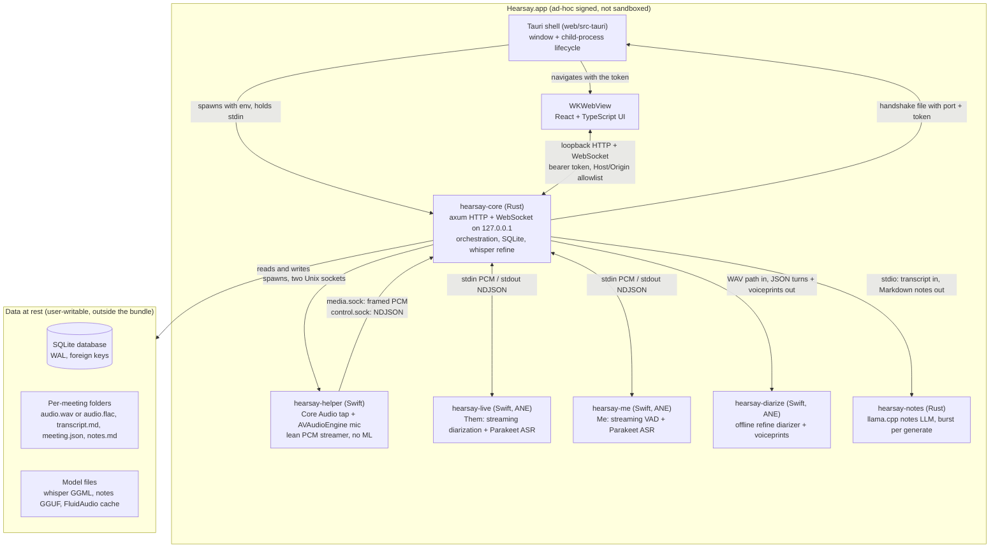
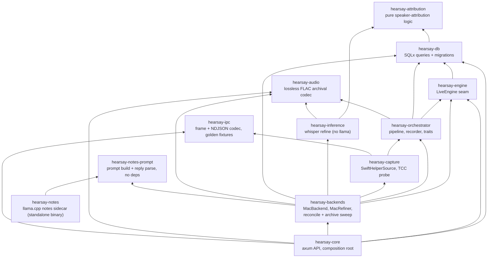
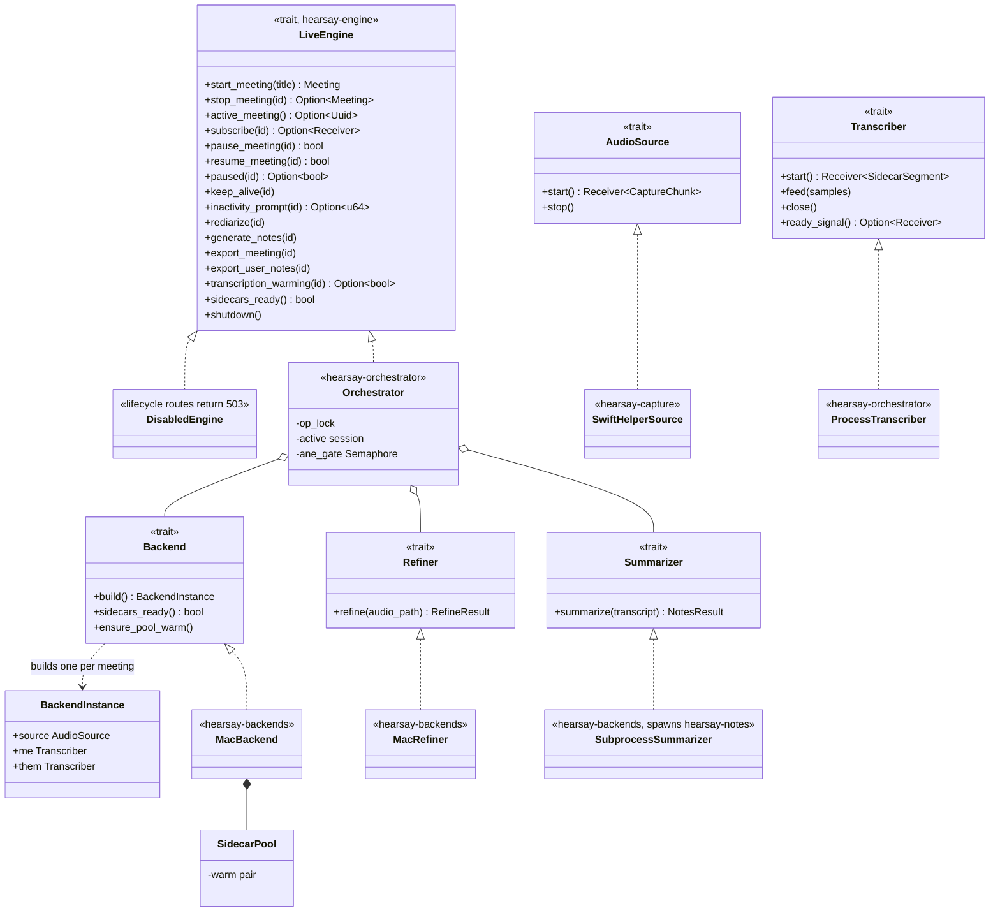
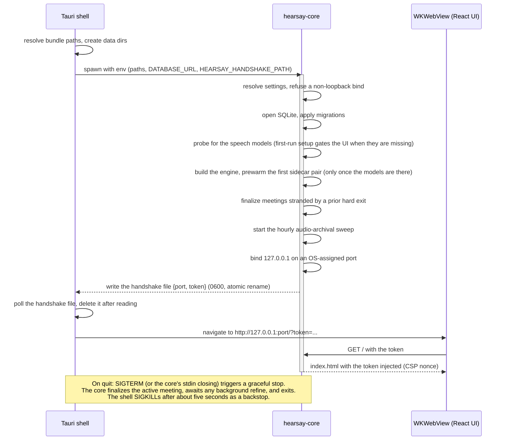
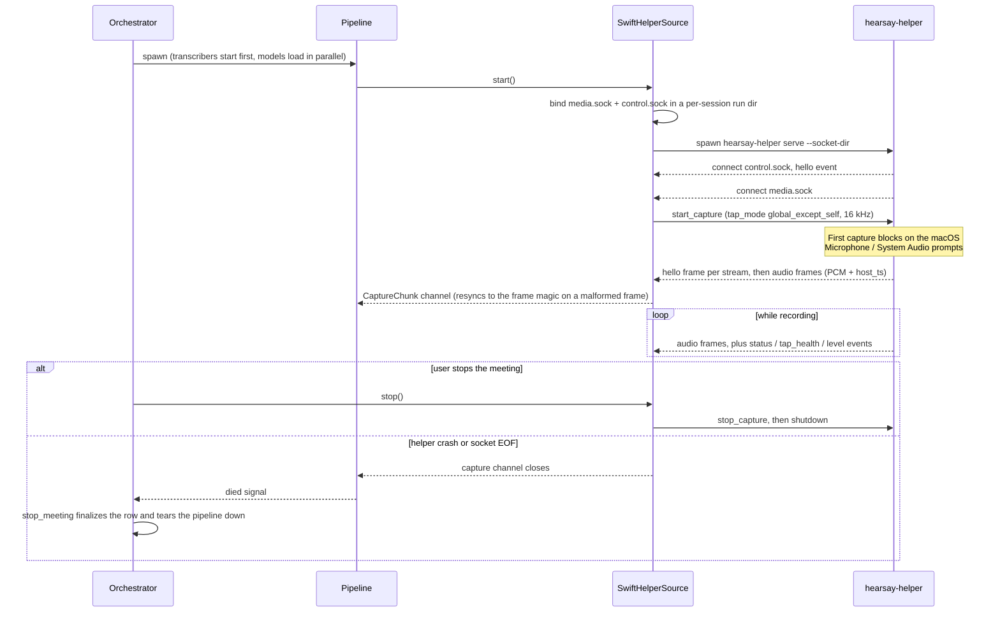
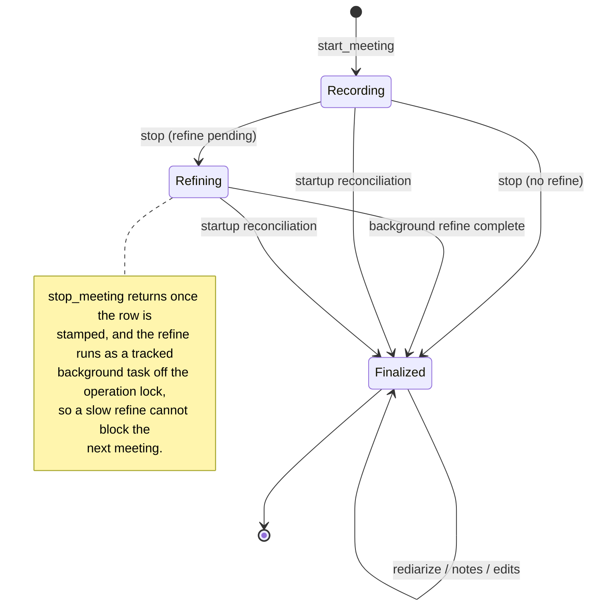
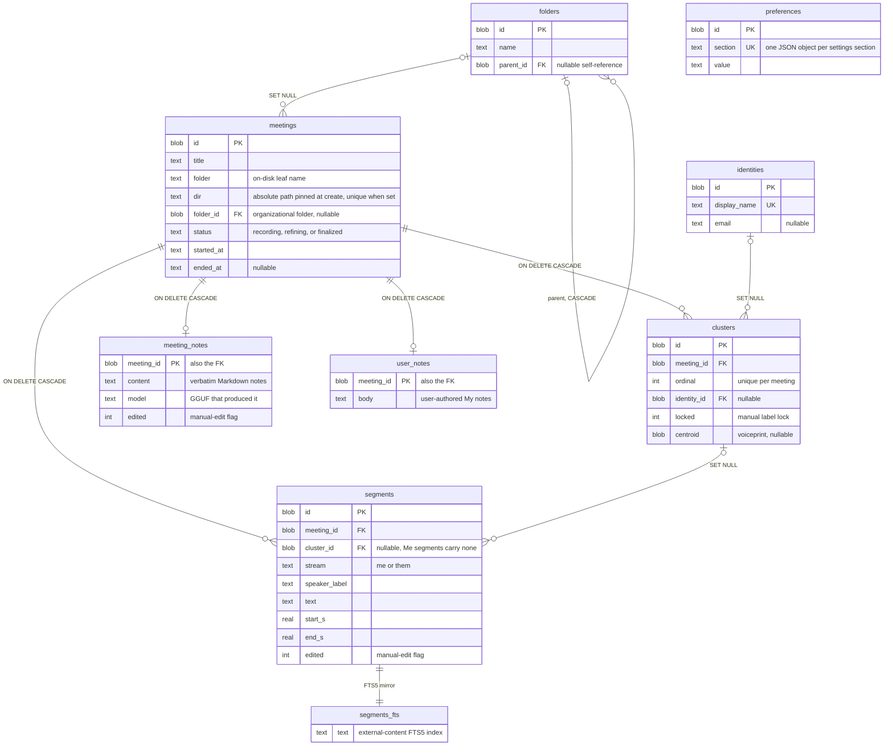

# Architecture

Hearsay is a local-first meeting transcriber for macOS (Apple Silicon, macOS 14.4 or later). It captures the
local microphone ("Me") and the system audio output ("Them") as separate 16 kHz streams, transcribes
both live, diarizes the Them stream into `Speaker N`, and refines the result after the meeting with
an offline re-diarization and re-transcription pass. Everything runs on the user's machine; audio
never leaves the device.

This document describes the product as built — the shape of the system. For *why* it has that shape,
see [design-decisions.md](design-decisions.md).

## Related documents

| Document | Scope |
|---|---|
| [design-decisions.md](design-decisions.md) | Why these choices, and what they were chosen over. |
| [pipeline.md](pipeline.md) | The live transcription data flow, stage by stage. |
| [echo-cancellation.md](echo-cancellation.md) | The AEC stage that cancels Them out of the live Me stream. |
| [voiceprints.md](voiceprints.md) | Cross-meeting speaker recognition and voiceprint storage. |
| [api.md](api.md) | Auth, conventions, meeting audio, and the WebSocket protocol. |
| [../shared/protocol/ipc.md](../shared/protocol/ipc.md) | The helper/core IPC contract (byte-level source of truth). |
| [configuration.md](configuration.md) | Every setting and the runtime overlay. |
| [development.md](development.md) | Building, running, and testing from source. |
| [packaging.md](packaging.md) | Building and installing the macOS bundle. |

Where the code lives: `rust/crates/` (the workspace, mapped below), `helper/` (the Swift capture
helper and sidecars), `web/` (the React UI and the Tauri shell).

## Process topology

One macOS app bundle containing seven spawned processes plus the webview. The Tauri shell owns the
window and the core's lifecycle; the core owns everything else. Three of the seven —
`hearsay-diarize`, `hearsay-notes`, and `hearsay-models` — are burst sidecars the core spawns on
demand rather than keeping resident.

### Process responsibilities

| Process | Role | Why a separate process |
|---|---|---|
| Tauri shell (`hearsay-app`) | Owns the OS window, spawns exactly one child (`hearsay-core`), stops it gracefully on quit, and hosts the native commands the UI can invoke (erase-all-data with a native confirm dialog, quit, model file picker, and the inactivity OS notification). | The desktop entry point; it never touches the Swift processes. |
| `hearsay-core` | The single backend: loopback HTTP + WebSocket API, SQLite persistence, meeting orchestration, speaker attribution, and the offline whisper refine. Spawns and supervises the helper, sidecars, and the `hearsay-notes` LLM sidecar. | The composition root; the only ML it runs in-process is the offline whisper refine, never live — the notes LLM runs out-of-process in `hearsay-notes` (see below). |
| `hearsay-helper` | The only process that touches TCC-guarded native APIs: the Core Audio process tap (system audio, configured global-except-self) and the microphone. Resamples both to 16 kHz mono and stamps both with one monotonic clock. | Confines the permission surface, and keeps the capture binary free of CoreML so a model problem can never take down capture. |
| `hearsay-live` / `hearsay-me` | The live audio AI (FluidAudio on the Apple Neural Engine): streaming diarization plus Parakeet ASR for Them, streaming VAD plus Parakeet for Me. One process per stream, one meeting per process. | Each model owns its address space; a crash is contained and the warm pool replaces the pair. |
| `hearsay-diarize` | The offline refine diarizer: given the recorded Them track, returns speaker turns and per-speaker voiceprint embeddings. | Same CoreML isolation; runs as a burst after the meeting, never live. |
| `hearsay-notes` | The optional local-LLM notes step (llama.cpp): given the finalized transcript, returns the verbatim Markdown notes over stdio. | llama's vendored `ggml` must not co-link with the whisper refine's (a ~5x refine slowdown), so it runs out-of-process as a burst sidecar. |
| `hearsay-models` | First-run model preparation: downloads the FluidAudio models the live and refine sidecars load, reporting progress as NDJSON. The installer ships no models. | It calls the same FluidAudio loaders those sidecars call, so what it fetches cannot drift from what they load — which a hand-maintained file manifest in Rust could not guarantee. |

## Rust crate map

Workspace crates under `rust/crates/`. Arrows point at the dependency (the actual `path`
entries in each `Cargo.toml`). `hearsay-notes` is a standalone sidecar binary the core spawns rather
than links, so it stands apart from the `hearsay-core` link graph.

| Crate | Responsibility |
|---|---|
| `hearsay-ipc` | The binary media-frame codec (28-byte little-endian header) and the NDJSON control codec. Source of truth for `shared/protocol/ipc.md`; generates the golden fixtures both languages validate in CI. |
| `hearsay-attribution` | Pure attribution logic: speaker ordering, segment-speaker assignment, cosine voiceprint matching. No dependencies; unit-tested in isolation. |
| `hearsay-audio` | Lossless FLAC archival of the recorded meeting WAV: a bounded-memory streaming encoder, a block-at-a-time decoder, and the byte-exact verifier that must pass before the original is deleted. Also resolves which form a meeting's recording is in. Ships `restore` and `repair_header` examples for un-archiving a library and for fixing the STREAMINFO of files written before the frame-size range was populated. No first-party dependencies, so every consumer can depend on it without pulling in whisper or the orchestrator. |
| `hearsay-db` | Persistence: SQLite via SQLx (WAL, `busy_timeout`, foreign keys), UUID primary keys, forward-only migrations, the attribution policy (vote and recognition), FTS transcript search, folders, notes, and settings queries. |
| `hearsay-engine` | The neutral `LiveEngine` trait and the `DisabledEngine` placeholder the API test suite runs against. Exists so the core and the orchestrator can share the seam without a dependency cycle. |
| `hearsay-orchestrator` | Implements `LiveEngine`: creates the meeting row and folder, drives an `AudioSource`, routes each stream's PCM to its `Transcriber`, records the stereo `audio.wav`, persists and broadcasts segments, and runs the refine and notes steps after stop. Ships scripted test fakes. |
| `hearsay-capture` | `AudioSource` implementations. On macOS, `SwiftHelperSource` spawns `hearsay-helper` and pumps its socket traffic; also hosts the TCC permissions probe. |
| `hearsay-inference` | In-process ML, all offline: the whisper refine (GGML; CPU, or Metal by feature). The llama.cpp notes summarizer runs out-of-process in the `hearsay-notes` sidecar, reusing the pure prompt/parse logic from `hearsay-notes-prompt`. |
| `hearsay-notes-prompt` | Dependency-free prompt construction and reply parsing for the notes step, shared by `hearsay-backends` (the `SubprocessSummarizer`) and the `hearsay-notes` sidecar so the sidecar never pulls in `hearsay-inference` → whisper. |
| `hearsay-notes` | The standalone notes-LLM sidecar binary: owns llama.cpp (`llama-cpp-2`), spawned by the core over stdio (JSON in, JSON out). The only process that links llama's vendored `ggml`. |
| `hearsay-backends` | Platform backend wiring behind the engine seam: `MacBackend` (warm sidecar pool), `MacRefiner`, the `SubprocessSummarizer` (spawns `hearsay-notes`), startup reconciliation, the periodic audio-archival sweep, and `build_engine`. |
| `hearsay-core` | The application binary: the axum HTTP + WebSocket API, security middleware, the served UI, OpenAPI generation, and the composition root that calls `build_engine`. Depends only on the seam, never on the concrete backend crates directly. |

The Tauri shell (`web/src-tauri/`) is a separate crate outside the workspace; it spawns the
`hearsay-core` binary rather than linking it.

## Trait seams

The meeting lifecycle and the live transcript stream are the only API surface that needs a running
capture and inference stack. That boundary is one trait, `LiveEngine`, defined in its own crate so
`hearsay-core` can consume it and `hearsay-orchestrator` can implement it without a cycle.
`DisabledEngine` answers those routes with 503 and a clean WebSocket close, which lets the entire
API test suite run with no ML and no capture.

Below the engine, the orchestrator injects five more traits, so the whole lifecycle is testable
with scripted fakes over in-memory SQLite.

Notable implementation points, each verifiable in the named file:

- `MacBackend` keeps one `hearsay-me`/`hearsay-live` pair pre-spawned in a `SidecarPool`
  (`hearsay-backends/src/mac.rs`) so the multi-second CoreML model load happens before the user
  presses start. A meeting adopts the warm pair; the replacement spawns only after the meeting
  ends, so a warming load never competes with live inference on the Neural Engine. A background
  ticker re-warms a pair that died while idle.
- The orchestrator serializes live inference and the offline refine on a single shared ANE permit
  (`hearsay-orchestrator/src/pipeline.rs`): a new meeting's stream loops wait to feed until any
  still-running refine releases the permit. Recording is unaffected; only transcription waits.
- The orchestrator is constructed through `Arc::new_cyclic` (`into_arc`), so the capture-death
  supervisor always holds a valid weak self-reference; there is no separate init step to forget.
- The capture source is never pooled: spawning it touches the microphone and tap and can raise a
  TCC prompt, so it must stay fresh per meeting.

## Runtime behavior

### Startup and shutdown

The shell and the core hand off through a private handshake file rather than stdout, so the session
token never appears in a log line.

If the core exits before the handshake appears, or 30 seconds pass, the shell replaces the splash
screen with a boot error instead of spinning. In headless development (`make rust-serve`) no
handshake path is set; the core prints the tokenized URL to stdout instead.

### Capture session

The core owns the sockets and spawns the helper as a client. The byte-level frame and command
formats are specified in [`shared/protocol/ipc.md`](../shared/protocol/ipc.md); this diagram shows
the lifecycle around them.

Two details worth knowing:

- Both streams are stamped from one monotonic clock in the helper (`host_ts`), so Me and Them share
  a timeline and are aligned by timestamp, never by sample index. The sidecars' own sample-count
  clocks are bridged back to meeting time with a per-stream offset, padded with silence across
  real delivery gaps (capped at five minutes so a bad timestamp cannot force a huge allocation).
- A helper crash cannot leave a meeting falsely live: the closed capture channel fires a supervisor
  that stops the meeting through the normal path.

### Live pipeline

Inside a meeting, the pipeline runs one `demux` task (which anchors the shared clock, feeds the
stereo WAV recorder, and forwards chunks) and one `stream_loop` task per stream (which feeds the
stream's sidecar and persists/broadcasts the segments it emits). The stage-by-stage walk-through,
including partial versus final semantics and the finalize rewrite, is in
[pipeline.md](pipeline.md).

### Meeting lifecycle

Meeting status is one of `recording`, `refining`, or `finalized`
(`hearsay-db/src/models.rs`).

Every stop path funnels through the same transition: the API's stop route, a graceful shutdown,
the capture-death supervisor, and the inactivity watchdog all call `stop_meeting`, which stamps the
row `refining` when the auto-refine will run and `finalized` otherwise. The inactivity watchdog runs
inside the pipeline: it measures the time since the last emitted segment (VAD-gated speech on either
stream), broadcasts a `prompt` event to the live WebSocket after a configurable silence (default 5
minutes), and — if the silence continues to the end threshold (default 10 minutes) — writes a
`System` transcript marker and signals `stop_meeting` to auto-end the meeting. Any speech, or the
"Keep recording" action, resets the clock. The prompt and the auto-end are independently toggleable
in the `recording` settings section (so a meeting can be nudged without ever being auto-stopped, or
auto-stopped with no prior nudge). When the window is unfocused, the frontend asks the Tauri shell
(a granted `notify_still_recording` command) to raise a native OS notification, so a user who has
switched away still sees the nudge.

Pause and resume (`POST /api/meetings/{id}/pause` and `/resume`) freeze and restart capture on the
active recording without changing its persisted status. While paused the pipeline drops incoming
chunks and elides the silent span, and it broadcasts `capture_state=paused` to the live WebSocket;
both routes are idempotent (204) and return 404 for any meeting that is not the current session.

A hard exit (SIGKILL, panic, power loss) can strand a row in `recording` or `refining`. Because
nothing can be active at startup, the core sweeps every non-terminal row at boot, marks it
finalized, and rewrites its transcript from the persisted segments
(`hearsay-backends/src/reconcile.rs`).

### Audio archival

An uncompressed `audio.wav` is 230 MB per hour and nothing ever shrinks it, so recordings grow
without bound. An hourly background sweep (`hearsay-backends/src/archive.rs`, on by default) re-encodes
a finalized meeting's WAV as lossless FLAC once it is older than the configured threshold — about 3x
smaller on real meeting audio. Because it is lossless, nothing downstream changes: playback, the
offline refine, and re-diarization resolve whichever form exists
(`hearsay_audio::resolve_recorded_audio`) and see identical samples, so diarization accuracy is
unaffected.

The encoder patches the real frame-size range into STREAMINFO after the frames are written. This is
not cosmetic: leaving `flacenc`'s defaults writes `min_frame_size = 0xFFFFFF` against
`max_frame_size = 0`, an impossible range that AVFoundation -- and therefore every macOS player,
including the app's own WKWebView -- refuses to play, while reporting the correct duration and no
error. The audio decodes perfectly either way, so no round-trip test catches it; the encoder asserts
the declared range is coherent instead. `cargo run -p hearsay-audio --example repair_header` rewrites
those six bytes in files written before the fix, without touching a sample.

The destructive step is ordered so a failure can only cost disk space, never audio: encode to a
temporary, decode it back and compare it to the source sample for sample, rename it into place, and
only then unlink the WAV. A crash between the rename and the unlink leaves both files, which the
resolver tolerates and the next sweep cleans up. The sweep only considers `finalized` rows, so it
never races the recorder or the post-stop refine, and it defers entirely while a meeting is
recording — encoding is CPU work and a live meeting owns the machine.

The Settings > Storage "Compress now" button runs the same pass on demand through
`start_background_pass`, which resolves the work list before responding (so the UI gets a real total
and can poll immediately) and shares one `Sweeper` with the ticker, so the two can never sweep the
same folders at once.

A deferred pass re-checks in 5 minutes rather than waiting out the hour, and a pass cut short by a
meeting starting mid-sweep does the same. That distinction matters more than it looks: the app is
normally opened *in order to* record, so the post-launch sweep routinely lands inside a meeting, and
on a flat hourly cadence a user who records and then quits would never archive anything at all. A deterministic failure (an
unreadable recording) is remembered for the process so it is not retried hourly forever; a transient
I/O failure is not.

## Data model

SQLite, nine tables across twelve forward-only migrations (`hearsay-db/migrations/`). UUIDs are
stored as BLOB, timestamps as RFC3339 TEXT; every table also carries `created_at` and `updated_at`
(omitted below).

Semantics that follow from the constraints:

- `meetings` is the aggregate root: deleting one cascades its segments, clusters, and both notes
  tables (`meeting_notes`, `user_notes`) in a single DELETE.
- `clusters` joins a meeting's diarized speakers (`ordinal`) to global, cross-meeting
  `identities`. Renaming a speaker binds and locks the cluster; `centroid` holds the voiceprint
  used to recognize a returning person in a later meeting. A single Them line can also be
  reassigned on its own — repointing that segment's `cluster_id` (to another cluster, or a new one
  created for a typed name) and flagging it `edited` — without touching the rest of the cluster.
- Deleting an organizational folder cascades its sub-folders but un-files its meetings to the root
  (`folder_id` is set NULL); meetings are never deleted by a folder operation.
- `segments_fts` is an external-content FTS5 index over `segments.text`, kept in step by triggers,
  so the destructive refine and manual edits need no search-specific code.
- `preferences` is the writable settings overlay: the effective value of each section is the
  stored row when present, else the environment/config default.

## Security model

Loopback is not a security boundary: any local process or browser page can reach `127.0.0.1`. The
core therefore treats its port as untrusted and gates it three ways
(`hearsay-core/src/security.rs`, `hearsay-core/src/lib.rs`):

| Control | Mechanism |
|---|---|
| Session token | A 244-bit random token generated per process. REST requires `Authorization: Bearer`; the SPA navigation, the audio element, and the WebSocket (channels that cannot set headers) pass `?token=`. Compared in constant time. |
| Host allowlist | The `Host` header must name `127.0.0.1`, `localhost`, or `::1`, which blocks DNS rebinding. |
| Origin allowlist | A present `Origin` must be loopback, which blocks cross-site requests and WebSocket hijacking from web pages; non-browser clients without an Origin rely on the token. |
| Bind guard | The core refuses a non-loopback bind unless `ENVIRONMENT=development`. |
| Token delivery | The token reaches the shell through a 0600 handshake file that is deleted after one read; it is never printed outside development. The SPA keeps it in memory, never in web storage. |
| Response hygiene | Every response carries `X-Content-Type-Options: nosniff`, `X-Frame-Options: DENY`, and `Referrer-Policy: strict-origin-when-cross-origin`; the served index adds a per-response CSP nonce. Each request gets an `X-Request-Id` and one access-log line with the token redacted. |
| Error discipline | Database and internal errors render as a literal "internal error"; details go to the log only. |

Privacy posture: raw audio retention is a single per-meeting recording that can be turned off in
Settings (turning it off also disables the refine, which reads it), deleting a meeting removes both
the rows and the folder, and the app collects no telemetry.
