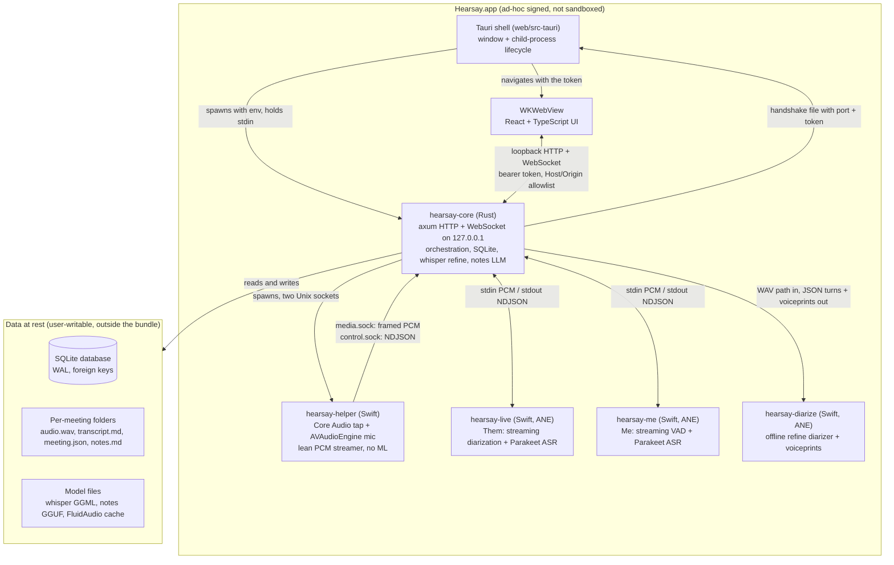
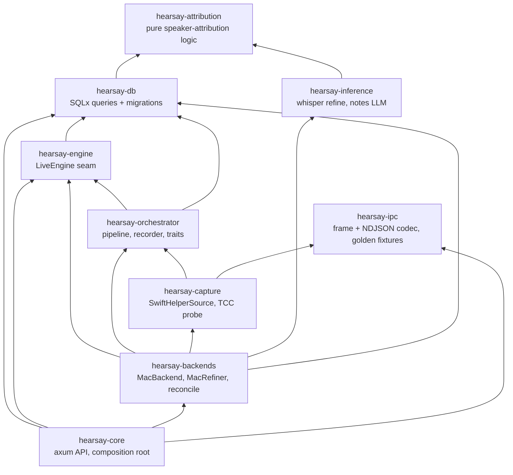
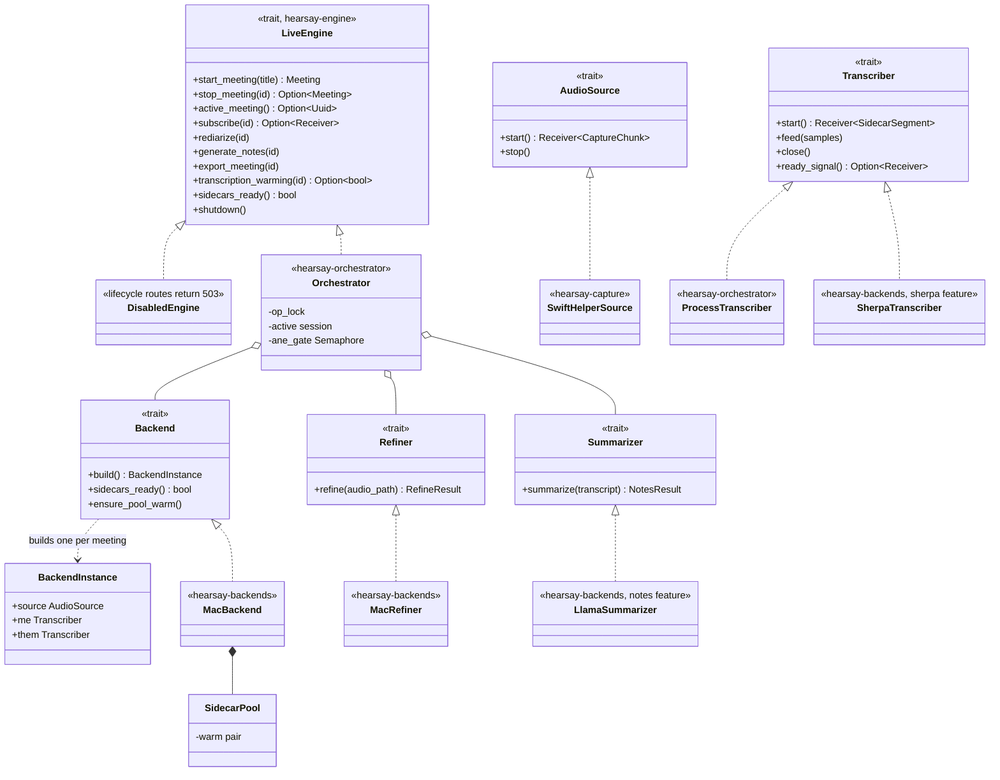
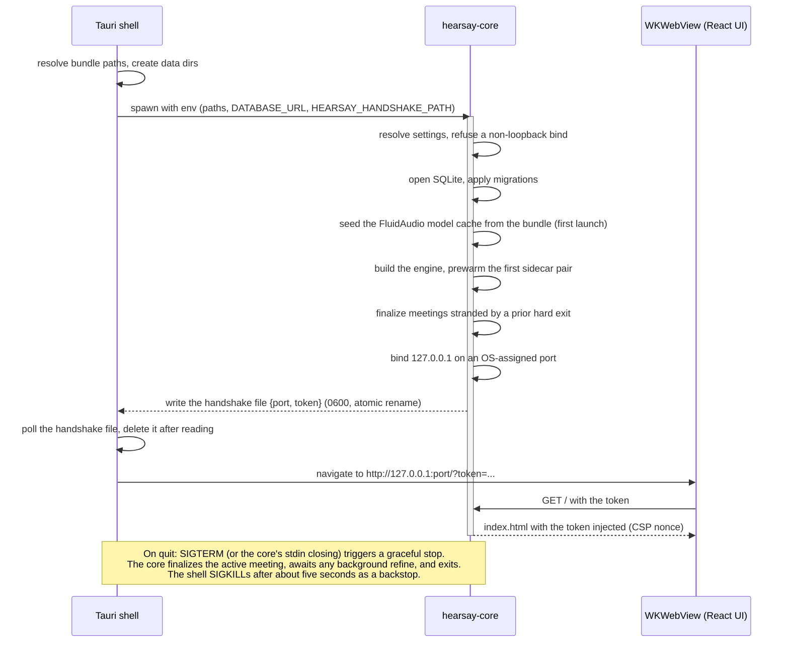
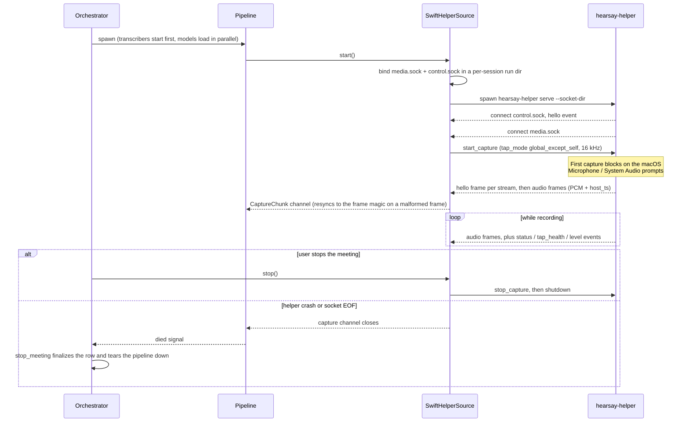
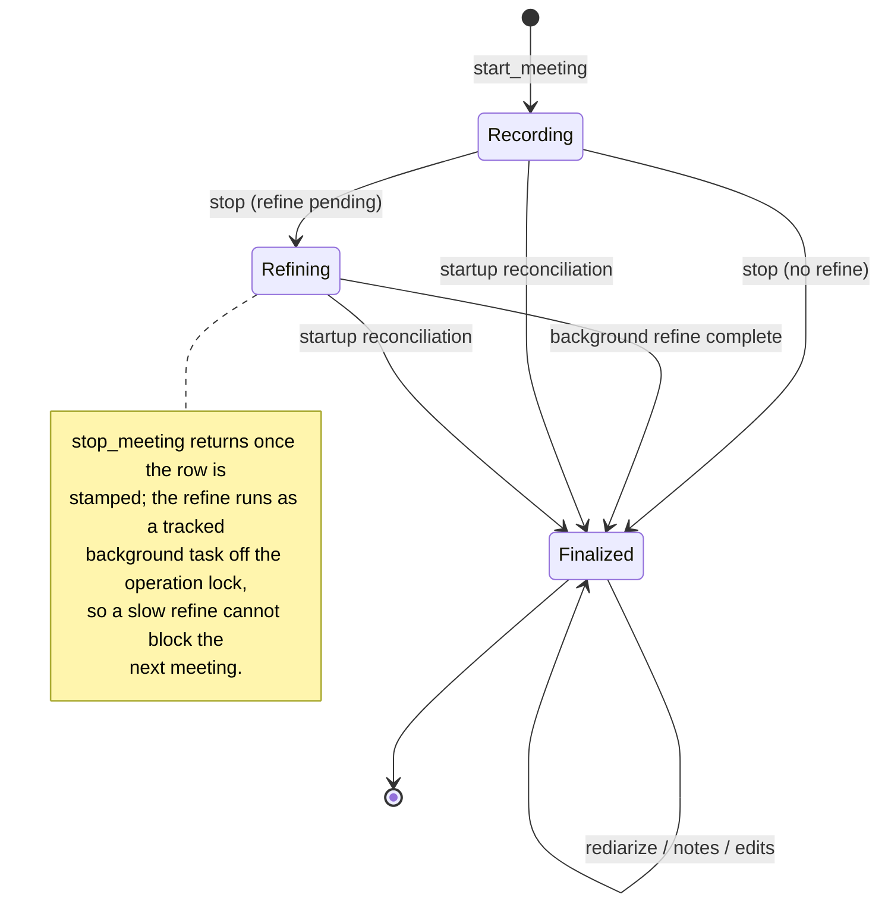
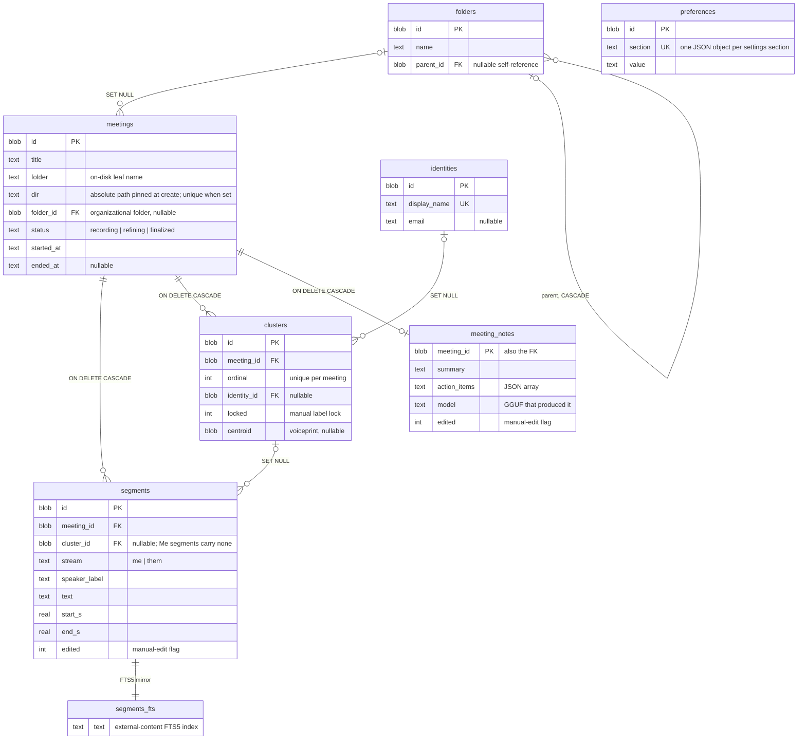

# Architecture

Hearsay is a local-first meeting transcriber for macOS (Apple Silicon, macOS 14.4 or later; a
Windows port is planned, see [Cross-platform roadmap](#cross-platform-roadmap)). It captures the
local microphone ("Me") and the system audio output ("Them") as separate 16 kHz streams, transcribes
both live, diarizes the Them stream into `Speaker N`, and refines the result after the meeting with
an offline re-diarization and re-transcription pass. Everything runs on the user's machine; audio
never leaves the device.

This document describes the product as built. Related references:

| Document | Scope |
|---|---|
| [pipeline.md](pipeline.md) | The live transcription data flow, stage by stage. |
| [api.md](api.md) | REST and WebSocket reference. |
| [../shared/protocol/ipc.md](../shared/protocol/ipc.md) | The helper/core IPC contract (byte-level source of truth). |
| [packaging.md](packaging.md) | Building and installing the macOS bundle. |
| [development.md](development.md) | Building, running, and testing from source. |

## Design principles

- **Local-first.** Transcription, diarization, and the optional notes LLM run on-device. The Them
  stream contains other people's voices, so keeping audio local is a privacy requirement, and it
  makes the installer self-contained and offline-capable.
- **Multi-process, split by capability.** Process boundaries follow capability and isolation needs,
  not features: all TCC-guarded native APIs live in one lean capture helper, each heavy CoreML model
  runs in its own sidecar process, and the core's live path runs no ML at all.
- **One contract per boundary.** The helper/core boundary is a fixed binary and NDJSON contract
  pinned by golden fixtures; the core/UI boundary is an OpenAPI schema that generates the
  TypeScript types. Both are drift-checked in CI.
- **The database is the source of truth.** `transcript.md`, `meeting.json`, and `notes.md` are
  one-way exports rebuilt from the rows; the files are never read back.

## Process topology

One macOS app bundle containing five processes plus the webview. The Tauri shell owns the window
and the core's lifecycle; the core owns everything else.

### Process responsibilities

| Process | Role | Why a separate process |
|---|---|---|
| Tauri shell (`hearsay-app`) | Owns the OS window, spawns exactly one child (`hearsay-core`), stops it gracefully on quit, and hosts the three native commands the UI can invoke (erase-all-data with a native confirm dialog, quit, model file picker). | The desktop entry point; it never touches the Swift processes. |
| `hearsay-core` | The single backend: loopback HTTP + WebSocket API, SQLite persistence, meeting orchestration, speaker attribution, the offline whisper refine, and the optional llama.cpp notes step. Spawns and supervises the helper and sidecars. | The composition root; the only ML it runs in-process is offline (refine, notes), never live. |
| `hearsay-helper` | The only process that touches TCC-guarded native APIs: the Core Audio process tap (system audio, configured global-except-self) and the microphone. Resamples both to 16 kHz mono and stamps both with one monotonic clock. | Confines the permission surface, and keeps the capture binary free of CoreML so a model problem can never take down capture. |
| `hearsay-live` / `hearsay-me` | The live audio AI (FluidAudio on the Apple Neural Engine): streaming diarization plus Parakeet ASR for Them, streaming VAD plus Parakeet for Me. One process per stream, one meeting per process. | Each model owns its address space; a crash is contained and the warm pool replaces the pair. |
| `hearsay-diarize` | The offline refine diarizer: given the recorded Them track, returns speaker turns and per-speaker voiceprint embeddings. | Same CoreML isolation; runs as a burst after the meeting, never live. |

## Rust crate map

Nine workspace crates under `rust/crates/`. Arrows point at the dependency (the actual `path`
entries in each `Cargo.toml`).

| Crate | Responsibility |
|---|---|
| `hearsay-ipc` | The binary media-frame codec (28-byte little-endian header) and the NDJSON control codec. Source of truth for `shared/protocol/ipc.md`; generates the golden fixtures both languages validate in CI. |
| `hearsay-attribution` | Pure attribution logic: speaker ordering, segment-speaker assignment, cosine voiceprint matching. No dependencies; unit-tested in isolation. |
| `hearsay-db` | Persistence: SQLite via SQLx (WAL, `busy_timeout`, foreign keys), UUID primary keys, forward-only migrations, the attribution policy (vote and recognition), FTS transcript search, folders, notes, and settings queries. |
| `hearsay-engine` | The neutral `LiveEngine` trait and the `DisabledEngine` placeholder the API test suite runs against. Exists so the core and the orchestrator can share the seam without a dependency cycle. |
| `hearsay-orchestrator` | Implements `LiveEngine`: creates the meeting row and folder, drives an `AudioSource`, routes each stream's PCM to its `Transcriber`, records the stereo `audio.wav`, persists and broadcasts segments, and runs the refine and notes steps after stop. Ships scripted test fakes. |
| `hearsay-capture` | `AudioSource` implementations. On macOS, `SwiftHelperSource` spawns `hearsay-helper` and pumps its socket traffic; also hosts the TCC permissions probe. |
| `hearsay-inference` | In-process ML, all offline: the whisper refine (GGML; CPU, or Metal/Vulkan/CUDA by feature), the optional llama.cpp notes summarizer (`notes` feature), and the feature-gated sherpa-onnx modules for the future Windows path (`sherpa` feature). |
| `hearsay-backends` | Platform backend wiring behind the engine seam: `MacBackend` (warm sidecar pool), `MacRefiner`, the notes summarizer, startup reconciliation, and `build_engine`, the one place a future `WindowsBackend` plugs in. |
| `hearsay-core` | The application binary: the axum HTTP + WebSocket API, security middleware, the served UI, OpenAPI generation, and the composition root that calls `build_engine`. Depends only on the seam, never on the concrete backend crates directly. |

The Tauri shell (`web/src-tauri/`) is a separate crate outside the workspace; it spawns the
`hearsay-core` binary rather than linking it.

## Trait seams

The meeting lifecycle and the live transcript stream are the only API surface that needs a running
capture and inference stack. That boundary is one trait, `LiveEngine`, defined in its own crate so
`hearsay-core` can consume it and `hearsay-orchestrator` can implement it without a cycle.
`DisabledEngine` answers those routes with 503 and a clean WebSocket close, which lets the entire
API test suite run with no ML and no capture.

Below the engine, the orchestrator injects five more traits, so the whole lifecycle is testable
with scripted fakes over in-memory SQLite.

Notable implementation points, each verifiable in the named file:

- `MacBackend` keeps one `hearsay-me`/`hearsay-live` pair pre-spawned in a `SidecarPool`
  (`hearsay-backends/src/mac.rs`) so the multi-second CoreML model load happens before the user
  presses start. A meeting adopts the warm pair; the replacement spawns only after the meeting
  ends, so a warming load never competes with live inference on the Neural Engine. A background
  ticker re-warms a pair that died while idle.
- The orchestrator serializes live inference and the offline refine on a single shared ANE permit
  (`hearsay-orchestrator/src/pipeline.rs`): a new meeting's stream loops wait to feed until any
  still-running refine releases the permit. Recording is unaffected; only transcription waits.
- The orchestrator is constructed through `Arc::new_cyclic` (`into_arc`), so the capture-death
  supervisor always holds a valid weak self-reference; there is no separate init step to forget.
- The capture source is never pooled: spawning it touches the microphone and tap and can raise a
  TCC prompt, so it must stay fresh per meeting.

## Runtime behavior

### Startup and shutdown

The shell and the core hand off through a private handshake file rather than stdout, so the session
token never appears in a log line.

If the core exits before the handshake appears, or 30 seconds pass, the shell replaces the splash
screen with a boot error instead of spinning. In headless development (`make rust-serve`) no
handshake path is set; the core prints the tokenized URL to stdout instead.

### Capture session

The core owns the sockets and spawns the helper as a client. The byte-level frame and command
formats are specified in [`shared/protocol/ipc.md`](../shared/protocol/ipc.md); this diagram shows
the lifecycle around them.

Two details worth knowing:

- Both streams are stamped from one monotonic clock in the helper (`host_ts`), so Me and Them share
  a timeline and are aligned by timestamp, never by sample index. The sidecars' own sample-count
  clocks are bridged back to meeting time with a per-stream offset, padded with silence across
  real delivery gaps (capped at five minutes so a bad timestamp cannot force a huge allocation).
- A helper crash cannot leave a meeting falsely live: the closed capture channel fires a supervisor
  that stops the meeting through the normal path.

### Live pipeline

Inside a meeting, the pipeline runs one `demux` task (which anchors the shared clock, feeds the
stereo WAV recorder, and forwards chunks) and one `stream_loop` task per stream (which feeds the
stream's sidecar and persists/broadcasts the segments it emits). The stage-by-stage walk-through,
including partial versus final semantics and the finalize rewrite, is in
[pipeline.md](pipeline.md).

### Meeting lifecycle

Meeting status is one of `recording`, `refining`, or `finalized`
(`hearsay-db/src/models.rs`).

Every stop path funnels through the same transition: the API's stop route, a graceful shutdown,
the capture-death supervisor, and the inactivity watchdog all call `stop_meeting`, which stamps the
row `refining` when the auto-refine will run and `finalized` otherwise. The inactivity watchdog runs
inside the pipeline: it measures the time since the last emitted segment (VAD-gated speech on either
stream), broadcasts a `prompt` event to the live WebSocket after a configurable silence (default 5
minutes), and — if the silence continues to the end threshold (default 10 minutes) — writes a
`System` transcript marker and signals `stop_meeting` to auto-end the meeting. Any speech, or the
"Keep recording" action, resets the clock; the whole behavior is a toggle in the `recording`
settings section.

A hard exit (SIGKILL, panic, power loss) can strand a row in `recording` or `refining`. Because
nothing can be active at startup, the core sweeps every non-terminal row at boot, marks it
finalized, and rewrites its transcript from the persisted segments
(`hearsay-backends/src/reconcile.rs`).

## Data model

SQLite, eight tables across eight forward-only migrations (`hearsay-db/migrations/`). UUIDs are
stored as BLOB, timestamps as RFC3339 TEXT; every table also carries `created_at` and `updated_at`
(omitted below).

Semantics that follow from the constraints:

- `meetings` is the aggregate root: deleting one cascades its segments, clusters, and notes in a
  single DELETE.
- `clusters` joins a meeting's diarized speakers (`ordinal`) to global, cross-meeting
  `identities`. Renaming a speaker binds and locks the cluster; `centroid` holds the voiceprint
  used to recognize a returning person in a later meeting.
- Deleting an organizational folder cascades its sub-folders but un-files its meetings to the root
  (`folder_id` is set NULL); meetings are never deleted by a folder operation.
- `segments_fts` is an external-content FTS5 index over `segments.text`, kept in step by triggers,
  so the destructive refine and manual edits need no search-specific code.
- `preferences` is the writable settings overlay: the effective value of each section is the
  stored row when present, else the environment/config default.

## Security model

Loopback is not a security boundary: any local process or browser page can reach `127.0.0.1`. The
core therefore treats its port as untrusted and gates it three ways
(`hearsay-core/src/security.rs`, `hearsay-core/src/lib.rs`):

| Control | Mechanism |
|---|---|
| Session token | A 244-bit random token generated per process. REST requires `Authorization: Bearer`; the SPA navigation, the audio element, and the WebSocket (channels that cannot set headers) pass `?token=`. Compared in constant time. |
| Host allowlist | The `Host` header must name `127.0.0.1`, `localhost`, or `::1`, which blocks DNS rebinding. |
| Origin allowlist | A present `Origin` must be loopback, which blocks cross-site requests and WebSocket hijacking from web pages; non-browser clients without an Origin rely on the token. |
| Bind guard | The core refuses a non-loopback bind unless `ENVIRONMENT=development`. |
| Token delivery | The token reaches the shell through a 0600 handshake file that is deleted after one read; it is never printed outside development. The SPA keeps it in memory, never in web storage. |
| Response hygiene | Every response carries `X-Content-Type-Options: nosniff`, `X-Frame-Options: DENY`, and `Referrer-Policy: strict-origin-when-cross-origin`; the served index adds a per-response CSP nonce. Each request gets an `X-Request-Id` and one access-log line with the token redacted. |
| Error discipline | Database and internal errors render as a literal "internal error"; details go to the log only. |

Privacy posture: raw audio retention is a single per-meeting `audio.wav` that can be turned off in
Settings (turning it off also disables the refine, which reads it), deleting a meeting removes both
the rows and the folder, and the app collects no telemetry.

## Cross-platform roadmap

The next platform is Windows, as the same Rust + Tauri app with per-OS code only at the edges.
Roughly 90 percent of the codebase is platform-neutral.

| Layer | Technology | Shared or per-OS |
|---|---|---|
| Shell and distribution | Tauri v2 (installer, system webview, signing, auto-update) | Shared configuration, two build targets |
| Frontend | React + TypeScript over the loopback API | Shared |
| Core | axum, SQLx/SQLite, OpenAPI codegen, orchestration | Shared |
| Capture | macOS: Swift helper. Windows: WASAPI loopback + mic (cpal), behind the same `AudioSource` trait | Per-OS, thin |
| Live transcription | macOS: FluidAudio sidecars. Windows: a pure-Rust streaming transcriber (`SherpaTranscriber`, already present behind the `sherpa` feature) | Per-OS engine behind the `Transcriber` trait |
| Offline refine | whisper (GGML) with a per-OS acceleration feature: Metal on macOS, Vulkan/CUDA for Windows | Shared code, per-OS acceleration |

Constraints the Windows design targets: a 16 GB laptop with integrated graphics (Core Ultra
225U-class reference hardware), no discrete GPU assumed, and the same local-only rule. Model sizes
are tiered by detected hardware, so faster machines run larger refine models.

One decision remains open, gated on verification rather than preference: unify macOS onto the same
whisper.cpp/ONNX stack as Windows (one engine, simplest distribution), or keep FluidAudio as a
macOS-specific high-accuracy tier. The trait seams keep both options open; the sherpa modules are
compiled only under the `sherpa` feature, so the macOS bundle carries no onnxruntime.
