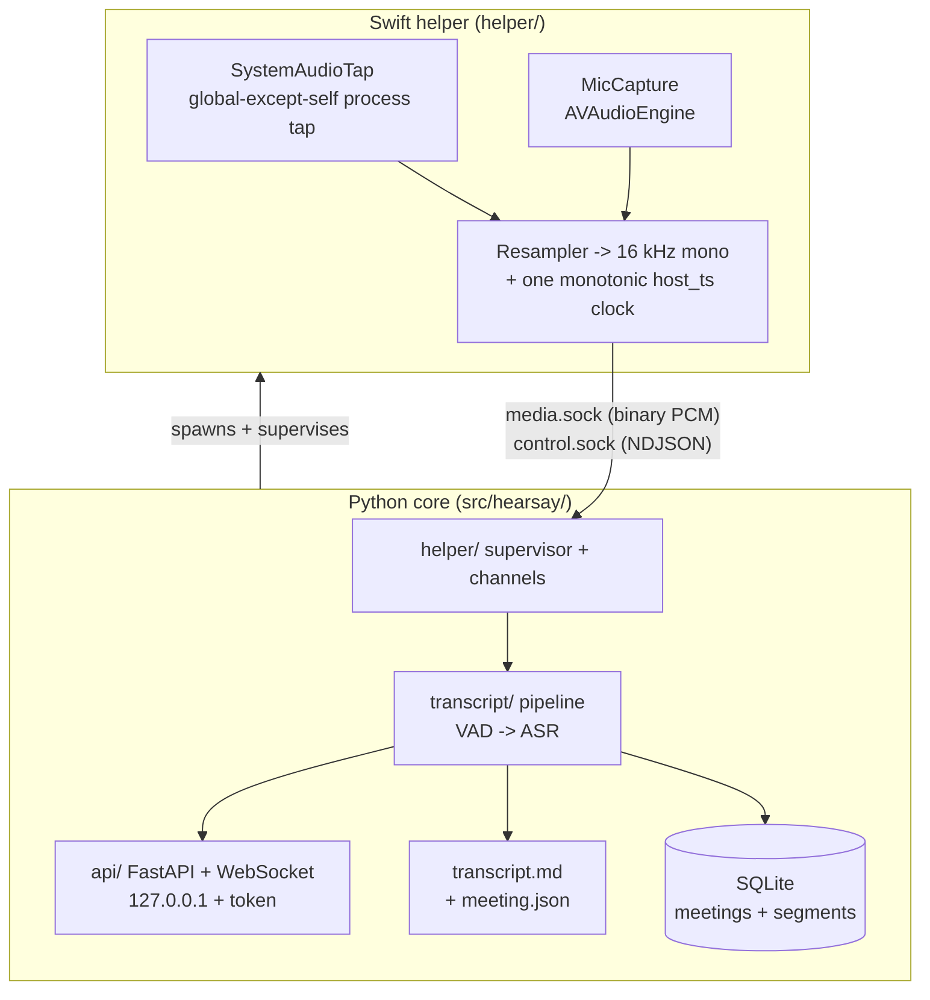

# Architecture

This document explains the implementation that exists today (the Phase 0 capture spike
and the Phase 1 backend MVP): the process boundaries, why the system is split the way it
is, and what each Python package does. For the real-time data flow see
[pipeline.md](pipeline.md); for the HTTP/WebSocket surface see [api.md](api.md).

## Why three processes

Two hard constraints shaped the design:

1. **Capturing mic and system audio as separate channels gives "Me vs Them" for free.**
   The only remaining hard problem is naming the *multiple* remote speakers inside the
   system-audio stream (later phases).
2. **Real-time audio capture cannot be done reliably from Python.** PyObjC cannot safely
   run Core Audio realtime callbacks. So a thin **Swift helper** owns native capture and
   everything else lives in **Python**.

The **core spawns and supervises the helper** (not the other way around), so capture
lifecycle and backpressure live in one place and survive helper restarts.

## Process boundary: the IPC contract

Two Unix-domain sockets in a per-session run directory, **owned (listened) by the core**
so they outlive helper restarts; the helper connects as a client.

- **`media.sock`** — binary framed PCM, helper -> core only. A fixed 28-byte little-endian
  header + payload. Both streams are multiplexed by a `stream` byte (0 = "me", 1 = "them").
  The load-bearing field is **`host_ts` (u64 ns, one monotonic clock)**: both streams are
  resampled to 16 kHz mono and stamped from the *same* clock at egress, so alignment is
  exact regardless of independent hardware clocks.
- **`control.sock`** — bidirectional NDJSON (one JSON object per line): core -> helper
  commands (with replies) and helper -> core events.

The frame layout and message schema are defined once in
[`shared/protocol/ipc.md`](../shared/protocol/ipc.md) and mirrored byte-for-byte by the
Swift `HearsayIPC.FrameCodec` and the Python `hearsay.helper.protocol`. Golden fixtures in
`shared/fixtures/frames.jsonl` pin the contract; both languages validate against them in
CI, so the two codecs cannot drift.

## The Python core, package by package

### `config/` — the single configuration source

`settings.py` is one `pydantic-settings` object loaded once and injected via DI. Every
tunable lives here: paths (`app_support_dir`, `output_dir`, `models_dir`, `helper_path`),
the database URL, the server host/port, and nested `asr` / `vad` groups. A model validator
fills derived paths (e.g. the default SQLite URL and the Silero model path) so the rest of
the code never computes them ad hoc. Reads `HEARSAY_`-prefixed env vars (nested via `__`,
e.g. `HEARSAY_ASR__MODEL`).

### `enums.py`, `log.py` — shared primitives

`StrEnum`s used for DB columns and JSON (`Stream`, `MeetingStatus`, `SampleFormat`,
`ASRBackendKind`, ...). The binary IPC uses integer codes instead; that mapping is isolated
in `helper/protocol.py` so the wire format stays decoupled from these names. `log.py`
configures a stdlib JSON logger once and hands out named loggers via `get_logger`.

### `helper/` — the core side of the IPC

This is the client-of-the-contract, not the Swift helper. It turns the two raw sockets into
typed async streams:

- `protocol.py` — the `FrameCodec` mirror: encode/decode 28-byte media frames, plus
  `expected_payload_len()` (size the second read without decoding) and `audio_samples()`
  (int16/float32 payload -> float samples).
- `control.py` / `control_channel.py` — the NDJSON codec and an async read loop that
  correlates replies to in-flight commands by `id` (`call()`) and routes unsolicited events
  to a queue.
- `media_channel.py` — pumps frames into per-stream `asyncio.Queue`s of `AudioChunk`
  (samples + `host_ts`), counting `seq` gaps (dropped frames). A `None` item marks
  end-of-stream.
- `supervisor.py` — `HelperSupervisor` creates the run dir, listens on both sockets, spawns
  the helper, awaits its `hello`, and tears everything down cleanly.
- `capture_debug.py` — the Phase 0 truth-test harness behind `hearsay capture-debug`:
  drains both streams for N seconds and writes `me.wav` / `them.wav` with drift + skew
  diagnostics. This is how Me/Them separation was first proven on-device.

### `db/` + `models/` — persistence

Local-first **SQLite** via **async SQLAlchemy 2.0** (`sqlite+aiosqlite`), portable to
PostgreSQL by swapping the URL.

- `db/engine.py` — `create_engine()` sets SQLite pragmas on connect (`journal_mode=WAL`,
  `busy_timeout`, `foreign_keys=ON`) and explicit pool settings.
- `db/session.py` + `db/__init__.py` — the async sessionmaker and a small `Database` holder
  (engine + sessionmaker) that the app keeps in `app.state` and tests build against a temp file.
- `models/base.py` — the declarative `Base`: every table gets a UUID primary key and
  `created_at` / `updated_at`. `str_enum()` renders a `StrEnum` as a portable
  `VARCHAR` + `CHECK` storing the member *values*.
- `models/meeting.py`, `models/segment.py` — `Meeting` (title, folder, status, started/ended)
  and `Segment` (stream, speaker label, text, `start_s`/`end_s` meeting-relative seconds),
  linked by a `meeting_id` FK with `ON DELETE CASCADE` and a `(meeting_id, start_s)` index.
- `db/migrations/` — Alembic (async `env.py`, `render_as_batch` for SQLite). The baseline
  revision is frozen; `alembic check` is run to confirm the models match it.

### `schemas/` — the API boundary

Pydantic request/response models, kept separate from ORM models so the HTTP surface is
validated and decoupled from storage: `MeetingCreate`/`MeetingRead`, `SegmentRead`, the
generic paginated `Page[T]`, the `TranscriptEvent` (the WebSocket payload), and the ASR
picker schemas (`ASRStatus`, `ASRSelect`).

### `services/` — business logic

`MeetingService` is the only place that reads/writes meetings + segments (routers call it and
stay thin): create, get, paginated list, add-segment, finalize, cascade delete, plus the
meeting-folder slug helper. Each method is a single logical write with one commit.

### `transcript/` — orchestration

The heart of a running meeting.

- `capture.py` — the `Capture` protocol (`start`/`stop`/`media`) and `HelperCapture`, which
  wraps `HelperSupervisor`: spawn the helper, send `start_capture`, expose the media channel,
  and tear down. The protocol is the seam that lets tests run the lifecycle without a helper.
- `pipeline.py` — `TranscriptionPipeline`: one consumer task per stream that segments audio
  (VAD), transcribes utterances off the event loop, and fans results out to DB +
  `transcript.md` + WebSocket. See [pipeline.md](pipeline.md).
- `broadcast.py` — `Broadcaster`, an in-process pub/sub that fans JSON event strings to
  active WebSocket subscribers.
- `session.py` — `MeetingSession` (one meeting: capture + pipeline + broadcaster) and
  `SessionManager` (owns the single active session; lock-guarded start/stop/delete). The
  manager injects the ASR/VAD/sink factories, so the real ML stack is built on demand and
  tests inject fakes.

### `vad/` — voice activity detection

- `base.py` — the `VAD` protocol (score a fixed-size frame) and `Segmenter`, the pure,
  heavily unit-tested state machine that turns frame scores into utterances using start/stop
  hysteresis and emits periodic partial snapshots.
- `silero.py` — the real `SileroVAD`, running the MIT Silero ONNX model directly on
  `onnxruntime` (no torch). Includes the pinned, integrity-checked model download.

### `asr/` — speech recognition

- `base.py` — the `ASRBackend` protocol (`transcribe(samples) -> [ASRSegment]`) and the
  `ASRSegment` type.
- `whispercpp_backend.py` — the default backend (pywhispercpp / whisper.cpp, Metal + CoreML,
  torch-free).
- `mlx_backend.py` — an opt-in Apple-MLX backend (behind the `accel` extra; pulls torch).
- `manager.py` — `build_asr()` selects the backend from settings; `resolve_model()` maps a
  friendly name (`large-v3-turbo`) to a backend-specific identifier (a GGML name vs an MLX
  Hugging Face repo); `available_models()` powers the picker.

### `export/` — output sink

- `base.py` — the `TranscriptSink` protocol (`open`/`append`/`finalize`) plus the
  `MeetingMeta` / `TranscriptLine` value types. This seam is where a future central /
  object-store sink attaches without touching the pipeline.
- `local_markdown.py` — the only implementation today: a corruption-safe writer that appends
  complete, newline-terminated blocks live and atomically rewrites the transcript in
  timestamp order at finalize.

### `api/` — the loopback HTTP/WebSocket surface

- `app.py` — `create_app()` assembles the `AppContext`, the loopback-hardening middleware,
  and the routers.
- `security.py` / `deps.py` — Host + Origin allowlist, bearer-token checks, and Annotated DI
  dependencies (session, manager, token).
- `meetings.py`, `asr.py`, `ws.py` — the meetings CRUD router, the ASR model picker, and the
  live-transcript WebSocket.

### `cli.py` — the `hearsay` command

`serve` (run the API), `live` (run the real pipeline and print transcripts — the on-device
validation harness), `fetch-models` (download the Silero model), and `capture-debug` (the
Phase 0 raw-audio dump).

## Seams (build one, defer the rest)

Each protocol below has exactly one real implementation today plus injectable test doubles.
This is what keeps the MVP small while the plausible futures stay cheap.

| Seam | Protocol | Today | Deferred |
|---|---|---|---|
| Capture | `transcript.capture.Capture` | `HelperCapture` (Swift helper) | test fakes |
| VAD | `vad.base.VAD` | `SileroVAD` (onnxruntime) | whisper.cpp built-in VAD |
| ASR | `asr.base.ASRBackend` | `WhisperCppBackend` | `MlxBackend` (built, opt-in), SpeechAnalyzer |
| Output | `export.base.TranscriptSink` | `LocalMarkdownSink` | central API / object store |

## The Swift helper (summary)

The helper is intentionally thin and stateless. `SystemAudioTap` builds a Core Audio process
tap configured **global-except-self** (dodges the Teams per-process-silent bug and covers
browser meeting apps) plus a private aggregate device, with a zero-buffer watchdog that
rebuilds both on sustained silence. `MicCapture` taps `AVAudioEngine` and rebuilds on
configuration changes. Both feed `Resampler` (16 kHz mono) and are stamped by `Clock`
(monotonic `host_ts`). `Serve.swift` drains the per-stream ring buffers to `media.sock` and
handles control commands. Details and the watchdog rationale are in the plan and
[`shared/protocol/ipc.md`](../shared/protocol/ipc.md).
