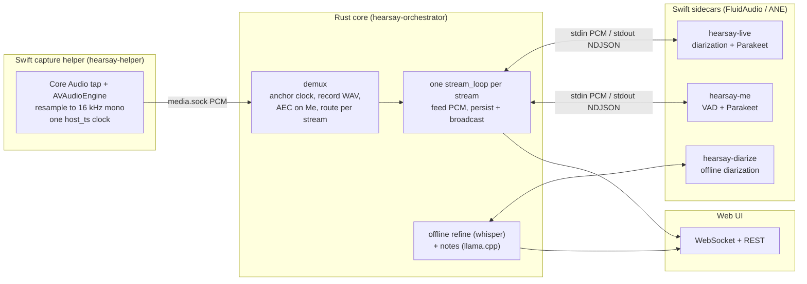

# Audio transcription: a deep review

This document is a source-grounded reference for how Hearsay turns two live audio streams into a
diarized, speaker-attributed, summarized transcript. It traces the full path — **collecting**,
**detecting** speech, **analyzing** it into text, **diarizing** the speakers, and **summarizing** the
result — and quotes the code that implements each stage.

It complements the two narrower docs: `docs/pipeline.md` (prose walkthrough of one meeting) and
`docs/echo-cancellation.md` (the AEC stage). Where they describe, this one shows the mechanism, with
`file:line` citations you can open directly. All snippets are verbatim from the working tree.

## Contents

1. [The shape of the system](#1-the-shape-of-the-system)
2. [Collecting: the Swift capture helper](#2-collecting-the-swift-capture-helper)
3. [Transport: the helper/core IPC contract](#3-transport-the-helpercore-ipc-contract)
4. [Routing and echo cancellation in the core](#4-routing-and-echo-cancellation-in-the-core)
5. [Detecting and analyzing: the live sidecars](#5-detecting-and-analyzing-the-live-sidecars)
6. [Live fan-out: persist, broadcast, transcript](#6-live-fan-out-persist-broadcast-transcript)
7. [Refining: the offline whole-track pass](#7-refining-the-offline-whole-track-pass)
8. [Diarizing: speaker attribution and voiceprints](#8-diarizing-speaker-attribution-and-voiceprints)
9. [Summarizing: local-LLM notes](#9-summarizing-local-llm-notes)
10. [Configuration reference](#10-configuration-reference)
11. [What is wired vs experimental vs planned](#11-what-is-wired-vs-experimental-vs-planned)
12. [Design rationale](#12-design-rationale)

---

## 1. The shape of the system

Hearsay captures two **separate** streams — "Me" (the local microphone) and "Them" (system audio) —
and keeps them separate the entire way through. The separation is what makes speaker attribution
tractable: Me is always the local user and is never diarized; Them is the remote party and is the only
stream that gets diarized.

The work is split across four processes so that the guarded native APIs, the heavyweight ML, and the
web-facing API each live in isolation:



**Process roles** (from `CLAUDE.md` and confirmed in code):

| Process | Crate / target | Responsibility |
|---|---|---|
| Capture helper | `helper/` `hearsay-helper` | The only process touching guarded native APIs (Core Audio tap, AVAudioEngine). Streams 16 kHz PCM. No ML. |
| Live sidecars | `helper/` `hearsay-live`, `hearsay-me` | Streaming VAD + diarization + Parakeet ASR on the Apple Neural Engine. |
| Refine sidecar | `helper/` `hearsay-diarize` | One-shot whole-track diarization + per-speaker voiceprints. |
| Core | `rust/crates/hearsay-*` | Orchestration, PCM routing, AEC, whisper refine, notes LLM, persistence, HTTP/WS API. |

The core spawns and supervises every other process. The two boundaries that matter for audio are the
**helper↔core IPC** (two Unix sockets, §3) and the **core↔sidecar stdio** (length-prefixed PCM in,
NDJSON out, §5).

---

## 2. Collecting: the Swift capture helper

All capture lives in `hearsay-helper`. Two real sources — `MicCapture` ("Me") and `SystemAudioTap`
("Them") — plus a `SyntheticSource` for tests each produce **16 kHz mono float32** into a per-stream
ring. One uplink loop drains the rings, stamps each frame with a monotonic clock, and writes framed
PCM to `media.sock`.

### 2.1 The system-audio (Them) tap

Them is captured with a Core Audio **process tap** configured *global-except-self*, wrapped in a
private aggregate device. Excluding self dodges a per-process-silent bug in some conferencing apps and
still covers browser meetings. `SystemAudioTap.buildGraphLocked()`
(`helper/Sources/hearsay-helper/Audio/SystemAudioTap.swift:109`):

```swift
private func buildGraphLocked() throws {
    let exclude: [AudioObjectID] = selfAudioProcessObject().map { [$0] } ?? []
    let desc = CATapDescription(monoGlobalTapButExcludeProcesses: exclude)
    desc.uuid = UUID()
    desc.isPrivate = true
    desc.muteBehavior = .unmuted  // keep audio audible to the user while tapping
    let tapUID = desc.uuid.uuidString

    var newTap = AudioObjectID(kAudioObjectUnknown)
    let tapStatus = AudioHardwareCreateProcessTap(desc, &newTap)
    guard tapStatus == noErr, newTap != AudioObjectID(kAudioObjectUnknown) else {
        throw CaptureError.createTap(tapStatus)
    }
    tapID = newTap
```

The tap is wrapped in a private aggregate device with drift compensation, and an IOProc drains it.
The real-time IOProc does the minimum — a `memcpy` of the mono float samples into a lock-free ring, no
allocation or resampling on the HAL thread (`SystemAudioTap.swift:10`):

```swift
func process(_ inData: UnsafePointer<AudioBufferList>) {
    let ab = inData.pointee.mBuffers  // mono tap -> a single buffer
    guard let mData = ab.mData, ab.mDataByteSize > 0 else { return }
    let count = Int(ab.mDataByteSize) / MemoryLayout<Float>.stride
    ring.write(mData.assumingMemoryBound(to: Float.self), count: count)
}
```

Self-exclusion resolves this process's Core Audio object by translating its PID
(`kAudioHardwarePropertyTranslatePIDToProcessObject`, `CoreAudioSupport.swift:57`), and the tap format
is strictly validated as mono float32 before use (`SystemAudioTap.swift:124`).

### 2.2 The microphone (Me) stream

Me is captured with `AVAudioEngine`'s input node and a resampling tap on bus 0
(`helper/Sources/hearsay-helper/Audio/MicCapture.swift:85`):

```swift
input.installTap(onBus: 0, bufferSize: 1024, format: inFormat) { [weak self] buf, _ in
    guard let self, let rs = self.resampler else { return }
    let samples = rs.resample(buf)
    guard !samples.isEmpty else { return }
    var nonZero = false
    for s in samples where abs(s) > self.silenceFloor {
        nonZero = true
        break
    }
    self.silence.record(nonZero: nonZero, nowNs: self.clock.nowNs())
    self.ring.write(samples)
}
```

### 2.3 Resampling to 16 kHz mono

Both sources resample with Apple's stateful `AVAudioConverter`, targeting a single fixed format
(`helper/Sources/hearsay-helper/Audio/Resampler.swift:10`):

```swift
static let targetFormat = AVAudioFormat(
    commonFormat: .pcmFormatFloat32, sampleRate: 16_000, channels: 1, interleaved: false)!
```

The converter is kept alive across calls and fed one buffer at a time, returning `.noDataNow` after
each so it treats the stream as continuous (`Resampler.swift:23`). The mic tap resamples inline on the
audio callback; the system tap defers resampling to a 10 ms worker thread so the RT IOProc stays free.

### 2.4 One clock, aligned by timestamp

Every frame is stamped from a single monotonic clock reading `CLOCK_UPTIME_RAW`
(`helper/Sources/hearsay-helper/Clock.swift:8`):

```swift
struct MonotonicClock: Sendable {
    func nowNs() -> UInt64 {
        clock_gettime_nsec_np(CLOCK_UPTIME_RAW)
    }
}
```

The two streams are aligned **by this timestamp, never by sample index** — the mic and system audio
come from independent hardware clocks that drift. The uplink loop stamps both streams from one clock
read per tick and back-corrects `host_ts` for the ring backlog, so `payload[0]` carries the time it was
actually captured (`Serve.swift:355`):

```swift
let backlogNs = UInt64((Double(remaining) / sampleRate) * 1_000_000_000)
var ts = nowNs > backlogNs ? nowNs - backlogNs : 0
if ts <= lastTs[i] { ts = lastTs[i] + 1 }  // strict monotonic per stream
lastTs[i] = ts
```

### 2.5 Ring buffers and the zero-buffer watchdog

The tap path uses two rings: an `SPSCFloatRing` (device-rate, ~2 s, drops newest on overrun) from the
RT IOProc to the resample worker, then a `RingBuffer` (16 kHz, 5 s, drops oldest) that the uplink
drains. Dropping newest vs oldest is deliberate — the raw ring preserves already-committed audio; the
output ring favors recent audio for live transcription.

A flow-based watchdog handles a **stuck tap**: amplitude cannot tell a broken tap from genuinely quiet
system audio, so the watchdog triggers on the *cadence* of audio reaching the ring. On 5 s of no flow
it emits `tap_health: zero_buffers`, rebuilds the whole graph (tap + aggregate device) with exponential
backoff, and emits `tap_health: recovered` when audio returns (`SystemAudioTap.swift:346`). Device
default-output and sample-rate changes proactively trigger the same rebuild. The mic has a parallel
`mic_health` monitor keyed on amplitude, because a revoked TCC grant lets `AVAudioEngine.start()`
succeed while delivering pure zeros.

### 2.6 Testing without hardware

`SyntheticSource` (`--synthetic` / `SYNTHETIC=1`) generates a sine tone directly at 16 kHz mono
(440 Hz for Me, 660 Hz for Them) straight into the output ring, bypassing Core Audio, the resampler,
and all TCC prompts — so the full ring→uplink→socket path is exercisable in CI and off-device.

> **Note on sample format.** The helper emits **float32** on the wire (a zero-cost reinterpret of the
> capture buffer). The int16 conversion happens later, in the core's WAV recorder — not in the helper,
> despite a loose reading of the "16 kHz mono" guardrail in `CLAUDE.md`.

---

## 3. Transport: the helper/core IPC contract

`shared/protocol/ipc.md` is the single source of truth, implemented byte-for-byte by the Rust
`hearsay-ipc` codec and the Swift `HearsayIPC.FrameCodec`, and pinned by golden fixtures validated in
both languages. The core owns (listens on) two Unix sockets in a per-session run directory; the helper
connects back.

```
<run_dir>/media.sock     binary framed PCM        helper -> core   (uni-directional)
<run_dir>/control.sock   NDJSON commands/events   bi-directional
```

### 3.1 The media frame

Every media message is a fixed **28-byte little-endian header** plus payload. The full field layout is
in `hearsay-ipc/src/lib.rs:150` (`MediaFrame`) and the table in `ipc.md`:

| offset | size | field | notes |
|---:|---:|---|---|
| 0 | 1 | `magic` | constant `0xA7` |
| 1 | 1 | `version` | constant `1` |
| 2 | 1 | `type` | `0`=audio `1`=hello `2`=heartbeat `3`=eos |
| 3 | 1 | `stream` | `0`=mic ("me") `1`=system ("them") |
| 4 | 1 | `format` | `0`=int16 `1`=float32 |
| 8 | 4 | `seq` | u32 per-stream monotonic; gaps mean dropped frames |
| 12 | 8 | `host_ts` | u64 ns, monotonic, shared clock; time of `payload[0]` |
| 20 | 4 | `n_samples` | u32 mono sample count |
| 28 | … | `payload` | `n_samples * bytes_per_sample` bytes |

Audio is always mono 16 kHz; the rate is fixed by contract, not carried per frame. The decoder
validates magic and version *before* trusting the length field, and rejects any `n_samples` that would
size an oversized read (`MAX_PAYLOAD_LEN = 16 MiB`), so a corrupt or hostile header cannot drive a huge
allocation (`hearsay-ipc/src/lib.rs:216`, `:298`).

### 3.2 The control channel

`control.sock` carries one UTF-8 JSON object per line — commands (core→helper), replies (correlated by
`id`), and unsolicited events (`hearsay-ipc/src/control.rs`). The core sends `start_capture` with
`tap_mode: "global_except_self"` and `sample_rate: 16000` (the only accepted values); the helper
answers and then streams `status`, `tap_health`, `mic_health`, and `level` events, each carrying a `ts`
on the same clock as the media `host_ts`.

### 3.3 Reading frames in the core

`SwiftHelperSource` (`hearsay-capture/src/lib.rs`) binds the sockets, spawns
`hearsay-helper serve --socket-dir <dir>`, waits for the `hello` event, sends `start_capture`, then
runs a `media_pump` task that decodes frames into a channel of `CaptureChunk`s. It tracks per-stream
`seq` for drop detection and resyncs to the frame magic on any malformed frame rather than tearing
capture down (`hearsay-capture/src/lib.rs:227`). The channel closing on socket EOF is what signals
capture end.

---

## 4. Routing and echo cancellation in the core

The pipeline (`hearsay-orchestrator/src/pipeline.rs`) is a set of trait seams so the whole lifecycle is
testable without hardware or ML:

- `AudioSource` → `SwiftHelperSource` (macOS capture)
- `Transcriber` ×2 → `ProcessTranscriber` (drives one Swift sidecar each)
- `Refiner` → `MacRefiner` (whisper refine)
- `Summarizer` → `SubprocessSummarizer` (spawns the `hearsay-notes` sidecar)

`build_engine` (`hearsay-backends/src/mac.rs:282`) is the composition root; shipped and dev builds use
`--features metal,notes,aec`.

### 4.1 Demux: record, cancel echo, route

One `demux` task reads the single tagged capture stream and splits it. It records the raw WAV *before*
any processing, then routes each stream to its sidecar. Them forwards unchanged and doubles as the AEC
far-end reference; Me is the AEC near-end (`pipeline.rs:313`):

```rust
match stream {
    Stream::Them => {
        let ready = canceller.push_far(t0_s, &samples);
        forward(&them_tx, t0_s, samples, Stream::Them);
        for (mt0, m) in ready { forward(&me_tx, mt0, m, Stream::Me); }
    }
    Stream::Me => {
        for (mt0, m) in canceller.process_me(t0_s, &samples) {
            forward(&me_tx, mt0, m, Stream::Me);
        }
    }
}
```

`forward` uses `try_send` and drops-with-log on a full queue, so a wedged sidecar backs up only its own
stream — never the recorder or the other stream.

### 4.2 Acoustic echo cancellation

When the user is on speakers, the mic picks up the system audio and `hearsay-me` would transcribe the
remote party as the local user. AEC removes that echo using SpeexDSP's MDF adaptive filter, via the
`aec-rs` crate, behind the `aec` feature (`hearsay-orchestrator/src/aec.rs`). Without the feature it is
a pure passthrough.

The hard part is hand-rolled: the two capture streams are variable-length and gappy (the tap emits
nothing while system audio is silent), so a `FrameAligner` turns them into index-aligned 160-sample
(10 ms) near/far pairs on one absolute sample clock. A Me frame is released once the far buffer covers
it, **or** once Me runs 0.2 s ahead of the far end (then the far frame is zero-filled — cancelling
against silence is a near-passthrough, which is correct because a silent far end means no echo)
(`aec.rs:204`). In the other direction the far reference is capped at a trailing 2 s, so a stalled
Me stream (mic device loss) bounds the backlog instead of growing it (`aec.rs:188`). SpeexDSP is
then driven per frame with a 300 ms filter tail — long enough to cover Bluetooth/AirPlay playout
latency in the echo path (`aec.rs:280`):

```rust
for f in &frames {
    let near = to_i16(&f.near);
    let far  = to_i16(&f.far);
    let mut out = [0i16; FRAME];
    self.aec.0.cancel_echo(&near, &far, &mut out);
    cleaned.extend(out.iter().map(|&s| s as f32 / 32768.0));
}
```

AEC affects **only what live transcription sees**. The recorded `audio.wav` stays raw, and the offline
refine reads the raw Them channel — so echo removal never degrades the archive.

### 4.3 Recording the meeting audio

When recording is on (default), `MeetingAudioRecorder` (`hearsay-orchestrator/src/recorder.rs`) writes
one timeline-accurate stereo WAV — **Me on the left, Them on the right, 16 kHz, 16-bit**. Each sample
is placed by meeting time (sample N is meeting second N/16000), and the recorder streams frames as soon
as both channels cover a timestamp, so memory is O(inter-stream skew), not O(meeting length). This one
file serves both in-browser playback and the offline refine (which reads only the Them channel).

---

## 5. Detecting and analyzing: the live sidecars

The two live sidecars are where speech is **detected** and **analyzed** into text. Both use FluidAudio
(pinned `exact: "0.15.4"`, `helper/Package.swift:17`) on the Apple Neural Engine. The core feeds each
one PCM on stdin and reads NDJSON segments on stdout.

The models each sidecar loads, and the compute unit each runs on:

| Role | FluidAudio API | Model (HuggingFace) | Compute |
|---|---|---|---|
| Live Them diarization | `LSEENDDiarizer` / `LSEENDModel` | `FluidInference/ls-eend-coreml` (LS-EEND, AMI, 500 ms step) | **CPU only** (leaves the ANE for Parakeet) |
| Live partials (Them + Me) | `StreamingUnifiedAsrManager` | `FluidInference/parakeet-unified-en-0.6b-coreml` (Parakeet Unified 0.6B, FastConformer-RNNT) | encoder ANE/GPU, decoder CPU |
| Live Them finals (per turn) | `AsrManager` (`AsrModels version: .v3`) | `FluidInference/parakeet-tdt-0.6b-v3-coreml` (Parakeet TDT 0.6B v3) | ANE |
| Live Me VAD | `VadManager` | `FluidInference/silero-vad-coreml` (Silero VAD) | ANE + CPU |
| Offline refine diarization | `OfflineDiarizerManager` | pyannote community-1 segmentation + wespeaker_v2 256-d embeddings + PLDA clustering | mixed |

`hearsay-live` loads **two** Parakeet models: the streaming Unified 0.6B for live partials and the batch
TDT-v3 for per-turn finals. `hearsay-me` uses only the streaming Unified 0.6B (for both its partials and
its finals).

**Latency and windowing.** The streaming Parakeet decodes in 80 ms encoder frames with a 5.6 s left /
1.04 s chunk / 1.04 s right window (7.68 s total context, ~1.04 s decoded per step, ~2.1 s theoretical
latency); the encoder is stateless and only the RNNT decoder state persists. The Silero VAD processes
256 ms (4096-sample) chunks at a 0.85 default threshold. The batch TDT-v3 transcribes each finalized
turn with a fresh decoder state (no cross-turn state).

### 5.1 The sidecar stdio protocol

`SidecarIO` (`helper/Sources/SidecarIO/SidecarIO.swift`) is the shared framing. PCM arrives as
`[u32 LE count][count × f32 LE]` frames; the count is bounded before allocation so one byte of desync
cannot drive a huge read (`SidecarIO.swift:42`):

```swift
public func readAudioFrame(maxSamples: Int = maxInputSamples) -> FrameResult {
    guard let header = readExactly(4) else { return .eof }
    let n = Int(header.withUnsafeBytes { $0.loadUnaligned(as: UInt32.self) })
    if n == 0 { return .empty }
    guard n <= maxSamples else { return .oversize(UInt32(n)) }
    guard let body = readExactly(n * 4) else { return .eof }
    let samples = body.withUnsafeBytes { Array($0.bindMemory(to: Float.self)) }
    return .samples(samples)
}
```

The Rust side frames identically (`hearsay-orchestrator/src/transcriber.rs:162`):

```rust
fn encode_feed(samples: &[f32]) -> Vec<u8> {
    let mut buf = Vec::with_capacity(4 + samples.len() * 4);
    buf.extend_from_slice(&(samples.len() as u32).to_le_bytes());
    for s in samples {
        buf.extend_from_slice(&s.to_le_bytes());
    }
    buf
}
```

Each sidecar emits one NDJSON line per segment: `{"kind":"partial|final","speaker":N,"text":"...",
"start_s":f,"end_s":f}`. Times are relative to the sidecar's first received sample; the pipeline shifts
them to meeting time. A `{"ready":true}` marker is printed once models finish loading, so a multi-minute
first-run model download is distinguishable from a hang. The Rust `SidecarSegment` mirrors the line,
with `kind` defaulting to `final` and `speaker` present only on Them finals
(`hearsay-orchestrator/src/types.rs:41`).

### 5.2 hearsay-me: VAD + streaming ASR

Me is always the local speaker, so there is no diarization. A streaming **Silero VAD**
(`FluidInference/silero-vad-coreml`) marks utterance boundaries, and a `StreamingUnifiedAsrManager`
(streaming Parakeet) transcribes each utterance — growing partials while you speak, a final when the
utterance closes.

The VAD is fed fixed-size chunks and tuned for meeting speech (`helper/Sources/hearsay-me/main.swift:137`):

```swift
let vadConfig = VadSegmentationConfig(
    minSpeechDuration: 0.2, minSilenceDuration: 0.45, speechPadding: 0.2)
```

Shorter `minSilenceDuration` closes quick turn-ends promptly; more `speechPadding` gives the ASR full
word onsets and tails. The read loop drives VAD events into ASR reset/finalize
(`hearsay-me/main.swift:178`):

```swift
if let event = result.event {
    if event.kind == .speechStart {
        speechStart = event.sampleIndex
        fedUpTo = event.sampleIndex
        try? await asr.reset()
    } else if let start = speechStart {  // speechEnd
        let feed = feedFrom(fedUpTo)
        fedUpTo = audioEndAbs()
        await finalizeUtterance(start: start, end: event.sampleIndex, feed: feed)
        speechStart = nil
    }
}
```

To bound memory, the sidecar retains only the tail of Me audio (a 1 s margin below the last-fed sample,
hard-capped at 3 s), dropping the finalized prefix rather than growing for the whole meeting.

### 5.3 hearsay-live: diarization + turn-driven ASR

Them is **turn-driven**, not VAD-driven. A VAD cuts on silence, not on speaker change, so a quick
exchange would land in one utterance a single label cannot split. Instead an **LS-EEND streaming
diarizer** marks speaker turns; as each turn finalizes, that turn's audio is sliced and transcribed by
batch Parakeet into a labeled final. On top of that, a streaming ASR pass produces speaker-less partials
so text appears live.

Three models load, with careful compute-unit placement (`helper/Sources/hearsay-live/main.swift:51`):

```swift
async let lseendModel = LSEENDModel.loadFromHuggingFace(
    variant: .ami, stepSize: .step500ms, computeUnits: .cpuOnly)
let streamManager = StreamingUnifiedAsrManager()
async let streamReady: Void = streamManager.loadModels()
asrTask = Task {
    let models = try await AsrModels.downloadAndLoad(version: .v3)
    let manager = AsrManager(config: .default, models: models)
    ...
}
diarizer = try LSEENDDiarizer(model: try await lseendModel)
```

- The **diarizer** (LS-EEND, AMI variant, 500 ms step) runs `computeUnits: .cpuOnly` on purpose, so it
  runs concurrently with ASR without contending for the ANE.
- The **streaming ASR** (`StreamingUnifiedAsrManager`, live partials) is on the ANE.
- The **batch ASR** (`AsrModels version: .v3` = `FluidInference/parakeet-tdt-0.6b-v3-coreml`) loads and
  ANE-warms in the background, off the ready path, and is awaited only before the first final.

The main loop feeds each PCM chunk to the diarizer; when it finalizes turns, each turn is transcribed
and the streaming partial is re-anchored to the turn boundary (`hearsay-live/main.swift:208`):

```swift
if let update = try diarizer.process(samples: samples, sourceSampleRate: 16_000),
    !update.finalizedSegments.isEmpty
{
    await transcribeAndEmit(update.finalizedSegments)
    let boundary = update.finalizedSegments
        .map { Int(Double($0.endTime) * 16_000) }
        .max() ?? partialAnchor
    await reanchorPartial(to: boundary)
}
```

`transcribeAndEmit` slices each finalized turn's audio by its `[startTime, endTime]`, runs batch
Parakeet on the clip, and emits a `final` carrying the **0-based diarizer speaker index**
(`hearsay-live/main.swift:135`):

```swift
let clip = Array(audio[start..<end])
var state = try TdtDecoderState()
let result = try await asr.transcribe(clip, decoderState: &state)
let text = result.text.trimmingCharacters(in: .whitespacesAndNewlines)
guard !text.isEmpty else { continue }
emitLine(
    Segment(
        kind: "final", speaker: segment.speakerIndex, text: text,
        startS: Double(segment.startTime), endS: Double(segment.endTime)),
    snakeCase: true)
```

Partials are emitted with `speaker: -1` (unknown), because the diarizer only assigns a speaker at turn
end. Like `hearsay-me`, the sidecar drops audio before the last finalized boundary (minus a 2 s margin)
to cap memory.

---

## 6. Live fan-out: persist, broadcast, transcript

Each `stream_loop` (`hearsay-orchestrator/src/pipeline.rs:350`) owns one sidecar, maps sidecar-local
times to meeting time via the stream's offset, and pads silence across real gaps so the mapping stays
correct. It first waits on a shared ANE permit so live inference never runs concurrently with the
offline refine.

`handle` fans each segment out (`pipeline.rs:469`):

- **Me** — always labeled "Me"; partials and finals both broadcast, only finals persisted. Me
  **broadcasts before it persists**.
- **Them partial** — pre-diarization, so streamed speaker-less as "Them", never persisted.
- **Them final** — the 0-based diarizer index becomes a 1-based `Speaker N` label and a per-meeting
  cluster; the segment is **persisted before it is broadcast**:

```rust
let ordinal = seg.speaker.unwrap_or(0) + 1;
let label = format!("Speaker {ordinal}");
let cluster_id = cluster_for(pool, meeting_id, ordinal, clusters).await;
if let Err(err) = queries::insert_segment(pool, meeting_id, role.stream(), &label,
                                          &seg.text, start_s, end_s, cluster_id).await { ... }
publish(broadcast_tx, &TranscriptEvent { kind: Final, stream: "them", speaker_label: &label, ... });
```

The persist-before-broadcast ordering for Them finals is what makes the DB a **superset** of the WS
stream: a slow WebSocket subscriber that falls behind receives a `{"kind":"resync"}` frame and backfills
from `GET /segments`, since every broadcast final is already persisted.

### 6.1 The WebSocket seam

Results reach the UI through a per-meeting `broadcast::Sender<String>` exposed as
`LiveEngine::subscribe`. The WS route (`hearsay-core/src/routes/ws.rs`) subscribes, sends a
`{"kind":"status","state":"warming"}` snapshot if the sidecars are still loading, then forwards each
JSON frame (`ws.rs:66`):

```rust
loop {
    match receiver.recv().await {
        Ok(text) => {
            if socket.send(Message::Text(text.into())).await.is_err() {
                break; // client disconnected
            }
        }
        Err(RecvError::Lagged(_)) => {
            let frame = r#"{"kind":"resync"}"#;
            ...
        }
        Err(RecvError::Closed) => break, // meeting ended
    }
}
```

### 6.2 The transcript file

The live `transcript.md` is appended in arrival order (which interleaves the two streams). At stop,
`close()` sends EOF to each sidecar to flush its tail, then reads every segment back from the database
sorted by `start_s` and atomically rewrites `transcript.md` in timestamp order, grouping consecutive
same-speaker segments under one `### HH:MM:SS — Speaker` header (`hearsay-orchestrator/src/markdown.rs:31`).
The database is the source of truth; the file is a durable projection.

---

## 7. Refining: the offline whole-track pass

The streaming Them labels are good but not authoritative: a whole-track pass clusters globally and
handles overlap better. The refine runs at stop when auto-refine is on (default off) and on demand from
the "Refine speakers" button; both drive `LiveEngine::rediarize`.

The current design transcribes the **entire Them track in one whisper call**, then assigns speakers by
overlap with diarizer turns — not a per-turn transcribe loop. `refine_them_with`
(`hearsay-inference/src/refine.rs:159`):

```rust
pub fn refine_them_with(
    asr: &WhisperAsr,
    diarizer: &dyn Diarizer,
    them_samples: &[f32],
) -> Result<RefineOutput, InferenceError> {
    let diarization = diarizer.diarize(them_samples)?;
    let asr_segments = asr.transcribe(them_samples)?;
    let segments = assemble_refined_segments(&asr_segments, &diarization.turns);
    ...
```

Transcribing whole-track (rather than slicing at turn boundaries) gives whisper full context and never
skips inter-turn audio, so no speech is dropped.

### 7.1 whisper

The binding is `whisper-rs` v0.16 (whisper.cpp). The default model is GGML **large-v3-turbo**
(`outputs/models/ggml-large-v3-turbo.bin`, overridable via `HEARSAY_REFINE_MODEL` or the Settings →
Models panel). Sampling is **greedy** (`hearsay-inference/src/asr.rs:57`):

```rust
let mut params = FullParams::new(SamplingStrategy::Greedy { best_of: 1 });
params.set_language(Some(self.language.as_str()));
params.set_print_special(false);
params.set_print_progress(false);
params.set_print_realtime(false);
params.set_print_timestamps(false);
```

GPU acceleration is a Cargo feature forwarded to whisper-rs — `--features metal` on macOS (also
`vulkan` / `cuda` for other targets); with no feature it runs on CPU.

The refine reads only the **right (Them) channel** of the stereo WAV, at a fixed 16 kHz (a wrong rate
is a hard error), via `hound` (`hearsay-inference/src/audio.rs:52`).

### 7.2 The diarizer sidecar

`SwiftDiarizer` drives the Swift `hearsay-diarize` sidecar as a bounded, file-based subprocess: it
writes the Them track to a temp WAV, spawns the sidecar with the WAV path, drains stdout/stderr on
separate threads, and kills the child on a deadline so a hung sidecar cannot wedge meeting-stop
(`hearsay-inference/src/refine.rs:86`). The sidecar runs FluidAudio's `OfflineDiarizerManager`
(pyannote community-1 CoreML) and returns turns plus each speaker's mean embedding
(`helper/Sources/hearsay-diarize/main.swift:71`):

```swift
let manager = OfflineDiarizerManager()
let result = try await manager.process(url)

let turns = result.segments.map {
    Turn(speaker: $0.speakerId, startS: Double($0.startTimeSeconds), endS: Double($0.endTimeSeconds))
}
let speakerCount = Set(result.segments.map { $0.speakerId }).count
let speakers = (result.speakerDatabase ?? [:]).map {
    SpeakerEmbedding(speaker: $0.key, embedding: $0.value)
}
```

`OfflineDiarizerManager` runs a fuller pipeline than the live LS-EEND diarizer: pyannote community-1
segmentation, wespeaker_v2 256-dimensional speaker embeddings, and agglomerative PLDA/VBx clustering.
Each speaker's returned embedding is the mean of that speaker's segment embeddings — that mean is the
cross-meeting voiceprint the Rust refine stores and matches, so no separate embedder is needed. A silent
track is reported as `noSpeechDetected` and mapped to a benign no-op that leaves existing segments intact.

### 7.3 Assigning speakers by overlap

Each whisper segment is attributed to the diarizer turn it **maximally overlaps**, with a nearest-turn
fallback so no text is ever dropped, then consecutive same-speaker segments are merged
(`hearsay-inference/src/refine.rs:186`):

```rust
let idx = max_overlap_turn(seg.start_s, seg.end_s, &overlap_turns, 0.0)
    .unwrap_or_else(|| nearest_turn(seg.start_s, seg.end_s, turns));
let ordinal = turns[idx].speaker;
match segments.last_mut() {
    Some(last) if last.ordinal == ordinal => {
        last.text.push(' ');
        last.text.push_str(text);
        last.end_s = seg.end_s;
    }
    _ => segments.push(RefinedSegment { ordinal, text: text.to_string(),
                                        start_s: seg.start_s, end_s: seg.end_s }),
}
```

`replace_them_segments` then swaps the live Them segments and clusters for the refined turns in one
transaction (Me is untouched). A refine that yields no turns leaves the transcript intact — neither
path ever wipes a transcript.

---

## 8. Diarizing: speaker attribution and voiceprints

Speaker identity is resolved in four composing layers, all pure logic in `hearsay-attribution` plus the
persistence in `hearsay-db`:

1. **Channel** — Me vs Them. Me is never diarized.
2. **Diarization clusters** — one per-meeting `Speaker N` per diarizer speaker (Them only).
3. **Cross-meeting voiceprints** — a named, locked cluster's centroid becomes recognizable later.
4. **Manual labels** — a rename binds a cluster to a named identity and locks it.

Precedence, realized in `replace_them_segments` (`hearsay-db/src/queries.rs:983`), is **manual (locked)
> recognized (bound, unlocked) > fresh `Speaker N`**.

### 8.1 Ordering and overlap

`order_speakers` numbers diarizer labels 1-based by first appearance in time
(`hearsay-attribution/src/mapping.rs:16`). `max_overlap_turn` / `assign_segment_speaker` map a segment
to the turn it overlaps most, with ties broken to the earliest turn and no-overlap returning `None`
(`mapping.rs:34`):

```rust
pub fn max_overlap_turn(start_s: f64, end_s: f64, turns: &[SpeakerTurn], offset_s: f64) -> Option<usize> {
    let mut best: Option<usize> = None;
    let mut best_overlap = 0.0_f64;
    for (i, turn) in turns.iter().enumerate() {
        let overlap =
            f64::min(end_s, turn.end_s + offset_s) - f64::max(start_s, turn.start_s + offset_s);
        if overlap > best_overlap {
            best_overlap = overlap;
            best = Some(i);
        }
    }
    best
}
```

### 8.2 Voiceprints: L2-normalized cosine matching

Each speaker's raw embedding is L2-normalized to a unit-length centroid before storage
(`hearsay-inference/src/refine.rs:324`), serialized as little-endian float32 bytes on
`clusters.centroid`. Matching is cosine similarity computed in f64, with a length mismatch treated as a
safe non-match (`hearsay-attribution/src/voiceprint.rs:28`, `:57`):

```rust
pub fn match_identity<'a>(
    centroid: &[f32],
    known: &'a [(String, Vec<f32>)],
    threshold: f64,
) -> Option<&'a str> {
    let mut best_name: Option<&'a str> = None;
    let mut best_score = -1.0_f64;
    for (name, vector) in known {
        if vector.len() != centroid.len() {
            continue;
        }
        let score = cosine(centroid, vector);
        if score >= threshold && score > best_score {
            best_score = score;
            best_name = Some(name.as_str());
        }
    }
    best_name
}
```

The threshold is the `speakers.recognition_threshold` setting, **default 0.6**
(`HEARSAY_RECOGNITION_THRESHOLD`), range-validated to `[0, 1]`. Recognition only ever pulls candidate
voiceprints from **other** meetings' named, locked clusters (`KNOWN_VOICEPRINTS_SQL`,
`queries.rs:16`), and binds a match **unlocked** — provisional, so a later manual rename still wins.

### 8.3 Protecting a stable binding across re-diarize

A re-diarize renumbers speakers, so a manual name could be lost. `carry_forward_locked_names`
(`hearsay-db/src/queries.rs:853`) prevents that by voting each old **locked** segment onto the new
ordinal its time span most overlaps, then resolving to a one-name↔one-ordinal bijection by descending
vote count:

```rust
let mut votes: HashMap<(i64, String), usize> = HashMap::new();
for (cluster_id, start_s, end_s) in old {
    let Some(name) = prior_name.get(&cluster_id) else { continue };
    let Some(label) = assign_segment_speaker(start_s, end_s, &turns, 0.0) else { continue };
    let Ok(ordinal) = label.parse::<i64>() else { continue };
    *votes.entry((ordinal, name.clone())).or_insert(0) += 1;
}
```

Only locked bindings vote, each old segment casts one vote, and resolution takes the majority — so a
single misattributed segment cannot flip a stable name. Auto-recognition then skips any ordinal a manual
carry-forward already claimed, so a locked manual label is authoritative.

> **Scope note.** This vote is *within one meeting across a re-diarize* (old locked bindings → new
> ordinals). The broader "weighted majority vote over many sparse hints" (OCR active-speaker, calendar
> roster) described in `CLAUDE.md` is **not implemented**: those `name_hint` / `active_speaker` /
> `roster` events exist only as IPC protocol fixtures with no consumer in the attribution or
> orchestration code. Diarization today is channel + clusters + voiceprints + manual labels.

### 8.4 Fallback and manual labeling

An unbound cluster surfaces as `Speaker N` at every layer (live, refine, and the API read model). The
REST surface (`hearsay-core/src/routes/speakers.rs`) lists clusters, renames one (validating 1–255
chars, then atomically locking + relabeling), lists known identities as rename suggestions, and triggers
a re-diarize (refused while the meeting is live).

---

## 9. Summarizing: local-LLM notes

Notes are optional: off by default, running in the bundled `hearsay-notes` sidecar and requiring a downloaded
GGUF model. When enabled, stopping a meeting (or the manual "Generate notes" route) runs one local-LLM
pass over the finalized transcript through `llama-cpp-2` (llama.cpp), the in-process sibling of the
whisper embed.

The prompt wraps the transcript in a `{transcript}` placeholder and a strict output format
(`hearsay-inference/src/notes.rs:27`):

```rust
pub const DEFAULT_NOTES_PROMPT: &str = "You are a meeting assistant. Read the transcript and \
     produce a concise summary and a list of concrete action items.\n\n\
     Meeting transcript:\n\n\
     {transcript}\n\n\
     Reply in exactly this format:\n\
     SUMMARY:\n\
     <2 to 4 sentences>\n\
     ACTION ITEMS:\n\
     - <action item>\n\
     - <action item>\n\
     Write \"- none\" under ACTION ITEMS if there are none.";
```

`build_prompt` substitutes the transcript (appending it if the placeholder is absent so it is never
dropped) and wraps it in ChatML turns; the transcript is first sanitized to neutralize any embedded
ChatML control tokens — a prompt-injection guard. Generation is greedy, the model is loaded per call
and dropped on return (so the ~GB weights are resident only during generation), and the KV context is
sized to the actual prompt-plus-generation need and capped at 16k tokens
(`hearsay-inference/src/notes.rs:247`). The transcript is fit to a token budget so a long or
dense-script meeting cannot overflow the cache. Output is parsed tolerantly into
`{ summary, action_items }` and written to `notes.md`. Notes are best-effort: a missing model or a
generation error is logged and never fails the meeting.

The in-app download manager (`hearsay-core/src/models.rs`) offers a curated catalog of Apache-2.0 GGUF
instruct models (Qwen3-4B-Instruct recommended, Qwen3-1.7B, SmolLM3-3B), with resumable, SHA256-verified,
GGUF-magic-checked downloads, and re-points the effective model preference on completion — applied to
the next generate with no restart.

---

## 10. Configuration reference

Everything flows through a typed `Settings` object (`hearsay-core/src/config.rs`); feature code never
reads env vars ad hoc. Model and prompt choices additionally resolve their **effective** value from the
DB preferences at each run, so a Settings change applies without a restart.

| Env var | Default | Purpose |
|---|---|---|
| `HEARSAY_HELPER_PATH` | build-relative | Path to `hearsay-helper`; the `-live` / `-me` / `-diarize` sidecars resolve as siblings. |
| `HEARSAY_FLUID_MODELS_DIR` | unset | Bundled FluidAudio live models seeded into its cache on first launch (set by the desktop shell; unset in dev, where FluidAudio downloads them). |
| `HEARSAY_RECORD` | `true` | Keep one stereo WAV per meeting. Off disables the refine (nothing to re-diarize). |
| `HEARSAY_AUTO_REFINE` | `false` | Run the offline refine automatically at stop. |
| `HEARSAY_REFINE_MODEL` | `outputs/models/ggml-large-v3-turbo.bin` | GGML whisper model for the refine. |
| `HEARSAY_REFINE_TIMEOUT_SECS` | `1800` | Deadline for the `hearsay-diarize` subprocess. |
| `HEARSAY_RECOGNITION_THRESHOLD` | `0.6` | Cosine threshold to bind a speaker to a prior voiceprint. |
| `HEARSAY_NOTES` | `false` | Enable the notes step (needs the bundled `hearsay-notes` sidecar + a model). |
| `HEARSAY_NOTES_MODEL` | empty | GGUF instruct model for notes. |
| `HEARSAY_NOTES_PROMPT` | built-in template | Notes prompt (`{transcript}` placeholder). |
| `HEARSAY_MODELS_DIR` | `outputs/models` | Where the download manager writes notes models. |

---

## 11. What is wired vs experimental vs planned

| Component | Status |
|---|---|
| Swift capture (`SwiftHelperSource` + tap + mic) | Wired, macOS. |
| Live sidecars (`hearsay-live`, `hearsay-me`, FluidAudio/ANE) | Wired, macOS. |
| AEC (SpeexDSP via `aec-rs`) | Wired under the `aec` feature (in `rust-serve` / `dmg`); passthrough without. |
| Stereo WAV recorder | Wired, gated by the `record` setting. |
| whisper offline refine + `hearsay-diarize` | Wired, macOS. |
| Notes (llama.cpp via `llama-cpp-2`) | Runs out-of-process in the `hearsay-notes` sidecar. |
| `sherpa_diarize.rs` / `sherpa_streaming.rs` / `SherpaTranscriber` (sherpa-onnx) | Experimental cross-platform / Windows path, behind the `sherpa` feature — **not compiled into the macOS build**. |
| OCR / calendar-roster / active-speaker hint fusion | **Planned** — protocol fixtures exist, no consumer. |

Windows is the remaining work: it reuses the same `demux` and refine seams with the sherpa transcriber
and diarizer in place of the FluidAudio sidecars, deferring Them diarization entirely to the offline
refine.

---

## 12. Design rationale

- **Two separate streams.** Keeping Me and Them apart from capture makes attribution a channel decision
  first; only the remote stream needs diarization.
- **One `host_ts` clock.** The mic and system audio come from independent hardware clocks that drift.
  Stamping both from one monotonic clock in the helper makes cross-stream alignment exact, so everything
  downstream aligns by time, never by sample index.
- **Sidecars on the Neural Engine.** Running live ASR and diarization on the GPU makes the two models
  contend, and a contended Metal pipeline can enter an unrecoverable state. On the ANE they co-schedule
  with negligible interference; the diarizer is pushed to the CPU so it never contends with Parakeet.
  Each model in its own subprocess also keeps the core's live path free of heavyweight ML.
- **Turn-driven Them, VAD-driven Me.** A VAD cuts on silence, not speaker change, so fast turn-taking
  would collapse into one label. The diarizer's turns are the segments for Them; Me needs no diarization.
- **Re-diarize after stop.** The streaming diarizer works online with limited context. A cheap
  whole-track pass on the ANE ends every meeting with authoritative labels and recognizes returning
  people by voiceprint.
- **Finals-only on disk, rewritten at finalize.** A live append cannot reorder past writes; a
  meeting-relative sort re-read from the database produces a readable final document with any corrected
  names baked in.
