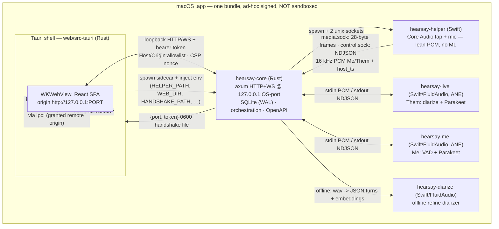
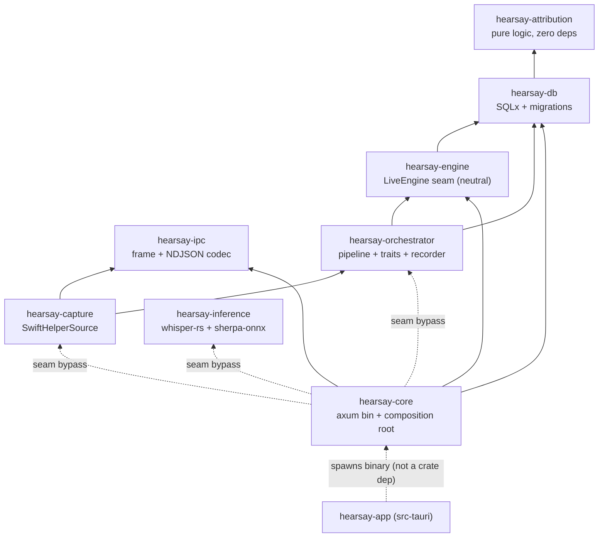
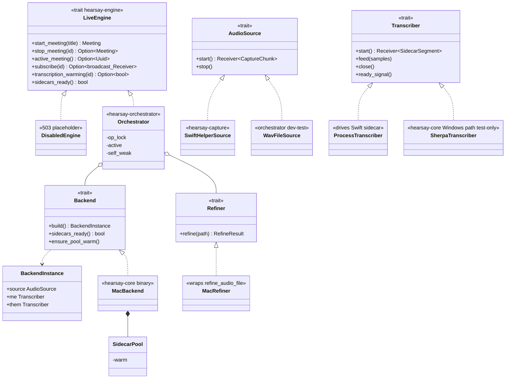
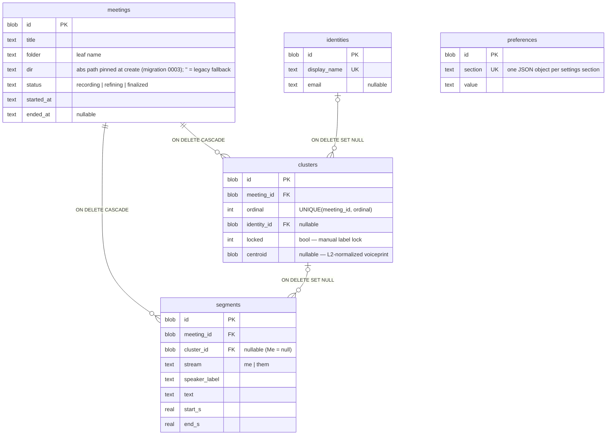
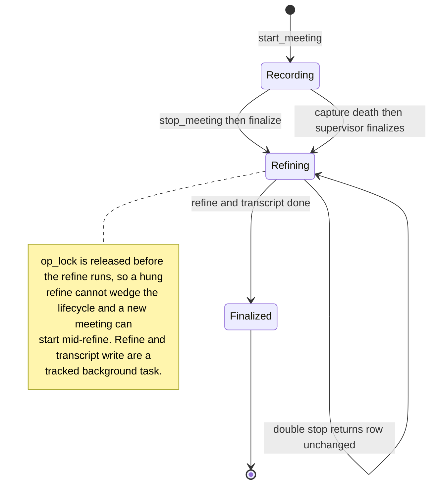
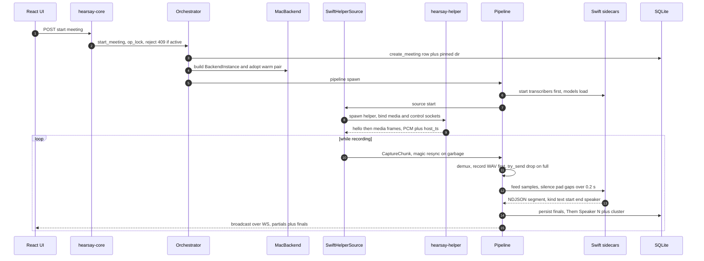
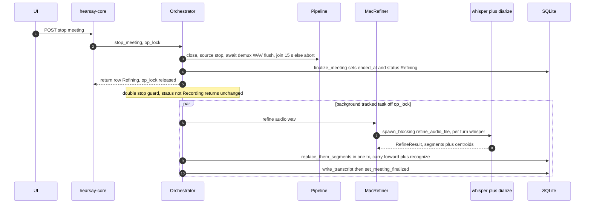

# Hearsay — Design Review & Architecture (UML)

Method: this document is derived from the **source code** (crate manifests, trait definitions,
call edges, SQL schema, socket wiring, Swift capture code), not from the other design docs — where
the two diverge, the code is authoritative. Reviewed at `main` (post `feat/packaging-dmg-uninstall`
merge). Diagrams are Mermaid so they render in GitHub and stay editable.

Reading order: sections 1-5 are **how it works** (topology, components, the central abstraction,
data model, runtime behavior). Section 6 is **why** the notable choices were made (each tied to
code). Section 7 is the **design review** (strengths, then prioritized issues). Section 8 is the
prioritized recommendation list.

---

## 1. System overview

Hearsay is a local-first meeting transcriber. It captures the local mic ("Me") and system audio
("Them") as **separate** 16 kHz streams, transcribes both live, diarizes Them into `Speaker N`,
and — after stop — runs an offline re-diarize + re-transcribe "refine". It ships as one macOS
bundle. Everything runs on-device; nothing leaves the machine.

It is deliberately **multi-process**, split along a capability/isolation boundary rather than a
functional one:

Process responsibilities and why the boundary sits where it does:

- **Tauri shell** (`hearsay-app`) owns the OS window and the child-process lifecycle. It spawns
  exactly one child — `hearsay-core` — and holds its handle in `CoreChild(Mutex<Option<CommandChild>>)`
  (`web/src-tauri/src/main.rs:18,252`). It never touches the Swift processes; the core does.
- **hearsay-core** is the single backend: the loopback HTTP+WS API, SQLite persistence, and the
  orchestration that spawns/feeds the Swift processes. It runs **no live ML** — only the offline
  whisper refine is in-process.
- **hearsay-helper** is the only process that touches TCC-guarded native APIs (Core Audio tap,
  AVAudioEngine). It is a lean PCM streamer with **no FluidAudio/CoreML linkage** (verified:
  `helper/Package.swift:27` — depends only on the dependency-free `HearsayIPC`).
- **Swift sidecars** (`hearsay-{live,me,diarize}`) are the audio-AI, isolated so the heavy CoreML
  dependency never touches the capture binary and each model runs in its own address space on the
  Apple Neural Engine.

---

## 2. Component & crate architecture

Eight Rust crates plus a separate Tauri crate. Edges below are the **actual `path` dependencies**
from the `Cargo.toml` files.

| Crate | Responsibility | Notable deps |
|---|---|---|
| `hearsay-ipc` | 28-byte LE media-frame codec + NDJSON control codec; source of truth for the wire contract, pinned by golden fixtures | none internal |
| `hearsay-attribution` | Pure attribution primitives: `assign_segment_speaker`, `match_identity`, cosine, centroid bytes | **zero deps** |
| `hearsay-db` | SQLite via SQLx: row types, queries, forward-only migrations; the attribution *policy* (vote + recognition) lives here | → `attribution` |
| `hearsay-engine` | The neutral `LiveEngine` trait + `DisabledEngine`. Exists solely to break the core↔orchestrator cycle | → `db` |
| `hearsay-orchestrator` | Implements `LiveEngine`; the live pipeline (demux → per-stream loop → persist/broadcast), recorder, `Backend`/`AudioSource`/`Transcriber`/`Refiner` traits, `ProcessTranscriber` | → `engine`, `db` |
| `hearsay-capture` | `SwiftHelperSource` (spawns + drives `hearsay-helper` over the sockets); the TCC probe | → `orchestrator`, `ipc` |
| `hearsay-inference` | Offline whisper ASR + the refine (shells out to `hearsay-diarize`); **plus** the pure-Rust sherpa streaming/diarize modules for the (unbuilt) Windows path | `whisper-rs`, `sherpa-onnx` (both external; **no** internal deps) |
| `hearsay-core` | Application binary: axum HTTP+WS, serves the SPA, the composition root that constructs `MacBackend`/`MacRefiner` | → **all six** |
| `hearsay-app` | Tauri shell; spawns the `hearsay-core` binary | `tauri` |

Two structural facts from this graph drive the review:

1. **`hearsay-core` depends on `orchestrator` + `capture` + `inference` directly** — the exact
   concrete crates the `engine` seam was built to hide. The intended shape (core → `engine` only,
   backends assembled elsewhere) is only half-realized; see Finding A1.
2. **`hearsay-inference` has no internal deps**, so it cannot reuse `hearsay-attribution` and instead
   re-implements ordinal assignment and centroid math; see Finding B2.

---

## 3. The central abstraction: the `LiveEngine` seam + injected backends

The meeting lifecycle and the live-transcript stream are the only parts of the API that need a
running capture+inference pipeline. Everything else (reads, pure DB writes, serving) is
engine-independent. That boundary is drawn with one trait, `LiveEngine`, placed in its **own crate**
so the API can consume it and the orchestrator can implement it without a dependency cycle
(`hearsay-engine/src/lib.rs:1-9`). `DisabledEngine` answers those routes with 503 / a clean WS close,
and the entire API test suite runs against it — no ML, no capture.

Below the engine, the orchestrator injects four more traits so the whole lifecycle is testable with
fakes over in-memory SQLite:

The seam is tested at **three fidelity levels**, which is a genuine strength: pure scripted fakes
(`testing.rs`), a real `ProcessTranscriber` over a `mock_sidecar` binary, and a full
`WavFileSource → Orchestrator → SQLite` end-to-end run. The only pieces not exercised in `cargo test`
are the Swift sidecars themselves and `refine_audio_file` (both need real models).

**But the seam is bypassed at the composition root.** `MacBackend` and `MacRefiner` are defined in
`hearsay-core/src/main.rs` (not behind the engine), `SherpaTranscriber` lives inside the HTTP crate
(`hearsay-core/src/streaming_transcriber.rs`), and `POST /rediarize` calls `hearsay_inference`
directly (`routes/speakers.rs`). That is why `hearsay-core` pulls in `orchestrator`+`capture`+
`inference` (section 2). See Findings A1-A3.

---

## 4. Data model

SQLite, five tables, UUID (BLOB) PKs, RFC3339 TEXT timestamps, lowercase-text enums.

- `meetings` is the aggregate root; deleting one cascades its `segments` and `clusters`.
- `clusters` is the join between a meeting's diarizer speakers (`ordinal`) and global, cross-meeting
  `identities`; `centroid` holds the voiceprint used to auto-recognize returning speakers.
- `segments` optionally point at a `cluster` (Them) or not (Me).
- `preferences` is a schema-free key/value settings overlay: one JSON object per section, resolved as
  "stored override, else config default".
- One index: `ix_segments_meeting_start(meeting_id, start_s)`. There is **no** index on
  `segments.cluster_id` (rename/cascade full-scan segments) or `clusters.identity_id`.

---

## 5. Runtime behavior

### 5.1 Meeting lifecycle

A gap: this machine has no path back to a terminal state after a **hard crash** — nothing on
startup reconciles a row left `recording`/`refining` (Finding R3).

### 5.2 Start → live capture → transcribe → persist → broadcast

Per-meeting concurrency (channels are the important part for reasoning about backpressure):
`capture_rx` (mpsc, cap 1024) → `demux` → `me_tx`/`them_tx` (mpsc, cap **128**, `try_send`
drop-on-full) → two `stream_loop`s → sidecar `feed`; segments return on **unbounded** `emit`
channels; everything user-visible fans out through a `broadcast` channel (cap 256) to WS subscribers.

### 5.3 Stop → finalize → background refine

### 5.4 Capture-helper crash (supervision)

`media_pump`'s `read_exact` hits EOF → the capture channel closes → the demux loop ends and finalizes
the WAV → because `intentional_stop == false`, it fires a `died` oneshot → the per-meeting capture
supervisor `weak.upgrade()`s the orchestrator and calls `stop_meeting`, which clears `active`,
finalizes the row, and drops the pipeline (closing the broadcast, so live WS subscribers observe
`Closed`). Covered by `capture_death_finalizes_the_meeting`.

### 5.5 IPC media framing

`media.sock` carries a fixed 28-byte little-endian header + payload (helper → core, uni-directional);
`control.sock` carries NDJSON commands/replies/events (bi-directional). The Rust `hearsay-ipc` codec
and the Swift `HearsayIPC.FrameCodec` are byte-for-byte identical (verified against
`shared/fixtures/frames.jsonl`, checked by both `cargo test` and `hearsay-helper selftest`).

| off | size | field | notes |
|---:|---:|---|---|
| 0 | 1 | magic | `0xA7` |
| 1 | 1 | version | `1` |
| 2 | 1 | type | 0 audio · 1 hello · 2 heartbeat · 3 eos |
| 3 | 1 | stream | 0 me · 1 them |
| 4 | 1 | format | 0 int16 · 1 float32 |
| 5 | 1 | flags | reserved |
| 6 | 2 | reserved0 | 0 |
| 8 | 4 | seq | u32, per-stream; gaps = dropped frames |
| 12 | 8 | host_ts | u64 ns, one monotonic clock shared by both streams |
| 20 | 4 | n_samples | u32 mono count |
| 24 | 4 | reserved1 | 0 |
| 28 | … | payload | `n_samples × bytes_per_sample` |

**Two timelines, bridged by timestamp.** Media frames carry `host_ts` from one process-global
`CLOCK_UPTIME_RAW` (`helper/Sources/hearsay-helper/Clock.swift:11`), so Me and Them share a timeline
and are aligned by time, never by sample index. Sidecar **segments**, however, are in
sample-relative seconds (`sampleIndex / 16000`) on a *different* clock; the pipeline bridges them with
a per-stream `offset` captured from the first fed chunk (`pipeline.rs:303`, applied at `:401`).

---

## 6. Why these designs were chosen (rationale, tied to code)

- **Multi-process split by capability, not function.** All TCC-guarded work is in one lean helper;
  all heavy CoreML is in per-model sidecars; the core's live path stays ML-free. This keeps the
  capture binary FluidAudio-free (`Package.swift:27`), isolates model crashes to a subprocess the
  warm pool can evict, and lets each model own its address space on the ANE.
- **`LiveEngine` in a third crate.** A neutral seam is the only way the API crate and the
  orchestrator crate can depend on the same abstraction without a cycle; `DisabledEngine` then makes
  every non-live route testable with zero ML/capture (`hearsay-engine/src/lib.rs:1-9`).
- **One `host_ts` clock, alignment by time.** Mic and system audio come from independent hardware
  clocks that drift; stamping both from one monotonic clock in the helper makes cross-stream
  alignment exact and makes the stereo recorder's timeline-placement correct.
- **Live = light + speaker-less partials; diarization authoritative offline.** Live Them partials are
  broadcast speaker-less; the diarizer's *turns* are the segments (a VAD would cut on silence, not on
  speaker change). A whole-track refine at stop clusters globally, handles overlap, and recognizes
  returning speakers by voiceprint — cheap on the ANE, and it removes GPU contention entirely (the
  reason the FluidAudio/ANE path exists). This is also what makes a unified whisper.cpp/ONNX Windows
  path plausible (live is light; the hard diarization is offline).
- **Warm sidecar pool off the start path.** CoreML model load is multi-second; a meeting always
  *adopts* a pre-spawned, already-loading pair rather than cold-spawning a second pair that would
  race it on the ANE (`main.rs:25-32`). Re-warm happens only when the ANE is free (after stop / idle).
- **Streaming stereo WAV, O(skew) memory, captured level.** No whole-meeting buffer and no global
  peak-normalize (which would force one); RAM is bounded by inter-stream skew, and playback gain is a
  UI concern (`recorder.rs:10-14`).
- **Refine off the op-lock, best-effort.** Stop returns promptly with an interim `Refining` status;
  a hung refine can't wedge start/stop and a new meeting can start mid-refine.
- **Loopback security as a real boundary.** Loopback is not itself a boundary, so: a per-session
  bearer token gates every request; a Host/Origin allowlist defends against DNS-rebinding/cross-site;
  the token is delivered per channel (bearer header for fetch, `?token=` for the three channels that
  can't set headers — SPA nav, `<audio>`, WS); the token reaches the shell via a 0600 handshake file,
  never stdout; the SPA keeps it in memory only. This is above-average for a local app.
- **IPC contract + golden fixtures generated from one side.** `shared/fixtures/frames.jsonl` is
  generated from Rust and validated by both languages in CI, so the two codecs cannot silently drift.

---

## 7. Design review

### 7.0 Strengths worth preserving

- The trait seams (`LiveEngine`/`AudioSource`/`Transcriber`/`Refiner`/`Backend`) tested at three
  fidelity levels — keep new features behind them.
- The security primitives in `security.rs` (constant-time compare, Host/Origin parsing, bind guard,
  per-request CSP nonce, `ws://{host}` pinning) and the error-leak discipline (`ApiError::Db`/`Internal`
  render as literal "internal error", real error only logged).
- DB transactional discipline: `replace_them_segments` reads pre-delete state and commits atomically;
  the empty-refine no-op never wipes a transcript.
- The realtime-audio discipline in `SystemAudioTap`: a memcpy-only HAL IOProc into a lock-free ring
  with resampling on a worker thread; a flow-cadence (not amplitude) watchdog; per-session `StopFlag`
  teardown; bounded socket writes so a stalled core can't pin the media lock.
- The frontend conventions: exactly one fetch wrapper, token in memory (never web storage), a typed
  query-key factory, client-level error handlers, codegen'd REST types with a CI drift gate, and a
  correct Tauri invoke-vs-HTTP split.

**Already hardened (verified present in the current tree)** — do not re-recommend these: bounded
child-process awaits (`transcriber.rs` `with_close_timeout`, refine deadline), `kill_on_drop`
everywhere, refine moved off the op-lock with a `Refining` status, token-gated `GET /`, the 0600
handshake, `ensure_bind_allowed`, the RT tap restructure (`SPSCFloatRing`), recorder off the
ASR-backpressure path, media-frame magic-resync + seq-gap logging, and the shared `SidecarIO` target.

### 7.1 Architecture & layering

**A1 — The `LiveEngine` seam is bypassed at the composition root. [High]**
`hearsay-core` depends on `orchestrator` + `capture` + `inference` directly (section 2), because the
production glue (`MacBackend`, `MacRefiner`, `SidecarPool`) lives in `main.rs:137,183` with no
`#[cfg(target_os)]` fork point. The web crate thus links the entire backend stack the seam was meant
to hide, and there is nowhere clean to add a `WindowsBackend`.
*Fix:* extract a `hearsay-backends` crate that owns platform backend selection; `hearsay-core` returns
to depending on `hearsay-engine` only; the binary wires `core` + `backends`.

**A2 — `POST /rediarize` re-implements the entire refine inline. [High]**
`routes/speakers.rs:78-164` hand-rolls existence checks, model/threshold resolution,
`spawn_blocking(refine_audio_file)`, `NoSpeech` handling, `RefineResult` assembly,
`replace_them_segments`, and the transcript rewrite — a near-duplicate of `MacRefiner::refine`
(`main.rs:185`) + the orchestrator's auto-refine, and the two already diverge. This violates the
"routers stay thin; business logic in the orchestrator" rule and guarantees drift between manual and
automatic refine.
*Fix:* add `LiveEngine::rediarize(meeting_id)`; reduce the route to validate → call → map error →
respond, sharing one refine implementation. (Also add the active-meeting guard, R2.)

**A3 — `SherpaTranscriber` (a live-pipeline worker) ships inside the HTTP crate. [Med]**
`hearsay-core/src/streaming_transcriber.rs` is a complete `Transcriber` for the Windows path, but its
only consumer is `tests/streaming_pipeline.rs`; `main.rs` never wires it. Live-transcription logic in
the web-API crate is a layering smell and bloats the binary's crate.
*Fix:* move it into the `hearsay-backends` (or a `hearsay-live-sherpa`) crate that depends on both
orchestrator and inference.

### 7.2 Cross-platform readiness (the sherpa/FluidAudio fork)

**B1 — sherpa-onnx is compiled and linked into the shipping macOS binary for code no macOS path runs. [Med]**
Definitive finding across the call graph: on macOS the sherpa path (`SherpaDiarizer`,
`SherpaTranscriber`) is **dead at runtime** — reachable only from `#[ignore]` tests — yet
`sherpa-onnx` is a **non-optional** dependency (`hearsay-inference/Cargo.toml:11`) and the modules are
declared with no `cfg` gate (`lib.rs:16-18,27`). So the DMG carries the whole onnxruntime native stack
(build time + binary size + supply-chain surface) for nothing on the canonical platform.
*Fix:* make `sherpa-onnx` `optional = true`; put the sherpa modules + `SherpaTranscriber` behind a
`sherpa` (or Windows-target) feature; leave it off for the macOS bundle.

**B2 — The refine has no `Diarizer` seam, so the Windows diarizer cannot plug in. [Med]**
`refine_them` hard-spawns the Swift subprocess (its parameter is `diarize_binary: &Path`,
`refine.rs:73-75,148`), including a fragile `stderr.contains("noSpeechDetected")` contract.
`SherpaDiarizer` was deliberately built to mirror the sidecar's output shape (`sherpa_diarize.rs:64`)
but nothing can consume it — the documented Windows path is blocked by a missing abstraction.
*Fix:* introduce a `Diarizer` trait returning `{turns, per-speaker embeddings}`; implement it for the
Swift-subprocess and for `SherpaDiarizer`; make the sidecar contract structured (exit code / stdout
JSON), not a stderr substring.

**B3 — First-appearance ordinal logic is implemented three times; the canonical copy is unused. [Med]**
`hearsay_attribution::order_speakers` (`mapping.rs:16`) has **zero callers**, while the same rule is
re-implemented inline in `refine.rs:100-109` and `sherpa_diarize.rs:140-145` (with a u32/i64
divergence between them). This is a direct consequence of `hearsay-inference` having no internal deps
(section 2).
*Fix:* depend on `hearsay-attribution` (it is dependency-free) and call `order_speakers` from both,
or delete the unused export.

### 7.3 Correctness & robustness

**R1 — The recorder's absolute-position resize is uncapped → OOM/panic on a clock jump. [Med]**
`recorder.rs:98,108-110`: `target = round(t0_s × rate)` then `data.resize(end, 0.0)` with **no
ceiling** — unlike the pipeline, which caps its silence pad at 5 minutes precisely for this
(`MAX_SILENCE_PAD_SAMPLES`). `t0_s` derives from helper `host_ts`, which is validated for frame
structure but not for monotonicity/bounds. A sleep/resume or a garbage `host_ts` can drive a
multi-GB/TB allocation and a process abort.
*Fix:* clamp the forward jump in `write` the same way the pipeline caps its pad (log the excess), or
validate `host_ts` bounds in `media_pump`.

**R2 — No route consults `active_meeting()`; delete/rediarize can operate on the live meeting. [Med]**
`active_meeting()` exists for exactly this, but `delete_meeting` (`routes/meetings.rs`) and
`/rediarize` (`routes/speakers.rs`) don't check it — delete pulls the folder out from under the
running pipeline; rediarize reads a partially-written WAV.
*Fix:* return 409 when `id == active_meeting()`.

**R3 — No startup reconciliation of stranded meetings. [Med]**
Graceful shutdown finalizes the active meeting (`main.rs:298-308`), but a hard crash
(SIGKILL/panic/power loss) leaves the row `recording` (or `refining` if it died mid-finalize), and
nothing on boot sweeps non-terminal rows — so it renders as live/refining forever.
*Fix:* on startup, mark any `recording`/`refining` row with no active session as `finalized`/`failed`
and write its transcript from persisted segments.

**R4 — Live WS silently drops finalized segments on lag/reconnect, with no client backfill. [Med]**
Server side, `ws.rs:73` treats `RecvError::Lagged` as `continue` on a broadcast buffer that carries
**finals**; client side, `useSegments` is fetched once with no refetch and `ws.ts` reconnects with
backoff but never backfills. A brief consumer lag or a reconnect permanently loses finalized lines
until stop re-seeds — the live view diverges from persisted state with no signal.
*Fix:* on `Lagged` (server) push a `resync`/cursor status; on reconnect (client) invalidate
`queryKeys.meetings.segments(id)` (the reducer already merges non-replace while live) or add a modest
`refetchInterval` while recording.

**R5 — Stripping `?token=` breaks reload and crash-recovery. [Med — High within the recovery path]**
`token.ts:24,30-42` removes `?token=` after first load, but the core requires it on every `GET /`
(`web.rs:78`) and the injected `window.__HEARSAY_TOKEN__` does not survive a full document reload. So
the `ErrorBoundary`'s `window.location.reload()` (the packaged app's only crash recovery) and any
manual Cmd-R re-request `/` tokenless → 401 blank window.
*Fix:* don't strip on loopback (the core already gates on the token), or have the shell set an
`HttpOnly` cookie the core also accepts, or have the ErrorBoundary re-navigate to a cached-token URL.

**R6 — Blocking mic-permission prompt held under `stateLock`. [Med]**
`Serve.swift:197,215`: in the non-synthetic branch `startCapture` calls the blocking
`requestMicrophone()` (waits on the modal TCC dialog) **while holding `stateLock`**, which the single
control thread and a SIGTERM-driven `stopCapture` also need. If the user ignores the dialog, the
helper is unresponsive and unkillable-by-signal. Usually hidden because onboarding runs
`check_permissions` first.
*Fix:* move the `undetermined → requestMicrophone` probe out of the `stateLock` critical section.

### 7.4 Concurrency policy (ANE scheduling)

**P1 — Background refine can contend with the next meeting's live sidecars on the ANE. [Med]**
The warm pool is meticulously kept off the ANE during a meeting (`main.rs:149-151`), yet the
auto-refine (`hearsay-diarize` + whisper) runs on an untracked background task off the op-lock
(`orchestrator.rs:373`) and can execute concurrently with the next meeting's live sidecars —
contending for the very ANE the warm-pool logic protects.
*Fix:* serialize refine against live capture with a shared ANE permit/semaphore, or defer refine while
a meeting is active.

**P2 — The cross-platform `Backend` trait encodes a macOS-ANE scheduling policy. [Med — leaky abstraction]**
`ensure_pool_warm`/`sidecars_ready` are neutral by signature, but the trait *doc* and the
orchestrator's call-site reasoning bake in Apple-Neural-Engine vocabulary ("a warm that lost an ANE
race", "starve the live sidecars on the ANE", `traits.rs:85-90`, `orchestrator.rs:419-423`). *When*
the cross-platform orchestrator warms is driven by ANE logic that may be wrong for a Windows GPU/CPU
backend.
*Fix:* replace the two ANE-motivated call sites with neutral lifecycle notifications
(`on_meeting_started`/`on_meeting_ended`/`on_idle`) and let each `Backend` own its warm policy.

**P3 — `sidecars_ready()` is a read with a process-spawning side effect. [Med]**
`orchestrator.rs:415-425` calls `ensure_pool_warm()` (which can spawn sidecars) inside the
`sidecars_ready` query, and the UI polls it via the meeting-status route (`meetings.rs:35`). A read
endpoint thus spawns processes; polling frequency is coupled to warm-pool recovery.
*Fix:* move recovery to a dedicated background "warm ticker"; keep `sidecars_ready` a pure read.

**P4 — `install_self` is a mandatory-but-forgettable init step. [Med]**
If a consumer `Arc`-wraps the `Orchestrator` but forgets `install_self()`, the capture supervisor's
`weak.upgrade()` is always `None`, so a **capture death silently fails to finalize** — the exact
failure the supervisor exists to prevent.
*Fix:* construct via `Arc::new_cyclic` so the weak self-ref is always set.

### 7.5 Performance

**F1 — The refine runs one whisper call per diarizer turn, each padded to a 30 s window. [Med]**
`refine.rs:113-136`: compute scales with **turn count**, not speech length, because whisper.cpp pads
every call's mel to 30 s. Metal (`--features metal`) reduces the constant but not the O(turns) factor,
and `make rust-build`/`cargo test` build CPU-only.
*Fix:* batch short adjacent same-speaker turns before transcribing, or whole-track transcribe + align
to turns; keep Metal on for the bundle.

**F2 — `GET /settings` does sequential DB round-trips + a double storage resolve + a full disk walk. [Low]**
`settings.rs:147-158` awaits four resolvers serially, then `storage_info` resolves storage **again**
and runs a recursive `dir_size` stat-walk of the recordings tree on every settings open.
*Fix:* resolve storage once and pass it down; cache/curb `dir_size`.

### 7.6 Security & cross-cutting HTTP hygiene

**S1 — Security headers are set only on `GET /`. [Med]**
`web.rs:101-108` sets CSP/nosniff/X-Frame-Options/Referrer-Policy on the index HTML only; `/assets/*`,
`/api/*` JSON, `/openapi.json`, and the audio stream get none.
*Fix:* add a `tower_http` response-header layer applying `X-Content-Type-Options: nosniff` +
`X-Frame-Options: DENY` to all responses; keep the per-request CSP+nonce on the index.

**S2 — No access log / request-correlation ID. [Med]**
`create_app` installs only the two auth middlewares; there is no `TraceLayer`, request-id, or
per-request access log (contradicting the observability rules), and the frontend wrapper sends no
`X-Request-Id`.
*Fix:* add a `TraceLayer` with a redacting span (strip `?token=`, which rides on audio/WS URLs) and a
generated request-id echoed as a header; have `client.ts` send `crypto.randomUUID()` per call.

**S3 — No shared golden fixture for the control channel. [Med]**
`shared/fixtures/` pins only media frames; control NDJSON parity rests on independent inline
assertions in each language (`main.swift:67` vs `control.rs:190-193`). They agree today, but a
one-sided change to key ordering or slash-escaping wouldn't be caught by CI the way media frames are.
*Fix:* add a `control.jsonl` golden (command / ok-reply / fail-reply / each event) generated by
`gen_fixtures` and validated by both `cargo test` and `hearsay-helper selftest`.

**S4 — `GET /openapi.json` is unauthenticated; `quit_app` is invokable from the remote origin. [Low]**
The schema endpoint sits outside `require_token` (`lib.rs:47`); `quit_app` is granted to
`http://127.0.0.1:*/*` with no confirmation (an XSS on the served page could quit the app — DoS only;
`erase` is correctly protected by a backend native dialog).
*Fix:* move `/openapi.json` inside the protected group (or document it as intentionally public); gate
`quit_app` behind a confirm or drop its remote grant.

**S5 — `start_capture` silently accepts a `target` arg the contract says to reject. [Low-Med]**
`unsupportedStartArg` (`Serve.swift:172-180`) validates `tap_mode` and `sample_rate` but not a
per-app/window `target`, so a core sending `target` gets `{"started":true}` and a global tap.
*Fix:* reject when `args["target"]` is present until `meeting_app_only` lands.

### 7.7 Config discipline & validation

**C1 — Config is read ad-hoc via `var_os`, bypassing the typed `Settings`. [Med]**
`HEARSAY_HANDSHAKE_PATH` (`main.rs:316`), `HEARSAY_FLUID_MODELS_DIR` (`main.rs:349`), and `HOME` are
read directly in feature code, splitting the config surface.
*Fix:* promote them into `Settings` (Option fields resolved in `from_env`).

**C2 — No startup validation; malformed env is silently swallowed. [Med]**
`env_bool` maps any non-truthy string (incl. typos like `ture`) to `false`; `env_f64`/timeout
parse-failures fall back silently; `recognition_threshold` isn't range-checked at boot even though the
API rejects the same value as 422. So `HEARSAY_RECORD=ture` silently disables recording.
*Fix:* validate ranges and warn (or hard-fail outside development) on unparseable overrides.

### 7.8 Lower-severity / hygiene (batch)

- **Data integrity:** `meetings.folder`/`dir` have no UNIQUE constraint and folder names have minute
  resolution — two same-title meetings within a minute share a directory that delete then wipes; add
  UNIQUE + a collision suffix. Delete removes the folder *before* the DB rows — delete rows first,
  then best-effort remove the folder. (`0001_baseline.sql`, `orchestrator.rs:280-282`,
  `routes/meetings.rs:141-150`.)
- **API conformance:** validation returns 400 in some routes and 422 in others; axum default extractor
  rejections (bad UUID, `page=abc`, malformed JSON) bypass the `{"detail":…}` envelope with plain-text
  400s. Standardize on 422 + a custom rejection mapper.
- **IPC codec edge:** `expected_payload_len` has no upper bound on `n_samples × bytes_per_sample`
  (32-bit overflow / preallocation spike on a corrupt-but-valid header); add a max-frame cap
  (`hearsay-ipc/src/lib.rs:250,288`).
- **Attribution robustness:** `cosine` only `debug_assert`s length equality — a release length mismatch
  returns a garbage score; return `0.0` instead (`voiceprint.rs:28`). Whisper language is hardcoded
  `"en"` (`asr.rs:46`).
- **Concurrency tails:** the unbounded sidecar `emit` channel can grow under a DB stall
  (`transcriber.rs:123`); ready-watcher tasks are untracked and hold `broadcast_tx` clones
  (`pipeline.rs:166-176`).
- **Dead code / over-permission:** the Tauri `open_url` command is registered + granted but never
  invoked; `reveal_data_dir` is an orphan in the ACL manifest (`build.rs:8`); `hearsay-attribution` is
  in both `[dependencies]` and `[dev-dependencies]` of `hearsay-db`.
- **A11y:** the Settings modal has `role="dialog"` but no Escape-to-close, focus trap, or focus
  restore (`SettingsPage.tsx:554`); one hardcoded scrim color and a single dark theme.
- **WS type drift:** `TranscriptEvent`/`StatusEvent` are hand-maintained outside the OpenAPI codegen
  gate (`ws.ts:4-20`) — model them in utoipa so they codegen too.
- **Doc rot in code comments:** several Swift headers, `Package.swift:15-16,53-76`, `transcriber.rs:2`,
  `vite.config.ts:5`, and `ws.ts:4` still reference the removed Python backend or misstate the
  FluidAudio dependency; and the `hearsay-diarize` sidecar doesn't `signal(SIGPIPE, SIG_IGN)` like its
  siblings.

---

## 8. Prioritized recommendations

| # | Change | Why | Effort | Refs |
|---|---|---|---|---|
| 1 | Extract `hearsay-backends`; `hearsay-core` → `engine` only; add `LiveEngine::rediarize` | Restores the seam; kills the manual/auto refine duplication; makes a `WindowsBackend` a wiring change | M | A1, A2, A3 |
| 2 | Fix reload/crash-recovery auth (`?token=` strip → 401) | The packaged app's only crash-recovery path currently dead-ends on a blank 401 window | S | R5 |
| 3 | Cap the recorder's forward resize / validate `host_ts` bounds | Removes an OOM/abort on a sleep-resume or garbage timestamp | S | R1 |
| 4 | Reconcile stranded meetings on startup | A hard crash otherwise leaves a meeting "recording" forever | S | R3 |
| 5 | WS lag/reconnect backfill (server cursor + client invalidate) | Live transcript silently diverges from persisted state today | S-M | R4 |
| 6 | `Diarizer` trait + feature-gate sherpa (optional dep) | Unblocks the Windows path; removes dead onnxruntime from the macOS DMG | M | B1, B2 |
| 7 | Serialize refine vs live on a shared ANE permit; `Arc::new_cyclic`; pure `sidecars_ready` | Closes the ANE-contention hole the warm pool otherwise guards; removes two footguns | M | P1, P3, P4 |
| 8 | Move the mic-permission prompt out of `stateLock` | Prevents an unresponsive, signal-unkillable helper | S | R6 |
| 9 | Global response-header layer + `TraceLayer`/request-id + control-channel golden fixture | Cross-cutting HTTP hygiene + the one real IPC-drift gap | S-M | S1, S2, S3 |
| 10 | Startup config validation + promote ad-hoc env into `Settings` | "Fail at startup, not silently" for misconfig | S | C1, C2 |
| 11 | Batch the hygiene set (folder UNIQUE, delete order, 422, active-meeting guards, dead code, doc rot) | Data-loss corners + conformance + drift hygiene | M (batched) | 7.8, R2 |

Highest-leverage first move is **#1**: it is both the top architecture-rule violation and the change
that most de-risks the Windows port, and it subsumes the refine-duplication bug.
