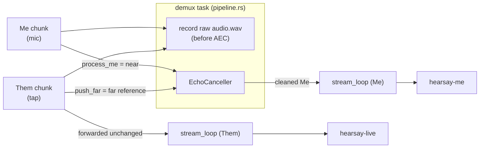

# Echo cancellation

Hearsay captures the microphone ("Me") and system audio ("Them") as two separate streams. When the
user is on a speakerphone rather than a headset, the mic picks up the remote party coming out of the
speakers, so that audio lands in **both** streams — and without correction, `hearsay-me` transcribes
the remote party a second time, attributed to the local user. Two layers remove that duplication:
acoustic echo cancellation (AEC) subtracts the leakage from the Me signal before live transcription,
and a text-level dedup backstop drops any residual echo that still reaches the transcript.

## Related documents

| Document | Scope |
|---|---|
| [pipeline.md](pipeline.md) | The surrounding audio flow; AEC runs inside its `demux` stage. |
| [design-decisions.md](design-decisions.md) | Why SpeexDSP, and why macOS Voice Processing I/O is not an option. |
| [architecture.md](architecture.md) | The capture topology that produces the two streams. |

Where the code lives: `hearsay-orchestrator/src/aec.rs` (the canceller, driven from the pipeline's
`demux` task) and `hearsay-orchestrator/src/echo_dedup.rs` (the text backstop, driven from `handle`;
see [Text-level dedup](#text-level-dedup-the-backstop)). Built under the `aec` feature.

## The problem

The two streams share one monotonic capture clock (`host_ts`) but are otherwise independent:

- **Me (near end)** — the microphone. On speakers, it contains the local user's voice *plus* a
  delayed, room-colored copy of whatever Them is playing.
- **Them (far end)** — the Core Audio process tap, configured global-except-self. This is a clean,
  pre-speaker copy of the exact signal that leaks into the mic — which makes it an ideal **reference**
  for cancellation.

AEC subtracts an adaptively-filtered version of the far-end reference from the near end, leaving only
the local user's own speech. On a headset there is no acoustic path from speaker to mic, so the mic
carries no echo and AEC is a near-passthrough.

## Design at a glance



Three properties define the design:

1. **AEC touches only what live transcription sees.** `demux` writes each *raw* chunk to `audio.wav`
   **before** cancellation, and the offline refine reads only the raw Them channel. Echo removal can
   never degrade the archive or the post-meeting refine — it is purely a live-Me cleanup.

   ```rust
   // rust/crates/hearsay-orchestrator/src/pipeline.rs
   // Record first ... so `audio.wav` captures every *raw* chunk ...
   // AEC applies only to what live transcription sees — the archive stays raw ...
   if let Some(rec) = recorder.as_mut() {
       rec.write(&samples, t0_s, stream);
   }
   ```

2. **Them is both a transcription stream and the AEC reference.** A Them chunk is forwarded to its
   own transcriber unchanged *and* buffered as the far-end reference; a Me chunk is cancelled against
   the buffered reference.

   ```rust
   // rust/crates/hearsay-orchestrator/src/pipeline.rs
   match stream {
       Stream::Them => {
           let ready = canceller.push_far(t0_s, &samples);
           forward(&them_tx, t0_s, samples, Stream::Them);   // Them unchanged
           for (mt0, m) in ready { forward(&me_tx, mt0, m, Stream::Me); }
       }
       Stream::Me => {
           for (mt0, m) in canceller.process_me(t0_s, &samples) {
               forward(&me_tx, mt0, m, Stream::Me);
           }
       }
   }
   ```

3. **It is optional, behind the `aec` feature.** With the feature off, `EchoCanceller` is a no-op
   passthrough (Me forwarded verbatim, Them ignored as a reference), so the default `cargo test`
   build needs no C toolchain. See [Build and feature flag](#build-and-feature-flag).

## Two halves: alignment, then cancellation

The DSP itself is a solved problem — SpeexDSP's MDF adaptive filter. The hard part is *feeding* it:
the filter demands equal-length, sample-aligned near/far frame pairs, but capture delivers two
variable-length, gappy streams (the tap emits nothing while system audio is silent). So the module
splits cleanly in two:

- **`FrameAligner`** (pure, `#[cfg(any(feature = "aec", test))]`) — turns the two streams into
  index-aligned 160-sample near/far pairs on one absolute sample clock. This is the
  correctness-critical part, and it compiles and is unit-tested even without the `aec` feature.
- **`EchoCanceller`** (`#[cfg(feature = "aec")]`) — drives the aligner and runs SpeexDSP on each
  pair.

### Alignment: `FrameAligner` and `StreamBuf`

Each stream is held in a `StreamBuf` that places samples contiguously from a `base` absolute sample
index, zero-filling forward gaps so near and far stay index-aligned, and dropping consumed samples
from the front as `base` advances.

The subtlety is that a chunk's timestamp is used only to *detect a real gap*, not to place every
chunk — otherwise sub-millisecond rounding jitter between chunks would punch spurious holes. A chunk
continues from the running `cursor` and only re-anchors to `round(t0_s * rate)` when the two diverge
past `RESYNC_GAP` (0.2 s):

```rust
// rust/crates/hearsay-orchestrator/src/aec.rs
let start = match self.cursor {
    None => { self.base = target; target }
    Some(cur) => {
        if target.abs_diff(cur) as usize > RESYNC_GAP { target }  // real delivery gap
        else { cur }                                              // jitter: stay contiguous
    }
};
```

A forward gap is zero-filled (capped at `MAX_FORWARD_FILL` = 5 min, so a non-monotonic `host_ts`
from sleep/resume can never drive a giant allocation); samples that fall before `base` or overlap
buffered data are dropped.

`FrameAligner` holds a `near` and a `far` `StreamBuf` and emits frames **at Me's pace**. A Me frame
`[next, next+160)` is released when either the far buffer covers it, or Me has run `MAX_REF_HOLD`
(0.2 s) ahead of the far end — in which case the far frame is zero-filled:

```rust
// rust/crates/hearsay-orchestrator/src/aec.rs
while self.near.end() >= next + FRAME as u64 {
    let far_ready = self.far.end() >= next + FRAME as u64;
    let hold_tripped = self.near.end().saturating_sub(next) >= MAX_REF_HOLD;
    if !far_ready && !hold_tripped { break; }
    out.push(AlignedFrame { start: next, near: self.near.frame_at(next), far: self.far.frame_at(next) });
    next += FRAME as u64;
    self.near.consume_to(next);
    self.far.consume_to(next);
}
```

The hold bound is what keeps Me flowing when nothing is playing: a silent far end produces no tap
chunks, so without it Me would stall forever waiting for a reference that never comes. Cancelling
against a zero (silent) reference is a near-passthrough, which is exactly right — a silent far end
means there is no echo to remove.

The mirror bound covers the other direction: frames are emitted at Me's pace, so if the *Me* stream
stalls (mic device loss mid-meeting) while the tap keeps flowing, nothing consumes the far buffer.
`push_far` therefore keeps only the trailing `MAX_FAR_BUFFER` (2 s) of reference (`aec.rs`) — a
mic stall costs a fixed 128 KB instead of ~230 MB/h. Trimming changes nothing observable: far only
outruns the frontier that far when Me is stalled, and those frames emit with a zero-filled near
side, whose cancelled output is silence regardless of the reference. When Me resumes, both streams
share the clock, so it re-anchors at the far frontier and pairs with the retained reference.

### Cancellation: SpeexDSP per frame

`EchoCanceller` converts each aligned pair to `i16`, runs `cancel_echo`, and converts back to `f32`:

```rust
// rust/crates/hearsay-orchestrator/src/aec.rs
for f in &frames {
    let near = to_i16(&f.near);
    let far  = to_i16(&f.far);
    let mut out = [0i16; FRAME];
    self.aec.0.cancel_echo(&near, &far, &mut out);
    cleaned.extend(out.iter().map(|&s| s as f32 / 32768.0));
}
```

The canceller is constructed with an explicit config (`aec.rs`):

| Parameter | Value | Meaning |
|---|---|---|
| `frame_size` | 160 | 10 ms per `cancel_echo` call at 16 kHz |
| `filter_length` | `FILTER_TAIL` = 4800 | **300 ms adaptive filter tail** — the longest playout + acoustic echo delay the MDF filter can model |
| `sample_rate` | 16000 | contract-fixed capture rate |
| `enable_preprocess` | true | chains SpeexDSP's preprocessor after the filter for **residual echo suppression** |

The tail is the one value deliberately overridden from the `AecConfig` default (1600, 100 ms). The
echo path the filter must model is not just room acoustics — the tap hands the reference over
*pre-speaker*, so the path includes output playout latency. Wired speakers sit at 10-40 ms, inside
the default; Bluetooth and AirPlay output buffer 150-300 ms, past which a 100 ms tail never
converges and the echo passes through untouched. 300 ms covers both, and the cost is linear in the
tail and trivial at 16 kHz mono (`aec.rs`).

With `enable_preprocess` on, `aec-rs` wires a `SpeexPreprocessState` to the echo state
(`SPEEX_PREPROCESS_SET_ECHO_STATE`) and runs `speex_preprocess_run` on the filter output, so each
frame gets the adaptive-filter subtraction *plus* a residual-echo/noise cleanup pass.

## Why these choices

System-level framing — SpeexDSP over VPIO, and why a text backstop sits behind the acoustic layer —
is in [design-decisions.md](design-decisions.md). The choices below are specific to this subsystem.

- **Why AEC at all, given separate streams?** Separate capture does not separate *acoustics*. On
  speakers the mic is a physical summing point: local voice + speaker output. Stream separation
  fixes routing, not the room. Without AEC, every remote utterance is transcribed twice — once
  correctly on Them, once wrongly as the local user on Me.
- **Why the process tap as the reference instead of a hardware loopback?** The global-except-self
  tap already produces a clean, pre-speaker copy of the far-end signal on the shared clock — the
  ideal reference — with no extra device to configure. It is the same signal the app is already
  capturing for Them.
- **Why a hand-rolled aligner instead of feeding chunks straight in?** SpeexDSP needs fixed-size,
  index-aligned near/far frames. Capture chunks are variable-length and the far stream goes silent
  (no chunks) whenever nothing plays. Getting the alignment wrong — a one-frame drift, a jitter hole
  — misaligns echo from reference and the filter cancels the wrong thing. Isolating this as a pure,
  unit-tested `FrameAligner` keeps the correctness-critical logic covered without a C toolchain.
- **Why release Me on the hold bound with a silent reference?** So a quiet far end (headset use, or
  system audio paused) never stalls the microphone. A zero reference makes cancellation a
  passthrough, which is the correct result when there is no echo.
- **Why record raw, before AEC?** The archive and the offline refine must be faithful to what was
  actually captured. AEC is a live-transcription aid, not an edit to the recording; keeping it out of
  the `audio.wav` path means a filter artifact can never corrupt the stored audio or the refine.
- **Why does `demux` own the canceller exclusively?** The Speex echo state holds raw C pointers and
  is not `Send` by default. `demux` is the single owner and Tokio never polls that future from two
  threads at once, so a narrow `unsafe impl Send for SendAec` is sound and no lock is needed
  (`aec.rs`).
- **Why is the Windows mic opened RAW?** Because otherwise there is nothing to cancel *linearly*.
  A normally-opened WASAPI capture stream arrives through the APO chain — "Audio enhancements",
  vendor noise suppression and AGC, and on most laptops the OEM's own echo canceller — which makes
  Me a nonlinear, time-varying function of the acoustic field. An adaptive linear filter cannot
  model that, so Speex cancels almost nothing and every remote utterance leaks into Me anyway.
  Measured on one laptop as the best ERLE *any* linear canceller could reach (an offline
  least-squares FIR, 200 ms fit, speakers, user silent): **1.7 dB** with enhancements on and the
  stream processed, **16.8 dB** with them manually off, and **17.3 dB** with them left on but the
  stream opened RAW. So RAW recovers the full ~15 dB without the user having to find the "Audio
  enhancements" checkbox — which matters because it is on by default. `wasapi_source.rs` therefore
  opens Me with `StreamOption::Raw`, falling back to the processed stream only if the endpoint
  refuses (logged, so a degraded mic is diagnosable rather than silent).
  Only Me: the loopback reference is a digital copy of the render mix with no APO chain in front of
  it. Note the ceiling keeps climbing to ~17 dB out at 300 ms of filter, which is why `FILTER_TAIL`
  is sized at 4800 and not the crate default — the echo path through a laptop chassis has a long
  reverb tail, and a 50 ms fit understates what is cancellable by ~10 dB.

## Text-level dedup: the backstop

A linear adaptive filter has a hard ceiling on speakers. Cheap laptop speakers distort nonlinearly
(harmonic content, clipping, chassis resonance), the echo path drifts, and double-talk perturbs the
filter — so `EchoCanceller` leaves a residual, and a loud remote party can still cross
`hearsay-me`'s VAD and be transcribed a second time as the local user. `echo_dedup.rs` is the second
layer that catches that residual, working on the *transcript* rather than the signal.

The rule: drop a Me **final** whose text is an echo of concurrent Them speech. The Them stream task
records each finalized Them segment (`record_them`) as a candidate; before a Me final is persisted
or broadcast, the Me stream task checks it against the recorded window (`is_echo`). A single
`EchoDedup` is shared between the two tasks behind the same `Arc<Mutex<…>>` pattern as the
last-activity clock.

Detection is deliberately conservative — it deletes transcript lines, so a false positive is worse
than a miss:

- **Length gate** — a final under `min_tokens` (4) is never dropped, so backchannels ("yeah",
  "right") always survive.
- **Concurrency gate** — only Them finals overlapping the Me final's window (`window_s` = 1.5 s of
  slack each side) are candidates; echo is roughly concurrent with its reference.
- **Coverage gate** — the concurrent Them finals are pooled, in time order, into one reference
  sequence, and the drop fires only when the longest common subsequence covers `similarity` (0.8) of
  the Me final's tokens. Normalizing by the *Me* length means a Me line is dropped only when it is
  almost entirely echo: a real Me utterance that merely quotes a short Them phrase, or Me talking
  over Them (double-talk), stays under threshold and is kept. Pooling handles Them being endpointed
  into several finals across a span the Me echo covers as one.

Two properties keep it safe alongside AEC:

- **It only touches live Me finals.** Persist and broadcast are skipped for a dropped final; the
  archive and the offline refine are untouched, exactly as with AEC. A Me *partial* still streams —
  it is ephemeral and the next partial or final supersedes any echo that flashed live.
- **It is pure and always on.** No C toolchain, no `aec` feature, no new dependency — it runs (and
  is unit-tested) in the default build, and it helps even when AEC is not compiled in.

It relies on Them finalizing before its Me echo, which the physics favors: Them is tapped
*pre-speaker*, so its ASR runs earlier and on cleaner audio than the mic echo, which the playout +
acoustic round trip delays. A Them final that lands *after* its Me echo is not caught — an accepted
limitation of a streaming backstop.

## Guardrails and edge cases

The pure `FrameAligner` is unit-tested against exactly the capture pathologies that would otherwise
corrupt alignment:

| Case | Behavior | Test |
|---|---|---|
| Far arrives after near | Near held (within the bound), then one aligned frame once far covers it | `frames_emit_once_far_catches_up` |
| Far silent past the hold | Me released with a zero far reference (passthrough), contiguous | `near_passes_through_when_far_silent_past_hold` |
| Far stops mid-stream | Frames before the stop use the real reference; later frames fall back to silent | `far_stopping_leaves_later_frames_with_silent_reference` |
| Sub-`RESYNC_GAP` timestamp jitter | Chunks stay contiguous — no spurious gap or overlap | `per_chunk_jitter_does_not_punch_holes` |
| Real delivery gap | Next chunk re-anchors to its `t0_s`; the gap is zero-filled at its true index | `real_gap_reanchors_to_timestamp` |
| Non-monotonic `host_ts` | Forward zero-fill capped at 5 min, so no runaway allocation | `MAX_FORWARD_FILL` |
| Me stalls mid-meeting (mic loss) | Far reference capped at the trailing 2 s; on resume Me pairs with the retained reference | `far_backlog_is_bounded_while_me_stalls` |

With the `aec` feature on, end-to-end tests drive the real SpeexDSP binding:

- `attenuates_a_pure_echo_of_the_reference` — a near signal that is a pure scaled copy of a
  broadband reference is attenuated to under half its energy over the adapted tail.
- `forwards_me_without_stalling_when_the_reference_is_silent` — a silent reference still forwards
  Me via the hold bound.
- `the_filter_tail_covers_bluetooth_playout_delay` — an echo delayed 150 ms (a Bluetooth-speaker
  playout latency, past the 100 ms `AecConfig` default tail) is still cancelled. This test drives
  the raw echo state with the preprocessor off and a zero-mean noise reference: the chained
  residual suppressor crushes a stationary residual even when the filter modeled nothing, and a
  periodic (line-spectrum) reference makes any delay a phase shift a short filter can fake — either
  would mask a too-short tail. It fails at the default 1600-sample tail (residual/echo ~0.94) and
  passes at `FILTER_TAIL`.

## Build and feature flag

AEC is gated by the `aec` cargo feature, which pulls in `aec-rs` (SpeexDSP). The feature chains up
through the crates:

```
hearsay-core/aec  ->  hearsay-backends/aec  ->  hearsay-orchestrator/aec  ->  dep:aec-rs
```

- **On** in `make rust-serve` and `make dmg` / `make mac-app` (`--features metal,aec`); the Windows
  package build adds it alongside `sherpa`/`vulkan`.
- **Off** by default (plain `cargo test`, `cargo build`), where `EchoCanceller` is the passthrough
  stub — so the default build and CI need no C toolchain.
- Building the feature compiles vendored SpeexDSP with `cc` + `cmake` + `bindgen` (on Windows,
  `bindgen` needs LLVM). Each platform's build treats AEC as a graceful add-on: if it is not built
  in, capture and transcription still work, just without echo removal.

Licensing: `aec-rs` is MIT and the vendored SpeexDSP is BSD-3-Clause — both inside the project's
MIT/BSD/Apache gate (`make licenses`).
