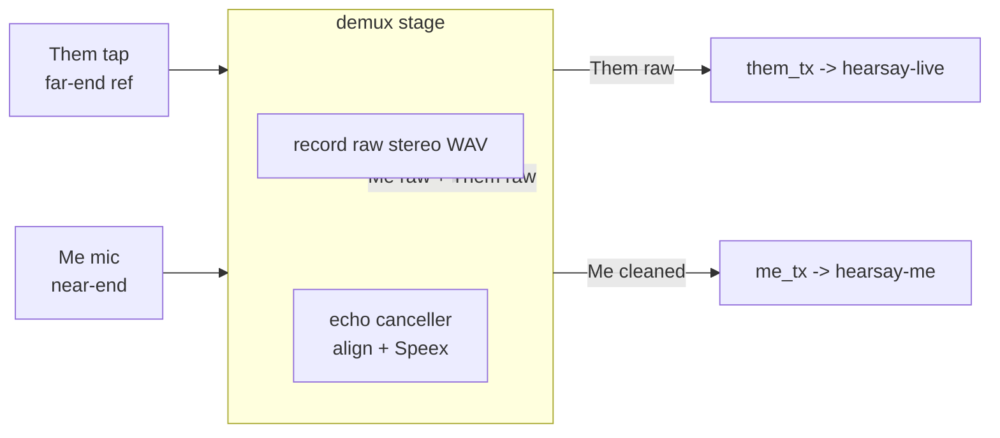

# Acoustic Echo Cancellation

When the user listens on speakers instead of headphones, the microphone picks up the system audio
playing in the room. That echo lands in the **Me** stream, so `hearsay-me`'s VAD triggers on it and
Parakeet transcribes the remote party's words as if the local user spoke them. Acoustic Echo
Cancellation (AEC) removes that echo before Me reaches transcription.

## Approach

The capture graph already produces exactly what an echo canceller needs:

- **Near-end** — the Me microphone stream (contains the echo to remove).
- **Far-end reference** — the Them system-audio tap (the clean digital signal being played out).

Both are 16 kHz mono `f32`, stamped with one monotonic `host_ts` clock, and they first meet — already
time-aligned to a shared epoch — in the Rust core's `demux` (`hearsay-orchestrator/src/pipeline.rs`).
AEC is a stage there, on the Me branch, with Them as the reference. It is **not** in the Swift helper:
the two streams live in independent ring buffers there and are never aligned, and Windows will reuse
this same `demux` path with no Swift helper at all.

## Library

SpeexDSP's MDF echo canceller via the [`aec-rs`](https://crates.io/crates/aec-rs) crate (v1.0.0).

- **License** — `aec-rs` and `aec-rs-sys` are MIT; the vendored SpeexDSP is 3-clause BSD. Both pass the
  `MIT/BSD/Apache-2.0` policy in `rust/deny.toml`.
- **Build** — `aec-rs-sys` compiles vendored SpeexDSP with `cc` + `cmake` and generates bindings with
  `bindgen`. All three are already available on the build host; no new system package is required.
- **API** — `Aec::new(&AecConfig)` then `Aec::cancel_echo(rec: &[i16], echo: &[i16], out: &mut [i16])`,
  where `rec` is near-end, `echo` is the far-end reference, `out` is the cleaned near-end.
  `AecConfig::default()` is `{ frame_size: 160, filter_length: 1600, sample_rate: 16000,
  enable_preprocess: true }` — 160 samples is one 10 ms frame at 16 kHz, our exact capture format.

### Rejected alternatives

- **Apple Voice Processing** (`kAudioUnitSubType_VoiceProcessingIO` / `setVoiceProcessingEnabled`) — its
  echo reference is whatever the *same* audio unit renders on its own output. It cannot use a system
  tap as the reference, so it cannot cancel echo from audio (Zoom / Teams / a browser) that Hearsay is
  not the one playing. Structurally unfit, and macOS-only.
- **WebRTC AEC3** (`webrtc-audio-processing` crate) — higher quality and the better long-term option,
  but its build requires `meson` + `ninja` + `pkg-config`, none of which are installable on this host.
  A build attempt fails at `Failed to execute meson`. Revisit if that toolchain becomes available; the
  `demux` seam and the alignment code below are canceller-agnostic.

## Design

### Alignment

Speex requires two sample-synchronous streams fed in fixed 160-sample frames. Me and Them arrive as
separate, variable-length chunks (up to 640 samples) that do not line up on a 160-sample grid, and Them
has **gaps**: the Core Audio tap emits no buffers while system audio is silent (confirmed by
`SystemAudioTap`'s flow-based watchdog, which cannot distinguish quiet audio from a stuck tap). So the
stage keeps a small aligner:

- Each stream is placed into a contiguous `f32` buffer by absolute sample index
  (`round(t0_s * 16000)`), written from a running cursor and only re-anchored to the index when a chunk
  diverges past a resync gap — mirroring `MeetingAudioRecorder`'s placement so per-chunk clock jitter
  never punches holes. Real gaps are zero-filled to keep the two buffers on one index.
- A Me frame `[a, a+160)` is emitted for cancellation once **either** the far buffer has reached
  `a+160` (a real reference is present) **or** Me has run a bounded hold ahead of the far frontier
  (`MAX_REF_HOLD` samples). In the second case the far frame is zero-filled: this is the
  silence/headphone path, where there is no echo, so cancelling against silence is a near-passthrough.
- Because a silent far-end produces no chunks, Me is **never stalled** waiting for a reference — the
  hold bound forces it through. This also makes echo gating automatic: no system audio playing means no
  reference, which means Me passes through unchanged.

Speex's adaptive filter absorbs the speaker-to-mic path delay itself, as a tap at that lag, provided
the delay plus room reverb fits inside `filter_length`. `host_ts` alignment guarantees near and far
share one sample clock (no skew for the filter to chase); `filter_length` (default 1600 = 100 ms,
configurable) covers the bulk delay and reverb tail. No explicit delay estimate is computed.

### Cancellation

For each aligned frame the stage converts near and far to `i16`
(`(s.clamp(-1,1) * 32767).round()`, matching the recorder), calls `cancel_echo`, and converts the
cleaned output back to `f32` (`/ 32768.0`). Consecutive cleaned frames are coalesced and forwarded to
`me_tx` as `(t0_s, samples)` with the run's start time, preserving the existing chunk cadence and the
downstream drop-on-full and silence-pad-on-gap behavior.

The Speex echo state is stateful and lives for the meeting; it holds raw C pointers, so it is wrapped
in a newtype with `unsafe impl Send` — sound because `demux` owns it exclusively and Tokio never polls
that future from two threads at once.

### Recording is untouched

`demux` records the **raw** Me and Them chunks to `audio.wav` on its always-drained path, exactly as
today. AEC applies only to the Me chunks forwarded to live transcription. This keeps the archive intact
and the recorder's "record even if a transcriber wedges" guarantee unaffected, and it is safe because
the offline refine reads only the Them channel (`refine.rs`, `read_them_channel`) — it never
re-transcribes Me, so a raw Me archive cannot regress the final transcript.

### Gating

- **Compile-time** — a `aec` Cargo feature gates the `aec-rs` dependency and the Speex call, mirroring
  `metal` / `notes`. Enabled in `make rust-serve` and `make mac-app` / `make dmg`; off for
  `cargo test` and `rust-build`, so the default test build needs no C toolchain. The alignment logic
  compiles and is unit-tested without the feature (`#[cfg(any(feature = "aec", test))]`).
- **Runtime** — automatic, via the far-activity passthrough above. A typed `HEARSAY_AEC` setting to
  force-disable is a follow-up (see below).

## Code plan

| File | Change |
| --- | --- |
| `rust/crates/hearsay-orchestrator/Cargo.toml` | add optional `aec-rs = "1.0.0"`; `[features] aec = ["dep:aec-rs"]` |
| `rust/crates/hearsay-orchestrator/src/aec.rs` | new: `FrameAligner` (pure, tested) + `EchoCanceller` (feature-gated Speex wrapper + `Send` newtype) + a no-op `EchoCanceller` when the feature is off |
| `rust/crates/hearsay-orchestrator/src/pipeline.rs` | construct an `EchoCanceller`; in `demux`, push Them to its far buffer and route Me through it before `me_tx.try_send`; recording unchanged |
| `rust/crates/hearsay-orchestrator/src/lib.rs` | `mod aec;` |
| `rust/crates/hearsay-backends/Cargo.toml`, `hearsay-core/Cargo.toml` | re-export `aec = ["hearsay-orchestrator/aec"]` up the chain |
| `Makefile` | add `aec` to the `--features` lists for `rust-serve` and `mac-app` |
| `rust/deny.toml` (if needed) | confirm MIT + BSD-3-Clause allowed; `make licenses` / `make audit` |
| `CLAUDE.md` env-var section, `docs/pipeline.md` | note the AEC stage |

## Testing

- **Unit (`FrameAligner`, no feature)** — placement from `t0_s`, contiguous-cursor vs resync-gap
  re-anchor, zero-fill on gaps, 160-sample framing, and the `MAX_REF_HOLD` passthrough when the far
  buffer stalls. These are the correctness-critical parts and run in the default `cargo test`.
- **Integration (`--features aec`)** — synthesize a near = `speech + delayed copy of far` signal and a
  far reference, run the stage, assert the residual echo energy drops materially versus the near input
  while a far-silent segment passes through unchanged.
- **Gates** — `make lint`, `cargo test`, `cargo test -p hearsay-orchestrator --features aec`,
  `make licenses`, `make audit`.

## Follow-ups

- Typed `HEARSAY_AEC` runtime setting (config field + Settings panel) to force-disable, mirroring
  `HEARSAY_AUTO_REFINE`.
- Optional clean-Me recording, behind a setting, once AEC is proven.
- Explicit speaker-vs-headphone detection in the helper (Core Audio default-output route) as a stronger
  gate than far-activity, surfaced as a capture hint.
- WebRTC AEC3 as a higher-quality backend if `meson`/`ninja` become available; swap behind the same
  seam and feature.
