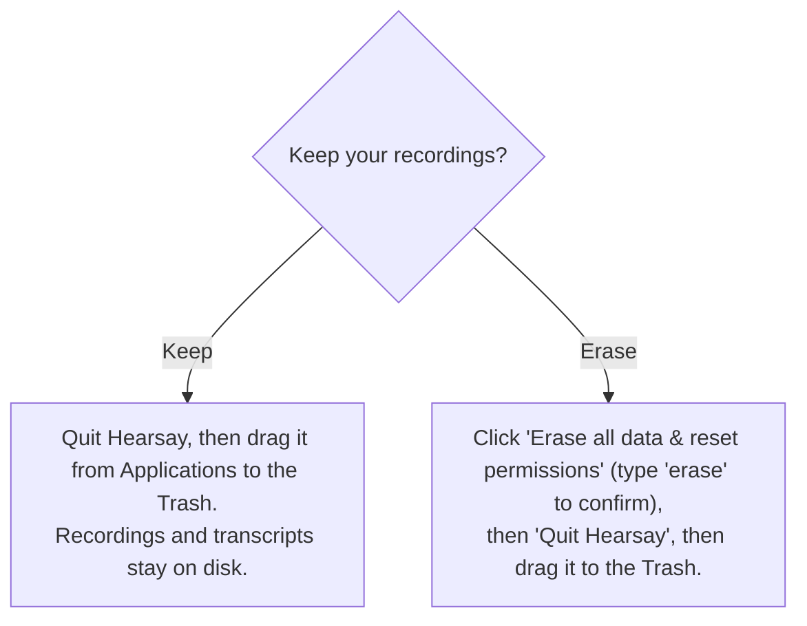

# Packaging and uninstall (macOS)

How to build a distributable Hearsay app without an Apple Developer account, install it past
Gatekeeper, and uninstall it while keeping or erasing your recordings.

The app is ad-hoc signed and not notarized by design (no paid Apple account). That is fine for
direct download and internal sharing; recipients clear the macOS quarantine flag once (see
[Install](#install-on-another-mac)). Notarization requires a paid Apple Developer account, so
`make notarize` prints that requirement rather than building.

- **Targets:** Apple Silicon (arm64) only, macOS 14.4 or later.
- **Bundle:** a Tauri shell wrapping the Rust `hearsay-core` server, the Swift capture helper and
  FluidAudio/ANE sidecars, the `hearsay-notes` LLM sidecar, and the React UI. The shell spawns the
  core (which in turn spawns `hearsay-notes` for the notes step) and points the window at its
  loopback URL.
- **Models:** not bundled. The macOS installer is about 50 MB; the app downloads its speech models
  on first run (see [First-run models](#first-run-models)).

## Prerequisites

```sh
cargo install tauri-cli --version 2.11.4 --locked   # once; provides `cargo tauri build`
```

A Rust toolchain, Node (`npm`), and Swift (Command Line Tools) must be installed, the same as the
development quickstart. `rust-toolchain.toml` pins the Rust channel, so rustup will fetch it on the
first build. The version pinned above is the one CI builds with; matching it locally keeps a local
`make dmg` and a released DMG comparable.

## Versioning

The version in git is a placeholder (`0.0.0`) and no commit ever bumps it. The installer build
derives the real number from the last release tag and stamps it in, so cutting a release needs no
version commit — and the lockfiles, which carry the version, never change for a release and never
invalidate the build cache.

`rust/Cargo.toml` is canonical for the drift check. Four other files repeat the version —
`web/src-tauri/Cargo.toml`, `web/src-tauri/tauri.conf.json`, `web/package.json`, and
`helper/Info.plist` — and the Swift helper reads its own from that plist at runtime, so it never
needs updating by hand.

```sh
make version                       # what a local build carries (0.0.0)
make stamp-version VERSION=0.2.0   # write all five; what the installer build runs
make set-version VERSION=0.2.0     # the same, plus regenerated codegen
```

`make dmg` runs the drift check first and stop if any file
disagrees, so a mismatched version cannot reach an installer. `make ci` runs the same check.
Versions are `x.y.z`; that is what Cargo and Tauri require and what `CFBundleShortVersionString`
expects.

## Build

```sh
make dmg      # unsigned .app + .dmg (distributable)
make mac-app  # unsigned .app only (faster; for local testing)
```

Both run `stage-release`, which builds the release binaries and copies them where Tauri's
`externalBin` expects them (`web/src-tauri/binaries/<name>-aarch64-apple-darwin`). The `mac-app`
target (which `dmg` depends on) then invokes `cargo tauri build` and runs `codesign --verify --deep
--strict` on the bundle to confirm the ad-hoc signature is intact.

`THIRD-PARTY-NOTICES.md` is bundled as a Tauri resource (`Contents/Resources/`), and the shell
points `HEARSAY_THIRD_PARTY_NOTICES` at it so Settings > About can open it. The speech models the app
downloads include CC BY 4.0 weights whose attribution has to travel with the app, so this file ships
with every build — no staging step, Tauri copies it from the repo root.

Nothing about packaging needs a model on the build machine.

Artifacts:

| Target | Output |
|---|---|
| `make mac-app` | `web/src-tauri/target/release/bundle/macos/Hearsay.app` |
| `make dmg` | `web/src-tauri/target/release/bundle/dmg/Hearsay_<version>_aarch64.dmg` |

Ad-hoc signing is configured by `bundle.macOS.signingIdentity: "-"` in
`web/src-tauri/tauri.conf.json`; the microphone and system-audio TCC prompt strings live in
`web/src-tauri/Info.plist`.

## Release pipeline

A release is a promotion, not a build. `.github/workflows/ci.yml` builds the DMG on every merge to
`main`, stamped with the next patch version off the last tag, and keeps it for 30 days as the
`hearsay-macos-dmg` workflow artifact. `.github/workflows/promote.yml` is a manual
`workflow_dispatch`: it takes one of those runs (the newest successful one on `main` by default),
downloads the artifact, verifies its checksum, and attaches it plus its `.sha256` sidecar to a
**draft** GitHub Release tagged at the promoted commit. The published DMG is byte-for-byte the one
CI built — nothing is rebuilt and nothing is re-stamped. Publishing the draft is a manual click, so
the notes and the artifact get a look first; the static half of the notes is
`.github/release-notes-macos.md`.

For a minor or major release, run `ci` from the Actions tab with the `bump` input set. That produces
an artifact at the chosen version, which promotes the same way.

A merge does not re-run the gate its pull request already passed. The `triage` job skips it when the
merge commit and the merged branch have the same tree — so the pull-request run tested exactly what
landed — and when nothing in the cargo cache key changed. Anything that moves that key still runs the
gate on `main`, because a run there is the only thing that writes a cache the next pull request can
read: Actions caches are readable from the branch that wrote them and from the default branch, never
sideways between pull requests. The same rule is why the installer is built on `main` and not on the
pull request.

The build environment is pinned by `.github/actions/mac-build-env`, shared by the gate and the
installer build (`promote` needs none of it — it moves a file):

| Pin | Value | Why |
|---|---|---|
| Runner | `macos-26` | The arm64 standard image. `stage-release` refuses non-arm64, and the floating `macos-latest` label moves between OS versions without a commit. |
| Xcode | `26.3` | Swift 6.3.x, matching the development machine, so FluidAudio compiles the same way. |
| Rust | `rust-toolchain.toml` | A new clippy release must not fail `-D warnings` without a commit. |
| Node | `24.19.0` | Its bundled npm (11.17.0) decides which lockfile tree `npm ci` demands, so the patch version is pinned and `web/package-lock.json` is generated with that npm. Local development needs only >= 20.19.0 (`web/package.json`). |
| `cargo-audit` / `cargo-deny` / `tauri-cli` | 0.22.2 / 0.20.2 / 2.11.4 | The Makefile assumes all three on `PATH`; none ship on the runner. |

The runner leaves about 14 GB free and this build compiles llama.cpp and SpeexDSP from
source, so the setup action deletes the unused Xcode installations before building.

Three caches, all `actions/cache`: the pinned cargo tools (keyed on the setup action itself, so a
dependency bump does not discard them), the cargo registries plus both target directories (keyed on the
lockfiles, the toolchain, and the setup action — its Xcode pin decides which clang compiled the cached C
objects — exact match with no fallback: on a hit nothing is re-saved, so an entry is written once and
never accretes stale artifacts), and the SwiftPM dependency checkouts. Incremental compilation is off
(`CARGO_INCREMENTAL=0`) to keep the target directories inside the repository's 10 GB cache quota.
`helper/.build` is deliberately not cached, because `swift-plist-guard` compares mtimes that a cache
restore does not preserve.

Every action used is GitHub-owned (`actions/*`, MIT) and pinned to a full commit SHA, so no third party
can change what runs in a build. `persist-credentials: false` on checkout keeps `GITHUB_TOKEN` out of
`.git/config`: nothing in either workflow pushes, and the promote step passes `GH_TOKEN` explicitly.

Artifacts stay unsigned and un-notarized — the same posture as a local `make dmg`, so recipients still
clear the quarantine flag as below.

## Install on another Mac

1. Open the `.dmg` and drag Hearsay to Applications.
2. Clear the quarantine flag once (unsigned, un-notarized apps are blocked otherwise):

   ```sh
   xattr -dr com.apple.quarantine /Applications/Hearsay.app
   ```

   Alternatively: launch it, dismiss the warning, then System Settings > Privacy & Security >
   Open Anyway.
3. Launch Hearsay. On first use macOS prompts for Microphone and System Audio. Grant them for
   capture to work.

`spctl -a -vv` reports the app as rejected; that is expected for a non-notarized build and is
exactly what the `xattr` step addresses.

## First-run models

The installer carries no models, so the first launch shows a setup screen instead of the app: about
1.3 GB of speech models (the FluidAudio set: Silero VAD ~1 MB, diarizer ~34 MB, LS-EEND ~43 MB, Parakeet
Ultra ~614 MB, Parakeet unified streaming ~582 MB), with an option to fetch a notes model in the same
pass. Nothing downloads until the user starts it, which is what makes a metered or offline first run survivable — the app simply waits.

- The models are fetched by the `hearsay-models` sidecar, which calls the same FluidAudio
  loaders the live sidecars call, so what it prepares cannot drift from what they load. They land in
  FluidAudio's own cache (`~/Library/Application Support/FluidAudio/Models/`).
- Setup carries a models revision; a build that changes the model set re-runs the setup screen on
  upgrade rather than failing later at first use.
- An interrupted download resumes from its `.part` file on the next attempt; quitting mid-download
  is safe.
- The core holds back sidecar pre-warming until the models are there, so nothing races the setup run
  for the same files.

`GET /api/setup` reports what is still missing; the screen clears once nothing is.

## Where your data lives

The installed app is read-only, so all user data is written under a standard, user-writable
location keyed by the bundle id `com.hearsay.app`:

| Data | Path |
|---|---|
| Database (meetings, speakers, settings) | `~/Library/Application Support/com.hearsay.app/db/` |
| Recordings and transcripts (one folder per meeting) | `~/Library/Application Support/com.hearsay.app/recordings/` |
| Downloaded refine and notes models | `~/Library/Application Support/com.hearsay.app/models/` |
| FluidAudio live models (re-downloadable) | `~/Library/Application Support/FluidAudio/`, `~/.cache/fluidaudio/` |
| WebView and app caches | `~/Library/Caches/com.hearsay.app`, `~/Library/WebKit/com.hearsay.app`, and similar |

Your recordings and transcripts live outside the `.app`, so deleting the app never deletes them.

## Uninstall

Open Settings > Data & Uninstall in the app, then choose:



- **Keep.** The panel's "Reveal data folder in Finder" button shows exactly where your meetings
  are so you can back them up. Then drag the app to the Trash; nothing else is touched.
- **Erase everything.** Deletes, best-effort:
  - the data directory `~/Library/Application Support/com.hearsay.app/` (database, recordings,
    transcripts, downloaded models),
  - the FluidAudio model caches; the next launch shows the first-run setup screen again and
    re-downloads them,
  - the WebView and app caches, saved state, and the preferences plist for `com.hearsay.app`,
  - and runs `tccutil reset All` for `com.hearsay.app` and `com.hearsay.helper`, so a reinstall
    prompts for permissions again.

  The erase is confirmed through a native dialog driven by the shell (not the web page), and it
  cannot be undone. The app then quits so you can drag `Hearsay.app` to the Trash.

## Known limitations

- **Not notarized.** By design; recipients run the `xattr` quarantine strip once.
- **Settings changes apply from the next meeting.** The effective recording, speaker, storage,
  and notes settings are read at meeting start and stop, so an edit never alters a meeting
  already in progress.
- **The first run needs the network.** The installer is small because the models are not in it, so
  a machine that is offline on first launch can browse the app but cannot record until the download
  completes. After that Hearsay is fully offline.
