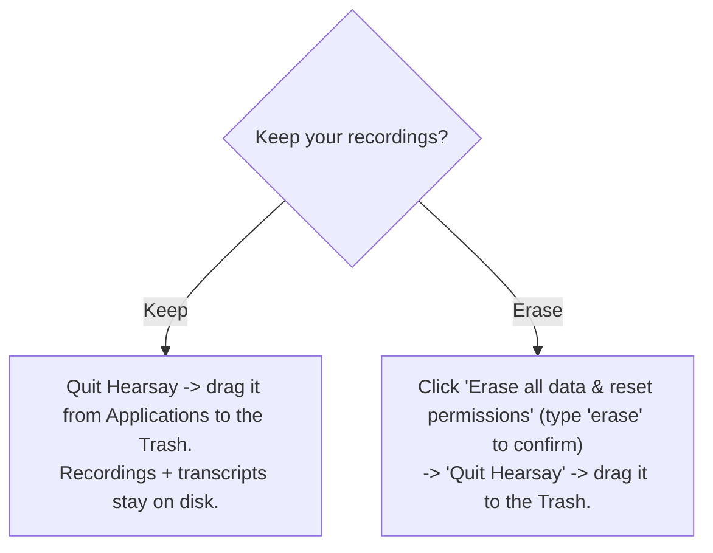

# Packaging & uninstall (macOS)

How to build a distributable Hearsay app **without an Apple Developer account**, install it past
Gatekeeper, and uninstall it while keeping or erasing your recordings.

The app is **ad-hoc signed and not notarized** by design (no paid Apple account). That is fine for
direct download / internal sharing; recipients clear the macOS quarantine flag once (see
[Install](#install-on-another-mac)). Notarization (`make notarize`) is intentionally out of scope —
it needs an Apple Developer ID.

- **Targets:** Apple Silicon (arm64) only, macOS 14.4+.
- **Bundle:** a Tauri shell wrapping the Rust `hearsay-core` server, the Swift capture helper +
  FluidAudio/ANE sidecars, and the React UI. The shell spawns the core and points the window at its
  loopback URL.

## Prerequisites

```sh
make sync                 # Python env (used by codegen, not shipped)
cargo install tauri-cli   # once; provides `cargo tauri build`
```

Node (`npm`) and Swift (Command Line Tools) must be installed — same as the dev quickstart.

## Build

```sh
make dmg      # unsigned .app + .dmg (distributable)
make mac-app  # unsigned .app only (faster; for local testing)
```

Both run `stage-release`, which builds **release** binaries and copies them where Tauri's
`externalBin` expects (`web/src-tauri/binaries/<name>-aarch64-apple-darwin`), then invokes
`cargo tauri build`. `make dmg` also runs `codesign --verify --deep --strict` on the bundle to
confirm the ad-hoc signature is intact.

`stage-release` also stages the whisper refine model. **`outputs/models/ggml-large-v3-turbo.bin`
(~1.5 GB) must be present** — the build copies it to `web/src-tauri/models/`, Tauri bundles it as
`Contents/Resources/models/…`, and the shell points `HEARSAY_REFINE_MODEL` at it so "Refine speakers"
works offline in the installed app. The copy is skipped once staged; `rm web/src-tauri/models/*.bin`
to refresh it.

Artifacts:

| Target | Output |
|---|---|
| `make mac-app` | `web/src-tauri/target/release/bundle/macos/Hearsay.app` |
| `make dmg` | `web/src-tauri/target/release/bundle/dmg/Hearsay_<version>_aarch64.dmg` |

Ad-hoc signing is configured by `bundle.macOS.signingIdentity: "-"` in
`web/src-tauri/tauri.conf.json`; the microphone / system-audio / calendar TCC prompt strings live in
`web/src-tauri/Info.plist`.

## Install on another Mac

1. Open the `.dmg` and drag **Hearsay** to **Applications**.
2. Clear the quarantine flag once (unsigned + un-notarized apps are blocked otherwise):

   ```sh
   xattr -dr com.apple.quarantine /Applications/Hearsay.app
   ```

   Alternatively: launch it, dismiss the warning, then **System Settings -> Privacy & Security ->
   Open Anyway**.
3. Launch Hearsay. On first use macOS prompts for **Microphone** and **System audio** (and later,
   **Screen recording** for on-screen speaker hints). Grant them for capture to work.

`spctl -a -vv` will report the app as rejected — that is expected for a non-notarized build and is
exactly what the `xattr` step handles.

## Where your data lives

The app is read-only once installed, so all user data is written under a standard, user-writable
location keyed by the bundle id `com.hearsay.app`:

| Data | Path |
|---|---|
| Database (meetings, speakers, settings) | `~/Library/Application Support/com.hearsay.app/db/` |
| Recordings + transcripts (one folder per meeting) | `~/Library/Application Support/com.hearsay.app/recordings/` |
| Downloaded ML models (re-downloadable) | `~/Library/Application Support/FluidAudio/`, `~/.cache/fluidaudio/` |
| WebView / app caches | `~/Library/Caches/com.hearsay.app`, `~/Library/WebKit/com.hearsay.app`, ... |

Your recordings and transcripts are **outside** the `.app`, so deleting the app never deletes them.

## Uninstall

Open **Settings -> Data & Uninstall** in the app, then choose:



- **Keep** — the panel's *Reveal data folder in Finder* button shows exactly where your meetings are
  so you can back them up. Then just drag the app to the Trash; nothing else is touched.
- **Erase everything** — deletes, all best-effort:
  - the data dir `~/Library/Application Support/com.hearsay.app/` (db + recordings + transcripts),
  - the model caches (`~/Library/Application Support/FluidAudio`, `~/.cache/fluidaudio`),
  - the WebView/app caches, saved state, and preferences plist for `com.hearsay.app`,
  - and runs `tccutil reset All com.hearsay.app` / `com.hearsay.helper` so a reinstall re-prompts
    for permissions.

  It then quits so you can drag `Hearsay.app` to the Trash. This cannot be undone.

## Known limitations

- **Not notarized** — by design; recipients run the `xattr` quarantine strip once.
- **Settings panels other than Data & Uninstall** — Recording / Speakers / Storage / Permissions /
  About call the loopback `/api/settings*` endpoints, which the Rust core does not yet serve, so they
  will not load in the packaged app. Data & Uninstall works regardless (it uses the desktop shell's
  IPC, not the HTTP API).
- **Large DMG** — the ~1.5 GB `ggml-large-v3-turbo` refine model is bundled (see below), so the DMG
  is ~1.5 GB. That is the cost of offline "Refine speakers" working out of the box.
