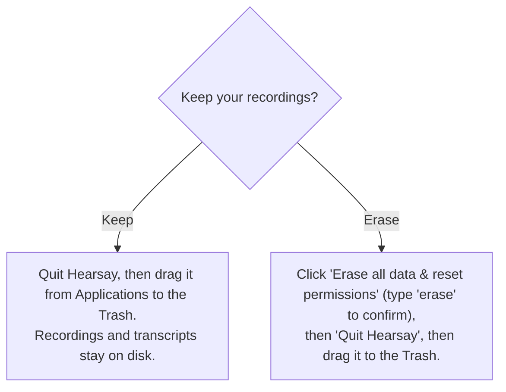

# Packaging and uninstall (macOS)

How to build a distributable Hearsay app without an Apple Developer account, install it past
Gatekeeper, and uninstall it while keeping or erasing your recordings.

The app is ad-hoc signed and not notarized by design (no paid Apple account). That is fine for
direct download and internal sharing; recipients clear the macOS quarantine flag once (see
[Install](#install-on-another-mac)). Notarization requires a paid Apple Developer account, so
`make notarize` prints that requirement rather than building.

- **Targets:** Apple Silicon (arm64) only, macOS 14.4 or later.
- **Bundle:** a Tauri shell wrapping the Rust `hearsay-core` server, the Swift capture helper and
  FluidAudio/ANE sidecars, the `hearsay-notes` LLM sidecar, and the React UI. The shell spawns the
  core (which in turn spawns `hearsay-notes` for the notes step) and points the window at its
  loopback URL.
- **Models:** not bundled. The macOS installer is about 50 MB; the app downloads its speech models
  on first run (see [First-run models](#first-run-models)).

## Prerequisites

```sh
cargo install tauri-cli    # once; provides `cargo tauri build`
```

A Rust toolchain, Node (`npm`), and Swift (Command Line Tools) must be installed, the same as the
development quickstart.

## Versioning

`rust/Cargo.toml` is canonical. Four other files repeat the version — `web/src-tauri/Cargo.toml`,
`web/src-tauri/tauri.conf.json`, `web/package.json`, and `helper/Info.plist` — and the Swift helper
reads its own from that plist at runtime, so it never needs updating by hand.

```sh
make version                     # what it is now
make set-version VERSION=0.2.0   # write all five, then regenerate codegen
git commit -am "release: v0.2.0"
git tag v0.2.0
```

Bump before building, not during: packaging verifies the version but never changes it. `make dmg`
and `scripts\build-windows.ps1` both run the drift check first and stop if any file disagrees, so a
mismatched version cannot reach an installer. `make ci` runs the same check.

Releases are tag-driven: the tag is the request and the committed files are the answer.
`make version-check-tag` asserts they agree, reading `TAG`, else `GITHUB_REF_NAME`, else the tag on
`HEAD` — so a build runner and a local check use the same target. Versions are `x.y.z`; that is what
Cargo and Tauri require and what `CFBundleShortVersionString` expects.

## Build

```sh
make dmg      # unsigned .app + .dmg (distributable)
make mac-app  # unsigned .app only (faster; for local testing)
```

Both run `stage-release`, which builds the release binaries and copies them where Tauri's
`externalBin` expects them (`web/src-tauri/binaries/<name>-aarch64-apple-darwin`). The `mac-app`
target (which `dmg` depends on) then invokes `cargo tauri build` and runs `codesign --verify --deep
--strict` on the bundle to confirm the ad-hoc signature is intact.

`THIRD-PARTY-NOTICES.md` is bundled as a Tauri resource (`Contents/Resources/`), and the shell
points `HEARSAY_THIRD_PARTY_NOTICES` at it so Settings > About can open it. The speech models the app
downloads include CC BY 4.0 weights whose attribution has to travel with the app, so this file ships
with every build — no staging step, Tauri copies it from the repo root.

Nothing about packaging needs a model on the build machine. `make fetch-refine-model` still exists,
but only for a local `make rust-serve` run (the dev default `HEARSAY_REFINE_MODEL` path).

Artifacts:

| Target | Output |
|---|---|
| `make mac-app` | `web/src-tauri/target/release/bundle/macos/Hearsay.app` |
| `make dmg` | `web/src-tauri/target/release/bundle/dmg/Hearsay_<version>_aarch64.dmg` |

Ad-hoc signing is configured by `bundle.macOS.signingIdentity: "-"` in
`web/src-tauri/tauri.conf.json`; the microphone and system-audio TCC prompt strings live in
`web/src-tauri/Info.plist`.

## Install on another Mac

1. Open the `.dmg` and drag Hearsay to Applications.
2. Clear the quarantine flag once (unsigned, un-notarized apps are blocked otherwise):

   ```sh
   xattr -dr com.apple.quarantine /Applications/Hearsay.app
   ```

   Alternatively: launch it, dismiss the warning, then System Settings > Privacy & Security >
   Open Anyway.
3. Launch Hearsay. On first use macOS prompts for Microphone and System Audio. Grant them for
   capture to work.

`spctl -a -vv` reports the app as rejected; that is expected for a non-notarized build and is
exactly what the `xattr` step addresses.

## First-run models

The installer carries no models, so the first launch shows a setup screen instead of the app: about
2.6 GB of speech models (1.1 GB of FluidAudio live models plus the 1.5 GB whisper refine model), with
an option to fetch a notes model in the same pass. Nothing downloads until the user starts it, which
is what makes a metered or offline first run survivable — the app simply waits.

- The live models are fetched by the `hearsay-models` sidecar, which calls the same FluidAudio
  loaders the live sidecars call, so what it prepares cannot drift from what they load. They land in
  FluidAudio's own cache (`~/Library/Application Support/FluidAudio/Models/`).
- The refine model is a resumable, SHA-256-verified download into
  `~/Library/Application Support/com.hearsay.app/models/`, where `HEARSAY_REFINE_MODEL` points.
- An interrupted download resumes from its `.part` file on the next attempt; quitting mid-download
  is safe.
- The core holds back sidecar pre-warming until the models are there, so nothing races the setup run
  for the same files.

`GET /api/setup` reports what is still missing; the screen clears once nothing is.

## Where your data lives

The installed app is read-only, so all user data is written under a standard, user-writable
location keyed by the bundle id `com.hearsay.app`:

| Data | Path |
|---|---|
| Database (meetings, speakers, settings) | `~/Library/Application Support/com.hearsay.app/db/` |
| Recordings and transcripts (one folder per meeting) | `~/Library/Application Support/com.hearsay.app/recordings/` |
| Downloaded refine and notes models | `~/Library/Application Support/com.hearsay.app/models/` |
| FluidAudio live models (re-downloadable) | `~/Library/Application Support/FluidAudio/`, `~/.cache/fluidaudio/` |
| WebView and app caches | `~/Library/Caches/com.hearsay.app`, `~/Library/WebKit/com.hearsay.app`, and similar |

Your recordings and transcripts live outside the `.app`, so deleting the app never deletes them.

## Uninstall

Open Settings > Data & Uninstall in the app, then choose:



- **Keep.** The panel's "Reveal data folder in Finder" button shows exactly where your meetings
  are so you can back them up. Then drag the app to the Trash; nothing else is touched.
- **Erase everything.** Deletes, best-effort:
  - the data directory `~/Library/Application Support/com.hearsay.app/` (database, recordings,
    transcripts, downloaded models),
  - the FluidAudio model caches; the next launch shows the first-run setup screen again and
    re-downloads them,
  - the WebView and app caches, saved state, and the preferences plist for `com.hearsay.app`,
  - and runs `tccutil reset All` for `com.hearsay.app` and `com.hearsay.helper`, so a reinstall
    prompts for permissions again.

  The erase is confirmed through a native dialog driven by the shell (not the web page), and it
  cannot be undone. The app then quits so you can drag `Hearsay.app` to the Trash.

## Windows installer

The Windows bundle is an unsigned NSIS installer built on a Windows x86_64 machine:

```powershell
powershell -ExecutionPolicy Bypass -File scripts\build-windows.ps1              # default: Vulkan (GPU) + AEC
powershell -ExecutionPolicy Bypass -File scripts\build-windows.ps1 -NoVulkan     # CPU-only build
```

Vulkan and AEC are on by default; opt out with `-NoVulkan` / `-NoAec` (and `-SkipModels` to reuse an
already-staged model set).

The script checks the app version for drift first (the PowerShell half of `make version-check`), then
fetches and stages the models (the sherpa live/diarize set plus `ggml-small.en.bin`
for the refine), builds the web bundle, `hearsay-core.exe` (features `sherpa`, plus `vulkan`/`aec`
unless disabled), and the `hearsay-notes.exe` sidecar (built separately with matching `vulkan` so
llama.cpp never co-links with the core's whisper), then runs `cargo tauri build --bundles nsis`.
`tauri.windows.conf.json` narrows the bundle for Windows: NSIS only, and `hearsay-core` +
`hearsay-notes` as the external binaries (no Swift sidecars). The installer lands in
`web/src-tauri/target/release/bundle/nsis/`.

Windows specifics:

- **Unsigned**: SmartScreen shows "Windows protected your PC" — More info > Run anyway.
- **WebView2**: the installer bootstraps Microsoft's WebView2 runtime if it is missing
  (preinstalled on Windows 11 and current Windows 10).
- **Data locations**: database, recordings, and downloaded models live under
  `%APPDATA%\com.hearsay.app\`; WebView state under `%LOCALAPPDATA%\com.hearsay.app\`. "Erase
  all data" removes both (Windows has no per-app permission grants to reset).
- **Quit during a meeting**: Windows has no SIGTERM-style graceful stop yet, so a meeting active
  at quit is finalized by the next launch's startup reconciliation instead of at exit.

## Known limitations

- **Not notarized.** By design; recipients run the `xattr` quarantine strip once.
- **Settings changes apply from the next meeting.** The effective recording, speaker, storage,
  and notes settings are read at meeting start and stop, so an edit never alters a meeting
  already in progress.
- **The first run needs the network.** The installer is small because the models are not in it, so
  a machine that is offline on first launch can browse the app but cannot record until the download
  completes. After that Hearsay is fully offline. (Windows still bundles its smaller model set, so
  its installer is about 650 MB and needs no first-run download.)
