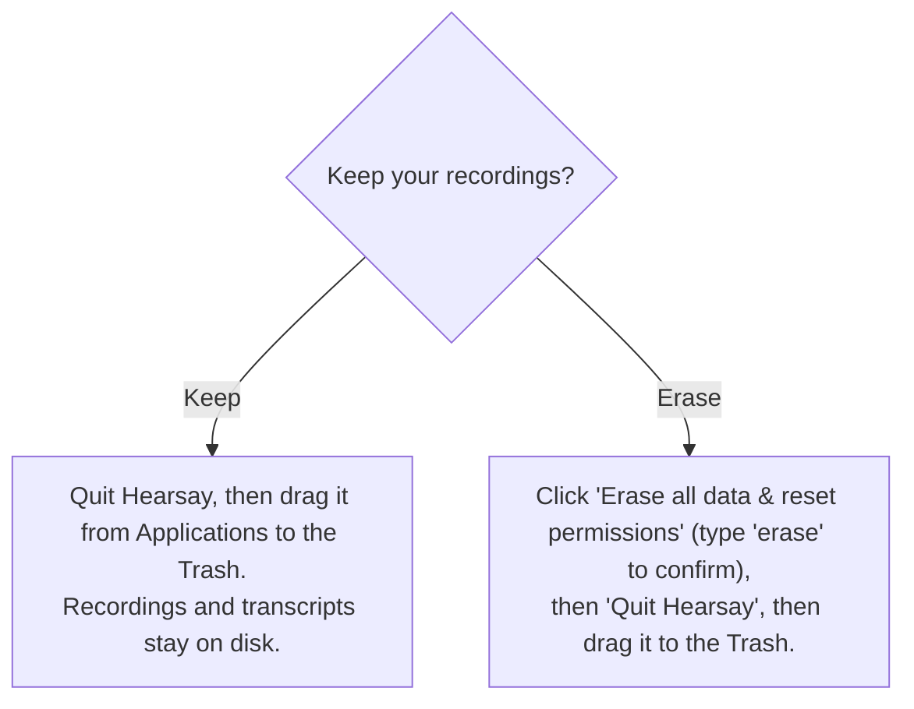

# Packaging and uninstall (macOS)

How to build a distributable Hearsay app without an Apple Developer account, install it past
Gatekeeper, and uninstall it while keeping or erasing your recordings.

The app is ad-hoc signed and not notarized by design (no paid Apple account). That is fine for
direct download and internal sharing; recipients clear the macOS quarantine flag once (see
[Install](#install-on-another-mac)). Notarization (`make notarize`) is intentionally out of scope,
since it requires an Apple Developer ID.

- **Targets:** Apple Silicon (arm64) only, macOS 14.4 or later.
- **Bundle:** a Tauri shell wrapping the Rust `hearsay-core` server, the Swift capture helper and
  FluidAudio/ANE sidecars, the `hearsay-notes` LLM sidecar, and the React UI. The shell spawns the
  core (which in turn spawns `hearsay-notes` for the notes step) and points the window at its
  loopback URL.

## Prerequisites

```sh
cargo install tauri-cli    # once; provides `cargo tauri build`
```

A Rust toolchain, Node (`npm`), and Swift (Command Line Tools) must be installed, the same as the
development quickstart.

## Build

```sh
make dmg      # unsigned .app + .dmg (distributable)
make mac-app  # unsigned .app only (faster; for local testing)
```

Both run `stage-release`, which builds release binaries and copies them where Tauri's
`externalBin` expects them (`web/src-tauri/binaries/<name>-aarch64-apple-darwin`), then invokes
`cargo tauri build`. `make dmg` also runs `codesign --verify --deep --strict` on the bundle to
confirm the ad-hoc signature is intact.

`stage-release` stages the whisper refine model. `outputs/models/ggml-large-v3-turbo.bin`
(about 1.5 GB) must be present: the build copies it to `web/src-tauri/models/`, Tauri bundles it
under `Contents/Resources/models/`, and the shell points `HEARSAY_REFINE_MODEL` at it so "Refine
speakers" works offline in the installed app. The copy is skipped once staged; remove
`web/src-tauri/models/*.bin` to refresh it.

`stage-release` also stages the FluidAudio live models (about 1.1 GB: batch and streaming Parakeet
ASR, the LS-EEND live diarizer, the pyannote refine diarizer, and Silero VAD) so the installer is
fully self-contained, with no first-run download. Populate them once from your local FluidAudio
cache:

```sh
# Run Hearsay (or any live sidecar) once so FluidAudio downloads the models, then:
make fetch-fluid-models    # copies the needed repos into outputs/models/fluidaudio/Models/
```

`stage-fluid-models` then copies them into the Tauri bundle, the shell points
`HEARSAY_FLUID_MODELS_DIR` at the bundled copy, and on first launch the core copies each repo into
FluidAudio's cache (`~/Library/Application Support/FluidAudio/Models/`), where the sidecars find
them and skip the download. A repo is re-copied into the bundle only when missing; remove
`web/src-tauri/models/fluidaudio` to force a refresh (for example after a FluidAudio version bump
changes the model set, pinned in the `FLUID_REPOS` list in the `Makefile`).

Artifacts:

| Target | Output |
|---|---|
| `make mac-app` | `web/src-tauri/target/release/bundle/macos/Hearsay.app` |
| `make dmg` | `web/src-tauri/target/release/bundle/dmg/Hearsay_<version>_aarch64.dmg` |

Ad-hoc signing is configured by `bundle.macOS.signingIdentity: "-"` in
`web/src-tauri/tauri.conf.json`; the microphone, system-audio, and calendar TCC prompt strings
live in `web/src-tauri/Info.plist`.

## Install on another Mac

1. Open the `.dmg` and drag Hearsay to Applications.
2. Clear the quarantine flag once (unsigned, un-notarized apps are blocked otherwise):

   ```sh
   xattr -dr com.apple.quarantine /Applications/Hearsay.app
   ```

   Alternatively: launch it, dismiss the warning, then System Settings > Privacy & Security >
   Open Anyway.
3. Launch Hearsay. On first use macOS prompts for Microphone and System Audio (and later, Screen
   Recording for on-screen speaker hints). Grant them for capture to work.

`spctl -a -vv` reports the app as rejected; that is expected for a non-notarized build and is
exactly what the `xattr` step addresses.

## Where your data lives

The installed app is read-only, so all user data is written under a standard, user-writable
location keyed by the bundle id `com.hearsay.app`:

| Data | Path |
|---|---|
| Database (meetings, speakers, settings) | `~/Library/Application Support/com.hearsay.app/db/` |
| Recordings and transcripts (one folder per meeting) | `~/Library/Application Support/com.hearsay.app/recordings/` |
| Downloaded notes models | `~/Library/Application Support/com.hearsay.app/models/` |
| FluidAudio model caches (re-creatable) | `~/Library/Application Support/FluidAudio/`, `~/.cache/fluidaudio/` |
| WebView and app caches | `~/Library/Caches/com.hearsay.app`, `~/Library/WebKit/com.hearsay.app`, and similar |

Your recordings and transcripts live outside the `.app`, so deleting the app never deletes them.

## Uninstall

Open Settings > Data & Uninstall in the app, then choose:



- **Keep.** The panel's "Reveal data folder in Finder" button shows exactly where your meetings
  are so you can back them up. Then drag the app to the Trash; nothing else is touched.
- **Erase everything.** Deletes, best-effort:
  - the data directory `~/Library/Application Support/com.hearsay.app/` (database, recordings,
    transcripts, downloaded models),
  - the FluidAudio model caches; the next launch re-seeds them from the bundled copy (a fast
    local copy, no re-download),
  - the WebView and app caches, saved state, and the preferences plist for `com.hearsay.app`,
  - and runs `tccutil reset All` for `com.hearsay.app` and `com.hearsay.helper`, so a reinstall
    prompts for permissions again.

  The erase is confirmed through a native dialog driven by the shell (not the web page), and it
  cannot be undone. The app then quits so you can drag `Hearsay.app` to the Trash.

## Windows installer

The Windows bundle is an unsigned NSIS installer built on a Windows x86_64 machine (the port's
plan and tracking state live in [windows-port.md](windows-port.md)):

```powershell
powershell -ExecutionPolicy Bypass -File scripts\build-windows.ps1        # CPU build
powershell -ExecutionPolicy Bypass -File scripts\build-windows.ps1 -Vulkan -Aec
```

The script fetches and stages the models (the sherpa live/diarize set plus `ggml-small.en.bin`
for the refine), builds the web bundle, `hearsay-core.exe` (features `sherpa`, plus `vulkan`/`aec`
unless disabled), and the `hearsay-notes.exe` sidecar (built separately with matching `vulkan` so
llama.cpp never co-links with the core's whisper), then runs `cargo tauri build --bundles nsis`.
`tauri.windows.conf.json` narrows the bundle for Windows: NSIS only, and `hearsay-core` +
`hearsay-notes` as the external binaries (no Swift sidecars). The installer lands in
`web/src-tauri/target/release/bundle/nsis/`.

Windows specifics:

- **Unsigned**: SmartScreen shows "Windows protected your PC" — More info > Run anyway.
- **WebView2**: the installer bootstraps Microsoft's WebView2 runtime if it is missing
  (preinstalled on Windows 11 and current Windows 10).
- **Data locations**: database, recordings, and downloaded models live under
  `%APPDATA%\com.hearsay.app\`; WebView state under `%LOCALAPPDATA%\com.hearsay.app\`. "Erase
  all data" removes both (Windows has no per-app permission grants to reset).
- **Quit during a meeting**: Windows has no SIGTERM-style graceful stop yet, so a meeting active
  at quit is finalized by the next launch's startup reconciliation instead of at exit.

## Known limitations

- **Not notarized.** By design; recipients run the `xattr` quarantine strip once.
- **Settings changes apply from the next meeting.** The effective recording, speaker, storage,
  and notes settings are read at meeting start and stop, so an edit never alters a meeting
  already in progress.
- **Partial permission reporting.** In Settings > Permissions, Microphone and System Audio show
  live TCC statuses; Screen Recording, Accessibility, and Calendar read `undetermined` until the
  capture phases that use them land.
- **Large DMG.** The refine model (about 1.5 GB) plus the FluidAudio live models (about 1.1 GB)
  are bundled, so the DMG is roughly 2.6 GB. That is the cost of a fully self-contained, offline
  install: live transcription and "Refine speakers" work with no first-run download.
