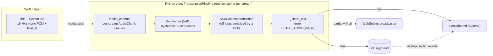
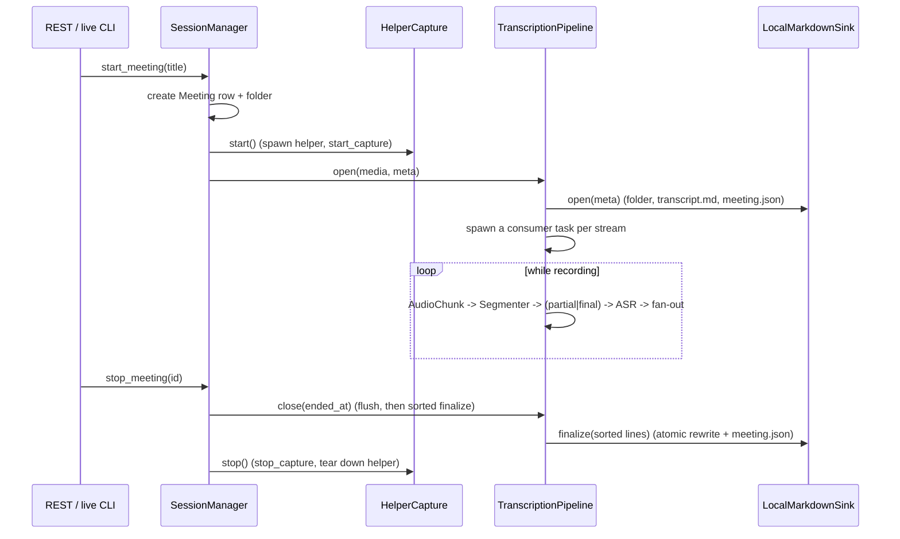

# The transcription pipeline

This document traces a single meeting from audio frames to a finished `transcript.md`. The
orchestration lives in `transcript/` (`SessionManager` -> `MeetingSession` ->
`TranscriptionPipeline`); the stages it drives live in `vad/`, `asr/`, `export/`, and `db/`.

## End-to-end flow

## Lifecycle

## Stages in detail

### 1. Capture -> per-stream chunks

The helper streams 16 kHz mono PCM for both streams over `media.sock`. `media_channel.py`
decodes frames into per-stream `asyncio.Queue`s of `AudioChunk` (samples + `host_ts`). The
pipeline runs **one consumer task per stream** (`Stream.ME`, `Stream.THEM`).

### 2. One clock, meeting-relative seconds

The first `AudioChunk` seen on either stream sets `epoch_ns`. Every chunk's time becomes
`t0_s = (host_ts - epoch_ns) / 1e9`. Because both streams are stamped from the helper's
*single* monotonic clock, "Me" and "Them" share one timeline — segment times are directly
comparable across streams without aligning by sample index.

### 3. Segmentation (VAD)

Each consumer feeds samples to a `Segmenter` (one per stream, each with its own `VAD`
instance because the model is stateful). The segmenter:

- slices the stream into fixed frames (512 samples for Silero) and scores each,
- applies **start/stop hysteresis** (`min_speech_ms` to open an utterance, `min_silence_ms`
  to close it), keeping a short speech-onset pre-roll,
- emits a **final** `Utterance` when speech ends, and periodic **partial** snapshots during
  ongoing speech (`partial_ms` cadence; set to 0 to disable).

`Segmenter` is pure logic and is the highest-value unit-test surface — tests drive it with a
deterministic stub VAD, so coverage does not require the ONNX model.

### 4. Transcription (ASR)

Each emitted utterance is transcribed by the configured `ASRBackend`. Two important details:

- ASR is CPU/GPU-bound, so it runs via `asyncio.to_thread` and never blocks the event loop.
- A single `asyncio.Lock` serializes transcription across both streams, so the two consumers
  never call the native model concurrently.

The joined text is passed through `_clean_text`, which drops clips whisper renders as a lone
non-speech marker (`[BLANK_AUDIO]`, `[Music]`, `(buzzing)`).

### 5. Fan-out: final vs partial

- **Partial** (speech in progress): broadcast to the WebSocket only. Partials are a live,
  best-effort preview; they are never persisted.
- **Final** (utterance closed): broadcast to the WebSocket, persisted as a `Segment` row
  (DB), and appended to `transcript.md`. The speaker label is `Me`/`Them` by channel in
  Phase 1 (diarization of "Them" arrives in Phase 2).

### 6. Finalize: ordered rewrite

The live `transcript.md` is appended in **ASR-completion order**, which interleaves the two
streams (a longer "Them" utterance can finish after a later "Me" one). At stop, the pipeline
reads every segment back from the DB sorted by `start_s` and the sink **atomically rewrites**
`transcript.md` in timestamp order (temp file + `os.replace`), grouping consecutive
same-speaker segments under one `### HH:MM:SS — Speaker` header. The DB is the source of truth;
the file is a durable projection of it.

## Design rationale

- **Why a single `host_ts` clock?** Mic and system audio come from independent hardware
  clocks that drift. Stamping both from one monotonic clock in the helper makes cross-stream
  alignment (and, later, hint-to-cluster fusion) exact.
- **Why VAD-driven utterances instead of fixed windows?** Whisper works best on coherent
  speech spans. VAD cuts on natural pauses, which also bounds latency (a final lands shortly
  after you stop talking) and keeps the model off silence.
- **Why finals-only to disk?** Partials are noisy and rewrite constantly. Persisting only
  finals keeps `transcript.md` corruption-free (complete, newline-terminated blocks) and the
  DB clean; the UI gets the live feel from the WebSocket.
- **Why rewrite at finalize?** Live append cannot reorder past writes, but a meeting-relative
  sort produces a readable final document. The same rewrite seam is where resolved speaker
  names will be baked in once diarization lands.

## Validation

The wiring is unit-tested end to end with a fake media channel + stub VAD + fake ASR
(`tests/test_pipeline.py`), asserting the segment persists, `transcript.md` contains it, and a
final WebSocket event fires. The real stack is exercised on-device via `hearsay live` (see
[development.md](development.md)); a real call confirmed Me/Them separation, ~1-2 s finals,
and a correct `transcript.md`.
