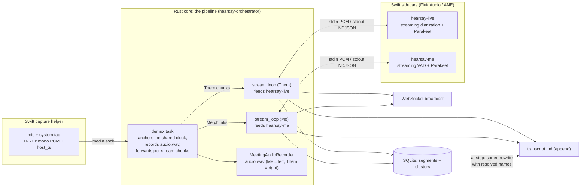
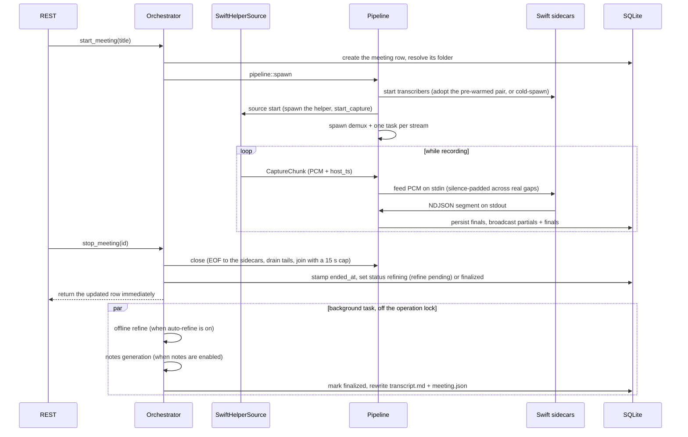

# The transcription pipeline

This document traces a single meeting from audio frames to a finished `transcript.md`. The
orchestration lives in `hearsay-orchestrator` (`Orchestrator`, `pipeline::spawn`, and one
`stream_loop` task per stream); the audio AI itself runs in Swift sidecars (FluidAudio on the Apple
Neural Engine) that the pipeline spawns and feeds. The Rust core relays PCM and persists results
but runs no live ML of its own; the offline refine uses whisper.

## End-to-end flow

## Lifecycle

## Stages in detail

### 1. Capture to per-stream chunks

The helper streams 16 kHz mono PCM for both streams over `media.sock`. `hearsay-capture` decodes
the frames into a channel of `CaptureChunk`s (samples plus `host_ts`) tagged by stream. The
pipeline's `demux` task forwards each chunk into a bounded per-stream channel, and one
`stream_loop` task per stream (`Me`, `Them`) consumes it. The recorder writes on the demux path
before that hand-off, so a slow transcriber can only back up its own stream's queue (chunks past
the 128-slot capacity are dropped with a log line); it can never stall the recorder or the other
stream.

When built with the `aec` feature, `demux` echo-cancels the Me stream against the Them tap (the
far-end reference) before the hand-off, so system audio the mic picks up on speakers is not
transcribed as the local user. The recording stays raw; only what live transcription sees is
cancelled. See `docs/echo-cancellation.md`.

### 2. One clock, meeting-relative seconds

The first chunk seen on either stream sets the epoch. Every chunk's time becomes
`t0_s = (host_ts - epoch_ns) / 1e9`. Both streams are stamped from the helper's single monotonic
clock, so Me and Them share one timeline and segment times are directly comparable across streams;
nothing is aligned by sample index. Each sidecar reports times relative to the samples it has been
fed, so each `stream_loop` records the meeting time of its first fed chunk as the stream's offset
and adds it to every segment. If a chunk's timestamp runs ahead of the samples fed so far by more
than 0.2 s (dropped frames, a tap rebuild, a chunk dropped under backpressure), the loop feeds
silence to close the gap, capped at five minutes so a corrupt timestamp cannot force a huge
allocation. The recorder re-anchors on the same rule, so transcript times and `audio.wav` stay in
step.

### 3. Routing a stream to its sidecar

Each `stream_loop` owns a `ProcessTranscriber`, which owns one Swift subprocess: PCM goes in on
stdin (a `u32` little-endian sample count followed by that many `f32` samples), and NDJSON segments
come back on stdout. All VAD, diarization, and ASR happen inside the sidecar on the Neural Engine.

- **Them, `hearsay-live`.** FluidAudio's streaming diarizer plus Parakeet: as each speaker turn
  finalizes, the sidecar transcribes it and emits a
  `{kind: "final", speaker, text, start_s, end_s}` turn. The loop maps the 0-based `speaker` to a
  1-based `Speaker N` label, creating a cluster row per ordinal on first sight. On top of that, a
  streaming ASR pass transcribes the in-progress turn into growing partial transcripts. Partials
  are speaker-less (broadcast under the generic `Them` label) because the diarizer only assigns a
  speaker at turn end.
- **Me, `hearsay-me`.** FluidAudio's streaming VAD finds utterance boundaries and streaming
  Parakeet transcribes them, emitting growing partials while you speak and a final when the
  utterance closes. Me is always the local speaker, so there is no diarization; the label is
  always `Me`.

A missing or broken sidecar binary fails `start_meeting` with a clean error rather than starting a
meeting that cannot transcribe. The sidecar pair for the next meeting is pre-spawned so its models
load before the user presses start (see the warm pool in
[architecture.md](architecture.md#trait-seams)); live feeding also waits on a shared permit until
any still-running refine releases the Neural Engine.

### 4. Recording the meeting audio

When recording is on (the default), a `MeetingAudioRecorder` accumulates one timeline-accurate
stereo WAV, `<folder>/audio.wav`, with Me on the left channel and Them on the right. Each sample is
placed by meeting time, so sample N is meeting second N/16000. This single file serves both
in-browser playback and the post-meeting refine (which reads the Them channel). It is the only raw
audio retained, and it can be turned off in Settings, which also disables the refine since there is
nothing to re-diarize.

### 5. Fan-out per segment

Each sidecar final is fanned out three ways by the loop's `handle` function: broadcast to the
WebSocket with its resolved label, persisted as a segment row (Them finals carry a `cluster_id`),
and appended to `transcript.md`. Partials are broadcast only, never persisted; the frontend renders
one dimmed partial per stream and replaces it with that stream's next final.

### 6. Finalize: ordered rewrite

The live `transcript.md` is appended in arrival order, which interleaves the two streams (a long
Them turn can finish after a later Me utterance). At stop, `close()` sends EOF to each sidecar so
it flushes its streaming tail, drains the remaining segments, reads every segment back from the
database sorted by `start_s`, and atomically rewrites `transcript.md` in timestamp order (temp file
plus rename), grouping consecutive same-speaker segments under one `### HH:MM:SS — Speaker`
header. The database is the source of truth; the file is a durable projection of it.

### 7. Post-meeting refine (offline re-diarization)

The streaming Them labels are good but not authoritative: a whole-track pass clusters globally and
handles overlap better. The refine runs automatically at stop when auto-refine is on (default off),
and on demand from the "Refine speakers" button (`POST /api/meetings/{id}/rediarize`). Both paths
drive the same `LiveEngine::rediarize` implementation. The refine:

- diarizes the whole Them track (the right channel of `audio.wav`) with the `hearsay-diarize`
  sidecar, which returns speaker turns and each speaker's mean voiceprint,
- re-transcribes each turn's audio span with whisper (`hearsay-inference`), so the transcript
  follows speaker changes turn by turn; `replace_them_segments` swaps the live Them segments and
  clusters for one segment per refined turn in a single transaction (Me is untouched),
- carries manual renames forward by voting each locked name onto the turn ordinal its old segments
  most overlap, so a re-diarize never drops a manual binding (per-line reassignments, being
  segment-level, are rebuilt only at the cluster level — like manual text edits, a refine discards
  them, and the `edited` flag warns first),
- stores each speaker's centroid on its cluster and matches it against people named in prior
  meetings; a returning person is auto-named provisionally, and a manual rename still wins,
- rewrites `transcript.md` from the rebuilt segments.

A meeting whose track contains no remote speech is treated as a no-op rather than an error, and a
refine that yields no turns leaves the existing transcript intact; neither path ever wipes a
transcript.

### 8. Notes (optional)

When notes are enabled in Settings (and the `hearsay-notes` sidecar is bundled), stopping a meeting also generates
notes from the finalized transcript with a local GGUF model (llama.cpp), through the same background
task that runs the refine. The model's reply is stored and rendered verbatim (as Markdown) — the
user-editable prompt template dictates the format, with no structured summary/action-item parsing.
Notes are best-effort: a missing model or a generation error is logged and never fails the meeting.
The manual "Generate notes" route drives the same `LiveEngine::generate_notes` path at any time after
the meeting.

## Design rationale

- **Why a single `host_ts` clock?** The microphone and system audio come from independent hardware
  clocks that drift. Stamping both from one monotonic clock in the helper makes cross-stream
  alignment exact.
- **Why sidecars on the Neural Engine?** Running live ASR and diarization on the GPU makes the two
  models contend, and a contended Metal pipeline can enter an unrecoverable error state. On the
  ANE the two workloads co-schedule with negligible interference and leave the GPU alone. Keeping
  each model in its own subprocess also keeps the core's live path free of heavyweight ML
  dependencies.
- **Why turn-driven Them instead of VAD plus separate diarization?** A VAD cuts on silence, not on
  speaker change, so a quick exchange lands in one utterance that a single label cannot split. The
  diarizer's turns are the segments, live and in the refine, so fast turn-taking splits correctly.
- **Why re-diarize after stop?** The streaming diarizer works online with limited context. A
  whole-track pass is more accurate and cheap on the ANE, so every meeting can end with
  authoritative labels, and the same pass recognizes returning people by voiceprint.
- **Why finals-only on disk, rewritten at finalize?** A live append cannot reorder past writes. The
  meeting-relative sort produces a readable final document, and re-reading from the database bakes
  in any names resolved or corrected along the way.

## Validation

The wiring is tested end to end with scripted fakes in `hearsay-orchestrator`: a fake audio source
and stubbed transcribers, asserting that a segment persists, appears in `transcript.md`, and fires
a WebSocket event. The sidecar transcribers are tested against their NDJSON contract, and the
refine against a stub diarizer (turn rebuild, rename carry-forward, voiceprint recognition, and the
empty-meeting and no-turns guards). The real stack is exercised on-device via `make rust-serve`
(see [development.md](development.md)); the standalone sidecars are validated directly on recorded
clips.
