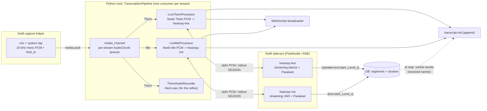
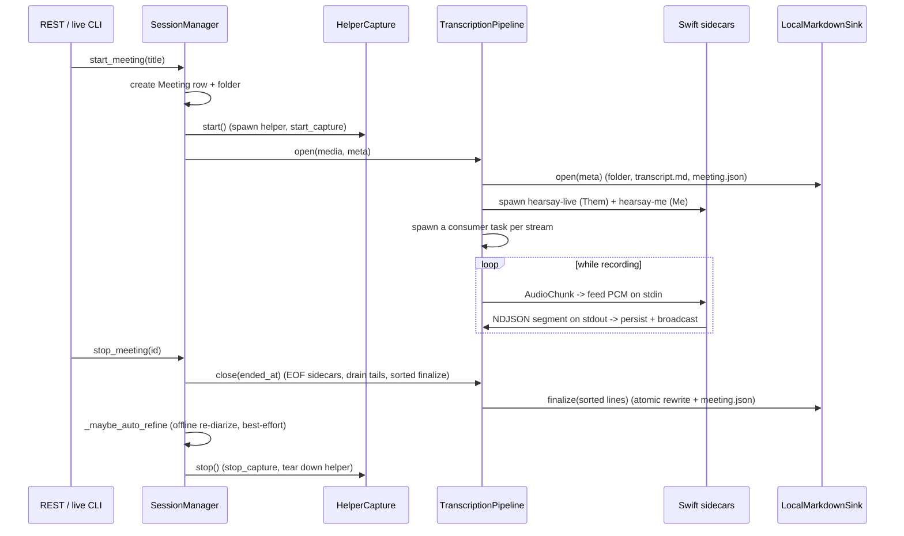

# The transcription pipeline

This document traces a single meeting from audio frames to a finished `transcript.md`. The
orchestration lives in `transcript/` (`SessionManager` -> `MeetingSession` ->
`TranscriptionPipeline`); the audio-AI itself runs in **Swift sidecars** (FluidAudio on the
Apple Neural Engine) that the pipeline spawns and feeds. The Python core relays PCM and
persists results but runs no ML models of its own.

## End-to-end flow

## Lifecycle

## Stages in detail

### 1. Capture -> per-stream chunks

The helper streams 16 kHz mono PCM for both streams over `media.sock`. `media_channel.py`
decodes frames into per-stream `asyncio.Queue`s of `AudioChunk` (samples + `host_ts`). The
pipeline runs **one consumer task per stream** (`Stream.ME`, `Stream.THEM`).

### 2. One clock, meeting-relative seconds

The first `AudioChunk` seen on either stream sets `epoch_ns`. Every chunk's time becomes
`t0_s = (host_ts - epoch_ns) / 1e9`. Because both streams are stamped from the helper's
*single* monotonic clock, "Me" and "Them" share one timeline — segment times are directly
comparable across streams, never aligned by sample index. Each sidecar is told the meeting
time of its first fed sample (`offset_s`), so the WAV-relative times it emits map back onto
the meeting clock.

### 3. Routing a stream to its sidecar

Each stream is handled by a `LiveSidecarProcessor` that owns one Swift subprocess: it spawns
the sidecar, streams the stream's PCM in on stdin (`<uint32 LE sample-count>` + float32
frame), and reads the NDJSON segments it emits on stdout. All VAD, diarization, and ASR happen
inside the sidecar on the ANE — the Python side never touches a model.

- **Them → `hearsay-live`** (`LiveThemProcessor`). FluidAudio's streaming diarizer + Parakeet:
  as each speaker turn finalizes, the sidecar transcribes it and emits
  `{speaker, text, start_s, end_s}`. The processor maps the 0-based `speaker` to a 1-based
  `Speaker N` label, creating a `Cluster` row per ordinal on first sight.
- **Me → `hearsay-me`** (`LiveMeProcessor`). FluidAudio streaming VAD + Parakeet: it finds
  speech boundaries and transcribes each utterance, emitting `{text, start_s, end_s}`. Me is
  always the local speaker, so there is no diarization — the label is always `Me`.

The pipeline runs no ML itself: it routes each stream's PCM to its processor and does nothing
else with the samples. A stream with no processor (e.g. a missing sidecar binary) is drained
without transcription — the Them track is still recorded for the refine.

### 4. Recording the Them track for the refine

When `diarization.refine` is on (the default), a `ThemAudioRecorder` streams the raw Them
samples to `<folder>/them.wav` (stdlib `wave`), capturing the first sample's meeting-time
offset in a sidecar file. Me is never recorded. This is the input the post-meeting refine
re-diarizes; it is the only raw-audio retention and can be turned off.

### 5. Fan-out per segment

Each sidecar segment is fanned out three ways by its processor's `_handle`: broadcast to the
WebSocket with its resolved label, persisted as a `Segment` row (DB, Them carries a
`cluster_id`), and appended to `transcript.md`. The sidecars emit finalized segments only.

### 6. Finalize: ordered rewrite

The live `transcript.md` is appended in arrival order, which interleaves the two streams (a
longer Them turn can finish after a later Me utterance). At stop, `close()` sends EOF to each
sidecar (so it finalizes and persists its streaming tail), reads every segment back from the DB
sorted by `start_s`, and the sink **atomically rewrites** `transcript.md` in timestamp order
(temp file + `os.replace`), grouping consecutive same-speaker segments under one
`### HH:MM:SS — Speaker` header. The DB is the source of truth; the file is a durable
projection of it.

### 7. Post-meeting refine (offline re-diarization)

The streaming Them labels are good but not authoritative — a whole-track pass clusters
globally and handles overlap better. `rediarize_meeting` runs automatically at stop (when
`diarization.auto_refine` is on) and on demand via the "Refine speakers" button /
`hearsay rediarize`:

- diarize the whole `them.wav` with `FluidAudioDiarizer` (the `hearsay-diarize` helper —
  FluidAudio's pyannote community-1 CoreML model on the ANE), which returns speaker turns
  **and** each speaker's mean voiceprint,
- **re-transcribe each turn's audio span** with Parakeet, so the transcript follows speaker
  changes turn by turn (`apply_turn_diarization` drops the coarse live Them segments/clusters
  and writes one segment per turn as `Speaker 1..N`; Me is untouched),
- carry any manual renames forward by voting each locked name onto the turn ordinal its old
  segments most overlap (a re-diarize never drops a manual binding),
- store each speaker's centroid on its cluster and match it against people named in prior
  meetings — a returning person is auto-named *provisionally* (a manual rename still wins),
- rewrite `transcript.md` from the rebuilt segments.

A meeting with no Them segments (e.g. a capture failure) is skipped rather than seeded with a
phantom speaker; a diarizer/ASR run that yields no turns leaves the existing transcript intact.

## Design rationale

- **Why a single `host_ts` clock?** Mic and system audio come from independent hardware
  clocks that drift. Stamping both from one monotonic clock in the helper makes cross-stream
  alignment exact.
- **Why sidecars on the ANE?** The earlier GPU path (whisper.cpp on Metal + pyannote on MPS)
  fought for the GPU and could enter an unrecoverable Metal error state. FluidAudio runs ASR
  and diarization on the Apple Neural Engine, which co-schedules the two workloads with
  negligible interference and never touches the GPU. Keeping each model in its own Swift
  subprocess also keeps the Python core free of heavyweight ML dependencies.
- **Why turn-driven Them instead of VAD + separate diarize?** A VAD cuts on silence, not on
  speaker change, so a back-and-forth exchange lands in one utterance that a single label
  cannot split (the Phase-2 "segmentation ceiling"). The diarizer's turns *are* the segments,
  live and in the refine, so quick turn-taking splits correctly.
- **Why re-diarize at finalize?** The streaming diarizer works online with limited context; a
  whole-track pass is more accurate and cheap on the ANE (~seconds), so every meeting ends with
  authoritative labels and the refine can also recognize returning people by voiceprint.
- **Why finals-only to disk, rewritten at finalize?** Live append cannot reorder past writes,
  but a meeting-relative sort produces a readable final document, and the re-read from the DB
  bakes in any speaker names resolved (or renamed) during or after the meeting.

## Validation

The wiring is unit-tested end to end with a fake media channel and stubbed processors
(`tests/test_pipeline.py`), asserting a segment persists, `transcript.md` contains it, and a
WebSocket event fires; the sidecar processors are tested against their NDJSON contract, and the
refine is tested with a stub diarizer (turn rebuild, manual-rename carry-forward, voiceprint
recognition, the empty-meeting and no-turns guards). The real stack is exercised on-device via
`hearsay live` and `hearsay serve` (see [development.md](development.md)); a real meeting
confirmed Me/Them separation, live turn labels with a few seconds' latency, and a correct
refined `transcript.md`. The standalone Swift sidecars are validated directly on recorded clips
(accurate Parakeet text; the offline diarizer returns the known speaker count).
