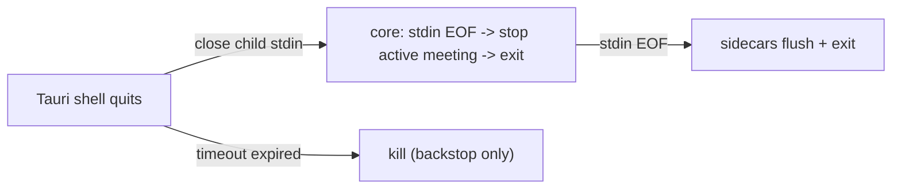

# Architecture-review remediation plan

> **Superseded / historical.** WP1-WP7 landed; WP8-WP10 were substantially addressed afterward
> (the `hearsay-backends` extraction, 422 conformance, data-integrity + concurrency hardening).
> Kept for provenance; current state lives in the code + the 2026-07-17 pre-remote cleanup pass.

Source: full-repo architecture/engineering review, 2026-07-14 (Rust crates, Swift helper package,
web/Tauri shell, build/CI). Every item below was verified against code at review time; references
are `file:line` on branch `feat/packaging-dmg-uninstall`. Line numbers will drift — the finding
descriptions are the contract, not the numbers.

How to use: work packages are ordered by priority. WP1-WP5 are days of work total and remove every
"app is dead / data is lost" failure mode found; WP6-WP9 shape the Windows port and should land
before it. Check items off as you go. Definition of done for every WP: `make ci` green plus the
WP's own verification steps.

Root-cause summary the fixes follow from: the happy path is engineered carefully; the unhappy path
is mostly unhandled. Recurring rules applied throughout:

- Every await on a child process is bounded (timeout + kill on expiry).
- Every spawned child has exactly one owner responsible for its death (`kill_on_drop` as backstop).
- Never hold a lock across I/O we do not control.
- A contract (`shared/protocol/ipc.md`) is only real if deviations fail loudly — implement it or
  amend it, never leave it fictional.

---

## Progress (resume here) — updated 2026-07-14

**Done: WP1-WP7.** All checkboxes in those sections are `[x]`. The work is in the working tree on
`feat/packaging-dmg-uninstall` but **not yet committed**.

| WP | Summary of what landed |
|----|------------------------|
| WP1 | Bounded sidecar/diarize awaits (`refine.rs`, `transcriber.rs` `with_close_timeout`); refine + transcript write moved off the op-lock into a tracked background task; `MeetingStatus::Refining`; double-stop guard; `wait_for_refines`. |
| WP2 | `/` gated on a valid `?token=` (401 otherwise); CSP pins `ws://{host}`; `ensure_bind_allowed` (refuse non-loopback outside dev); 0600 `{port,token}` handshake file replaces token-on-stdout; `HEARSAY_REFINE_TIMEOUT_SECS`; shell drops `http://localhost:*` capability. |
| WP3 | `kill_on_drop` on capture + sidecars; pipeline teardown guards; sidecar stderr → tracing; start-failure cleanup (no stranded `recording` row) + single-step meeting creation with `dir`; core shutdown chain (stdin-EOF + SIGTERM + stop active meeting after `serve`); shell graceful stop (SIGTERM→poll→SIGKILL) + boot-failure UI; Swift SIGPIPE-ignore + safe stderr writes. |
| WP4 | Segment pagination (fetch all pages — no >200 truncation); WS reconnect w/ backoff + guarded parse + connection banner; `stop.isError` rendered; delete confirm + per-item pending; top-level React `ErrorBoundary`. |
| WP5 | `tauri-lint` + `web-ci` + `version-check` folded into `make ci`; ESLint (typescript-eslint + react-hooks) added, 2 `exhaustive-deps` violations fixed; orchestrator compiles standalone (`macros`,`fs`); version single-sourced to `0.1.0` (rust canonical); `cargo audit`/`deny` extended to `src-tauri`; npm audit → moderate; CI actions SHA-pinned; model-staging checksum; `clean` covers web + tauri artifacts. |
| WP6 | Timestamp-drift fix (silence-pad resync in `stream_loop` keyed on `t0_s` vs sample-count); capture reader resync-to-magic + per-stream seq-gap logging; `expected_payload_len` validates magic/version; helper-crash supervisor finalizes the meeting (`install_self` + `died` oneshot); Swift `start_capture` arg validation (`unsupported`) + ring-overrun→seq-advance; recorder off the ASR-backpressure path (`try_send`) + bounded stream-join on close; ipc.md reconciled to the implemented subset. |
| WP7 | RT IOProc restructured to a raw-copy + `SPSCFloatRing` + off-thread resample worker (`SystemAudioTap`); tap watchdog switched to flow-cadence + edge-triggered `tap_health` + backoff-retry (watchdog survives failed rebuilds); mic silence detection + `mic_health` + `requestMicrophone` wired; media-socket `SO_SNDTIMEO` + honored uplink-join timeout + per-session uplink `StopFlag`; shared `SidecarIO` target (framing + stdin length cap + readiness marker); sidecar `audio` buffers compacted (drop finalized prefix); diarize header-only duration; `read_loop` recognizes the readiness marker. |

**Verification state:**
- Green locally: rust `clippy`/`fmt`/`test` (all binaries incl. WP6 + the WP7 `transcriber` change),
  `make swift-build` (all five products) + `hearsay-helper selftest` (now also `SPSCFloatRing`
  FIFO/wrap/overrun), the ignored synthetic capture e2e against the rebuilt helper. Earlier WPs:
  `make tauri-lint`, `make version-check`, web `typecheck`/`lint`/`build`, `npm ci`, `npm audit
  --audit-level=moderate`.
- **WP7 owes on-device verification** (the tap/mic RT + watchdog paths need real audio devices +
  TCC, which cannot run in CI): a >=30 min soak with Activity Monitor confirming flat sidecar RSS
  (item: buffer compaction); pull the aggregate device mid-capture and confirm edge-triggered
  `tap_health` + recovery (items: RT restructure + watchdog); revoke the mic grant mid-capture and
  confirm `mic_health degraded` (item: mic silence). Compile + reasoning only until then.
- Passes only after a commit: `make codegen-check` and `make version-check`'s `git diff` gates
  (regenerated `web/openapi.json` + `schema.ts` are staged; they diff until committed).
- **Not verified locally (no tooling installed): `cargo audit` + `cargo deny` on both Rust trees.**
  First CI run must confirm — the new `src-tauri` license check runs against `rust/deny.toml`'s
  allow-list, so an unlisted *permissive* license from the Tauri tree would fail and need its SPDX id
  added (never a copyleft), per `deny.toml`'s own note.

**Next: WP8 — pre-Windows refactor** (extract a `hearsay-backends` glue crate so `hearsay-core` returns
to web-only; move rediarize + the diarizer contract behind the engine seam; refine test coverage off
the `#[ignore]` path; portability landmines — `expand_home`/`USERPROFILE`, non-UTF-8 `dir`,
`HEARSAY_HELPER_PATH`; decide `hearsay-asr`'s fate). Then WP9 (data integrity/API), WP10 (hygiene
backlog). Note WP6 item 5 / WP7 watchdog leave one follow-on: the full helper-respawn-with-backoff
supervision loop in `SwiftHelperSource` (the tap now has the backoff-rebuild pattern to mirror).

---

## WP1 — Engine wedge: bounded child-process awaits + refine off the op-lock

Any hung child process currently wedges meeting start/stop permanently (one `op_lock` serializes
the lifecycle and three awaits under it are unbounded). Highest impact-to-effort in the plan.

- [x] `hearsay-inference/src/refine.rs:75-78` — the `hearsay-diarize` sidecar runs via
      `Command::output()` with no timeout. Spawn + wait with a deadline (config-derived, generous —
      refine is minutes-long by design) and kill on expiry; surface as `InferenceError::Diarize`.
      Done: `run_diarize` spawns with piped stdout/stderr (drained on threads to avoid pipe-buffer
      deadlock), polls `try_wait` against a `HEARSAY_REFINE_TIMEOUT_SECS`-derived deadline (default
      1800s), kills on expiry; diarize errors now use `InferenceError::Diarize`.
- [x] `hearsay-orchestrator/src/transcriber.rs:116-118` — `ProcessTranscriber::close()` awaits
      sidecar stdout EOF (`reader.await`) unbounded; the existing 10 s timeout at `:120` only covers
      `child.wait()` after stdout closes. Wrap the reader drain in the same timeout; kill on expiry.
      Done: the reader drain is bounded by `close_timeout` (10s default); on expiry the child is
      killed to force stdout EOF. Verified by `close_is_bounded_when_sidecar_never_closes_stdout`
      (real `ProcessTranscriber` over the new `hang_sidecar` fixture).
- [x] `hearsay-orchestrator/src/orchestrator.rs:223,254-255` — `stop_meeting` holds `op_lock`
      through `maybe_auto_refine` + `write_transcript`, so the stop request blocks for the full
      refine and no meeting can start meanwhile. Shrink the critical section to take-session +
      `Pipeline::close` + `finalize_meeting`; run refine + transcript write after the guard drops
      (tracked background task; add a `refining` meeting status so the UI can show it).
      Done: the critical section now ends at `finalize_meeting`; refine + transcript write + the
      `refining`->`finalized` flip run on a tracked `tokio::spawn` task (`wait_for_refines` joins
      them for shutdown/tests). New `MeetingStatus::Refining` threads through db, API schema, and TS
      codegen. Verified by `start_succeeds_while_previous_meeting_refines`.
- [x] `hearsay-orchestrator/src/orchestrator.rs:245` — double-stop on an already-finalized meeting
      silently rewrites `ended_at` and re-runs the refine. Guard on already-finalized status.
      Done: stop returns the existing row unchanged when `status != Recording` (covers `refining`
      too). Verified by `double_stop_does_not_rerefine`.

Verification: integration test with a scripted sidecar that never closes stdout — `stop_meeting`
must return within the timeout and a subsequent `start_meeting` must succeed. Existing
`tests/lifecycle.rs` fakes cover the refine-at-stop ordering; extend for the `refining` status.

## WP2 — Security: close the token handout, enforce loopback

`hearsay-core/src/security.rs:3-5` states the threat model (loopback is not a boundary; a bearer
token gates every request). Two gaps void it; both fixes are small diffs.

- [x] `hearsay-core/src/routes/web.rs:66-84` — `GET /` injects `window.__HEARSAY_TOKEN__`
      unauthenticated: any local process can harvest the token with one curl. Require a valid
      `?token=` query before injecting the bootstrap (401/404 otherwise). Both existing clients
      already send it: the Tauri shell navigates with `?token=` (`web/src-tauri/src/main.rs:144-152`)
      and the frontend reads it (`web/src/api/token.ts:14`).
      Done: `index` returns 401 unless `query_token` matches the session token; verified with a live
      `curl` (401 + no token in body) and by `index_gates_the_token_and_pins_the_ws_host`. NB the
      strip below means a hard page reload re-requests a tokenless `/` and gets 401 — the shell
      re-navigates via the handshake; WP4's reload affordance should re-navigate too.
- [x] `hearsay-core/src/config.rs:78` + `src/main.rs:111` — `HEARSAY_SERVER_HOST=0.0.0.0` binds
      publicly with no check; combined with the item above that is remote compromise from one env
      var. Parse the bind host as `IpAddr` and refuse non-loopback unless
      `ENVIRONMENT=development`.
      Done: `Settings::ensure_bind_allowed` (via `bind_allowed`/`is_loopback_bind`) is called before
      any work in `main`; verified live (`0.0.0.0`+production exits with the refusal, development
      binds). `localhost` and loopback IP literals are accepted.
- [x] `hearsay-core/src/main.rs:135` + `web/src-tauri/src/main.rs:145-158` — the session token is
      printed to stdout and the shell substring-sniffs log lines for `?token=` (secret-in-logs +
      brittle handshake; the shell also re-navigates on any later matching line). Replace with a
      structured handshake: shell passes a handshake path via env; core writes `{port, token}` JSON
      to a 0600 file once ready; shell reads it exactly once. Keep the println gated to development.
      Done: core `write_handshake` writes `{port,token}` to `HEARSAY_HANDSHAKE_PATH` (temp+rename,
      0600 on Unix); the `open:` println is gated to development. The shell passes a cache-dir path,
      polls it once, navigates, and deletes it. Verified live: 0600 file, no token in production
      logs.
- [x] `web/src-tauri/capabilities/default.json:8` — the remote IPC grant is port-wildcarded and
      includes `http://localhost:*/*` although the shell only navigates to `http://127.0.0.1:<port>`.
      Drop the localhost entry; add a native confirmation dialog inside `erase_all_data` so a
      webview compromise alone cannot wipe data.
      Done: dropped the `http://localhost:*/*` grant; `erase_all_data` now shows a backend-driven
      `tauri-plugin-dialog` Ok/Cancel confirm and no-ops unless confirmed. `cargo clippy` on
      `web/src-tauri` is clean.
- [x] `web/src/api/token.ts:14` — after caching the `?token=` query param, strip it with
      `history.replaceState` so it does not ride in location/history all session.
      Done: `stripTokenFromUrl` deletes `token` and `replaceState`s the cleaned URL after caching.
- [x] `hearsay-core/src/routes/web.rs:45` — `connect-src` wildcards `ws://127.0.0.1:*` +
      `ws://localhost:*`; the core knows its own port at render time — pin it.
      Done: `connect-src` now pins `ws://{request Host}` (the same `window.location.host` the client
      opens the socket on); verified the served CSP contains `ws://127.0.0.1:<port>` and no localhost.
- [x] `hearsay-core/src/main.rs:108-109` + `src/routes/audio.rs:29-34` — comment accuracy: the token
      is 244 bits (two v4 UUIDs), not "256-bit", and hex, not "URL-safe base64" — the base64 claim is
      load-bearing for `query_token`'s no-percent-decoding assumption. Correct both comments.
      Done: comments corrected; `query_token` moved to `security.rs` with the corrected hex rationale
      and shared by `audio.rs` + the index gate (`query_token_extracts_raw_value_without_decoding`).

Verification: `curl http://127.0.0.1:<port>/` without a token returns no token in the body;
`HEARSAY_SERVER_HOST=0.0.0.0 ENVIRONMENT=production` refuses to start; app still boots via the
file handshake. Unit tests beside the existing `security.rs` tests. All verified (see per-item
notes); `make ci` Rust/Swift/web stages green, `cargo audit`/`cargo deny` not installed locally.

## WP3 — Process lifecycle: no orphans, graceful shutdown chain, boot failure UI

- [x] `hearsay-capture/src/lib.rs:97` — `SwiftHelperSource::start()` spawns the helper without
      `kill_on_drop(true)` (the probe at `:316` sets it; start does not). Add it. Covers the
      start()-internal error paths too (accept timeout `:100-105`, hello `:110`, start_capture
      reply `:123`), where `child` is currently dropped un-killed with the mic hot.
- [x] `hearsay-orchestrator/src/pipeline.rs:68-70` — `pipeline::spawn` starts the source before the
      transcribers; if a sidecar spawn fails the source is dropped without `stop()`. Add a guard
      that calls `source.stop().await` when a later stage errors.
- [x] Graceful shutdown chain (one mechanism, fixes four findings, ports to Windows):
      the shell holds the core's stdin; the core treats stdin EOF as shutdown (stop active meeting,
      then exit); sidecars already exit on their stdin EOF.
      - [x] `web/src-tauri/src/main.rs:172-176` — replace bare `child.kill()` with: close stdin (or
            SIGTERM), wait with a short timeout, then kill.
      - [x] `hearsay-core/src/main.rs:144-147` — `shutdown_signal` only awaits ctrl_c; add stdin-EOF
            watch + `SignalKind::terminate()` (Unix) with a `tokio::signal::windows` arm later, and
            after `axum::serve` returns, stop the active meeting through the engine before exit.
      - [x] Parent-death detection falls out for free: shell crash closes stdin, core exits — no
            headless core with a live token, no second core against the same SQLite file.

- [x] `web/src-tauri/src/main.rs:145-166` — no boot health handling: if the core exits at startup or
      never emits the handshake, the splash shows "Starting Hearsay..." forever
      (`CommandEvent::Terminated` is discarded by the `_ => continue` arm). Handle Terminated
      (navigate the splash to an error state with the exit detail), add a boot timeout, and stop
      listening after the first successful navigation.
- [x] `hearsay-orchestrator/src/orchestrator.rs:103-124` — start failure after `create_meeting`
      strands the row at `status=recording` (shows as live forever). On error, finalize or delete
      the row. Also make creation single-step: resolve the output root first and insert `dir` in the
      same statement (today it is `INSERT` with `dir=''` then `set_meeting_dir`, non-transactional).
- [x] `hearsay-orchestrator/src/pipeline.rs:182` — when the emit channel closes first (sidecar died
      or closed stdout) the `ProcessTranscriber` is dropped without `close()`/kill. Call
      `transcriber.close().await` before `break` and add `kill_on_drop(true)` in
      `transcriber.rs:76-80`.
- [x] `hearsay-orchestrator/src/transcriber.rs:79` — sidecar stderr is `Stdio::null()`; crash
      diagnostics vanish. Pipe stderr into `tracing` (ipc.md already reserves stderr for NDJSON
      logs).
- [x] `hearsay-capture/src/lib.rs:158-166` — `stop()` kills the child then `abort()`s `media_pump`,
      discarding socket-buffered tail audio. Read the pump to EOF (helper exit closes the socket)
      before aborting.
- [x] Swift sidecar exit hygiene: `hearsay-live`/`me`/`asr` mains do not ignore SIGPIPE (only
      `Serve.run()` does) — a dead core kills them mid-write with no tail flush. Add
      `signal(SIGPIPE, SIG_IGN)` + treat write failure as EOF. Also `Serve.swift:418` uses the
      legacy `FileHandle.write` that raises an uncatchable ObjC exception on a dead stderr pipe —
      use `write(contentsOf:)` with `try?` or raw `write(2)`.

Verification: kill -9 the shell mid-meeting — core exits, sidecars exit, meeting row finalized on
next launch or by the stdin-EOF stop. Delete a sidecar binary and start a meeting — 500 returned,
no orange mic indicator, no `recording` row left. Boot with the port occupied — error UI, not
eternal splash.

## WP4 — Frontend correctness: transcript truncation + robustness

- [x] `web/src/api/hooks.ts:28` — segments are fetched as page 1 / page_size 200 and the server
      hard-caps page_size at 200 (`hearsay-core/src/routes/meetings.rs:100`): any meeting with more
      than 200 segments renders silently truncated. Loop pages until `total` is reached (or switch
      to an infinite query). This is user-visible data loss in the primary view — do first.
- [x] `web/src/api/ws.ts:16-32` — no reconnect, no `onclose`/`onerror`, unguarded `JSON.parse` in
      `onmessage`; a dropped socket silently freezes the live transcript. Reconnect with backoff
      while the meeting is live, surface connection state to `useTranscript`, wrap the parse.
- [x] `web/src/components/TranscriptView.tsx:186-190` — only `rediarize.isError` is rendered; `stop`
      mutation errors (including its 600 s timeout, `hooks.ts:49`) are invisible — the button flips
      back with no message while the meeting may still be recording. Render `stop.isError` too.
- [x] `web/src/components/MeetingList.tsx:66-74` — delete is single-click, permanent (DB rows +
      recordings folder), no confirmation; `remove.isPending` disables all delete buttons. Add a
      confirm step and per-item pending state.
- [x] `web/src/main.tsx` — no React error boundary; any render error (e.g. `getToken()` throwing,
      `TranscriptView.tsx:76`) is a blank white window in the packaged app. Add a top-level boundary
      with a reload affordance.

Verification: seed a meeting with >200 segments and confirm full render; kill the core mid-meeting
and confirm the UI shows a disconnected state and recovers on respawn.

## WP5 — CI parity: the gate covers what ships

The stated bar is "`make ci` is the gate and must stay green" — today the shipping entrypoint and
the web app are outside it. All items mechanical.

- [x] `Makefile:68` — add the Tauri shell to the gate: `cargo clippy --manifest-path
      web/src-tauri/Cargo.toml --all-targets -- -D warnings` (+ `cargo build`). Today a broken
      `src-tauri/main.rs` merges green (it only compiles during a manual `make dmg`).
- [x] `Makefile:61-66` — run `cargo audit` and `cargo deny` against `web/src-tauri` too (its
      Cargo.lock is the largest dependency tree in the repo and currently has no CVE or license
      gating).
- [x] `Makefile:68` — fold `web-ci` into `make ci` so a TS type error fails locally, not only in the
      Actions web job (local gate must equal CI gate).
- [x] `web/package.json` — add ESLint (typescript-eslint + react-hooks) and wire into `web-ci`;
      `react-hooks/exhaustive-deps` violations already exist (`SettingsPage.tsx:124-126`). Vitest
      for the pure logic (useTranscript reducer) is the follow-on.
- [x] `.github/workflows/ci.yml:8-9` — SHA-pin all actions (the TODO comment already says so);
      `taiki-e/install-action@v2` is a moving tag installing binaries that gate the build.
- [x] `Makefile:63` — `npm audit --audit-level=high` ignores moderate advisories; lower to moderate
      or document why not.
- [x] `rust/crates/hearsay-orchestrator/Cargo.toml:9` — the crate does not compile standalone:
      uses `tokio::select!` (needs `macros`, `pipeline.rs:155`) and `tokio::fs` (needs `fs`,
      `orchestrator.rs:112`); builds only via workspace feature unification. Add `"macros", "fs"`.
      Verified failing with `cargo check -p hearsay-orchestrator --lib`.
- [x] Version single-source: `rust/Cargo.toml:21` (0.0.0) vs `web/src-tauri/tauri.conf.json:4`
      (0.1.0) vs `web/package.json:4` (0.1.0); the About panel shows 0.0.0 while the DMG says 0.1.0.
      Derive all from one place.
- [x] `Makefile:94-101` — the staged refine model is copied once and skipped forever with no
      checksum; verify by hash (or at least size) so a corrupt/outdated staged model re-copies.
- [x] `Makefile:75-76` — `clean` misses `web/dist`, `web/node_modules`, `web/src-tauri/target`, and
      staged `binaries/`/`models/`.

Verification: introduce a deliberate clippy error in `src-tauri` and a TS error in `web/src` —
`make ci` must fail on both.

## WP6 — IPC contract reconciliation (do before writing the Windows side)

`shared/protocol/ipc.md` promises behavior neither side implements. Implement it or amend the doc;
the Windows implementation will be written against this document.

- [x] Timestamp guardrail violation (the one real correctness bug in the set):
      `hearsay-orchestrator/src/pipeline.rs:159,218-219` maps segment time as sidecar-local time +
      one constant offset captured at the first chunk — effectively sample-index time after any
      dropped frame or tap rebuild, and it diverges from the recorder, which does resync on gaps
      (`recorder.rs:101-105`). In `stream_loop`, compare each chunk's `t0_s` against the
      sample-count-derived expectation; past a threshold, feed silence into the sidecar (or maintain
      a piecewise offset) so transcript times stay aligned with `audio.wav`.
      Done: `stream_loop` tracks `fed_samples`; per chunk it compares `(t0_s - base)` against
      `fed_samples/rate` and, past `RESYNC_THRESHOLD_S` (0.2 s, matching the recorder's `RESYNC_GAP`),
      feeds `gap * rate` silence samples (capped at `MAX_SILENCE_PAD_SAMPLES`) before the chunk, so
      the single `offset` mapping stays correct and the sidecar timeline re-anchors on `t0_s` just as
      `audio.wav` does. Verified by `timeline_gap_pads_sidecar_with_silence` (lifecycle.rs).
- [x] `hearsay-capture/src/lib.rs:196-211` — `frame.seq` is decoded and discarded; ipc.md:42 makes
      seq gaps the drop-detection mechanism. Track last-seq per stream; on gap, log + count + (with
      the item above) trigger the resync path.
      Done: `media_pump` tracks last `seq` per stream (`seq_gap` helper, wrap-aware) and logs the
      dropped-frame count on a gap; the host_ts-based pad above handles the timeline recovery. Unit
      tests `seq_gap_detects_drops_and_ignores_contiguous_and_wrap`.
- [x] `hearsay-capture/src/lib.rs:179-199` — on a decode error the reader `continue`s from a
      misaligned stream position (silent desync of every later frame; failure not even logged); on
      `expected_payload_len` error it breaks and kills capture. ipc.md:58 requires
      drop/log-and-resync: scan forward for the `0xA7 0x01` magic to re-frame.
      Done: `media_pump` now reads via `next_frame`, which validates a full header
      (`header_payload_len`: magic/version/type/stream/format + size cap) and, when misaligned,
      slides one byte at a time to re-frame on the magic — logging the skipped-byte count — instead
      of desyncing or killing capture. Tests `next_frame_resyncs_past_leading_garbage_and_false_magic`
      + `next_frame_decodes_a_stream_of_frames`.
- [x] `hearsay-ipc/src/lib.rs:272-284` — `expected_payload_len` does not validate magic/version
      before trusting the length field to size the next read. Validate bytes 0-1 first.
      Done: `expected_payload_len` now returns `BadMagic`/`UnsupportedVersion` before reading
      `n_samples`. Test `expected_payload_len_rejects_bad_magic_or_version_before_sizing`.
- [x] Helper crash handling, ipc.md:115-116 ("mark degraded, respawn with backoff, replay
      start_capture") — currently `media_pump` EOF (`lib.rs:176-177`) silently winds the pipeline
      down while `active_meeting()` still reports live. Minimum: an engine-level capture-died event
      that flips meeting state and reaches the WS so the user knows. Full: a supervision loop in
      `SwiftHelperSource` that respawns + replays with backoff. Ship the minimum first.
      Done (minimum): the pipeline distinguishes an intentional stop (a flag `close()` sets before
      `source.stop()`) from an unexpected capture end and fires a `died` oneshot in the latter case;
      the orchestrator's per-meeting `spawn_capture_supervisor` awaits it and finalizes via
      `stop_meeting` (clears `active`, finalizes the row, closes the broadcast → live WS subscribers
      see it). Wired to the real `Arc<Orchestrator>` via `install_self` (`main.rs`). Verified by
      `capture_death_finalizes_the_meeting`. Full respawn-with-backoff remains future work (noted in
      ipc.md step 5).
- [x] `helper/Sources/.../Serve.swift:163-233` — `start_capture` never reads `cmd.args`:
      `tap_mode: "meeting_app_only"`, `target`, `sample_rate` are silently ignored and answered
      `{"started": true}`. Validate args; reply `unsupported` for unimplemented modes.
      Done: `startCapture` calls `unsupportedStartArg` first — a `tap_mode` other than
      `global_except_self` or a `sample_rate != 16000` now returns `{"ok": false, "error": {"code":
      "unsupported", ...}}`. `swift build` + `selftest` green; the Rust `SwiftHelperSource` (which
      sends `global_except_self`@16k) still starts, proven by the synthetic e2e test.
- [x] `helper/Sources/.../RingBuffer.swift:16` — `droppedSamples` is counted but never read, and
      because drops happen before framing, wire `seq` never gaps (the advertised loss mechanism
      structurally cannot fire). Either advance `seq` by the dropped-frame equivalent or emit a
      buffer-pressure control event when it advances.
      Done: `noteRingDrops` (per drain tick) advances `seqByStream` by the dropped-frame equivalent
      of any new `droppedSamples`, so the core's new seq-gap detection fires and logs the loss; the
      helper also logs the overrun. Chose the seq-advance path (contract's own drop mechanism) over a
      new event, so no wire/contract addition.
- [x] `hearsay-orchestrator/src/pipeline.rs:125` + `transcriber.rs:101` — a wedged (non-crashed)
      sidecar that stops reading stdin fills the pipe, blocks `feed`, fills the mpsc(128), and
      blocks `demux` — head-of-line: the other stream AND the `audio.wav` recorder stop.
      Backpressure-to-capture is intentional, but the recorder must not sit behind ASR
      backpressure: keep the recorder on an always-drained path (`try_send` + drop-with-log to the
      stream tasks), and/or add a stall timeout that marks the transcriber broken.
      Done: demux records on its own always-drained path, then `try_send`s to each stream (drop-with-
      log on a full queue) instead of `send().await`, so a wedged/slow transcriber can stall neither
      the recorder nor the other stream (the dropped span becomes a timeline gap the resync above
      pads). Chose the bounded-join variant over a feed stall-timeout: `Pipeline::close` awaits demux
      unbounded (never truncate the WAV) then bounds each stream-task join at `STREAM_JOIN_TIMEOUT`
      and aborts (kill_on_drop reaps the sidecar), so a wedged sidecar cannot hang stop. Verified by
      `wedged_sidecar_does_not_starve_other_stream`.
- [x] Amend `shared/protocol/ipc.md` for whatever subset is deliberately not implemented, so the doc
      and both implementations agree.
      Done: added an "Implemented subset (this phase)" note under the commands table (only
      `ping`/`check_permissions`/`start_capture`/`stop_capture`/`shutdown` implemented; the rest +
      unsupported `start_capture` modes reply `unsupported`) and rewrote lifecycle step 5 to describe
      the actual crash behavior (finalize the meeting; respawn-with-backoff not yet implemented).

Verification: golden-fixture suite still green both sides (`make test`); new Rust unit tests for
seq-gap detection and resync-after-garbage; scripted-fake pipeline test for the offset resync.
All done: `cargo clippy`/`test` (34 binaries) + `cargo fmt --check` green; `swift build` +
`hearsay-helper selftest` green; the ignored synthetic capture e2e passes against the rebuilt helper.

## WP7 — Swift helper: real-time audio hygiene + watchdog correctness

- [x] RT-thread restructure (`SystemAudioTap.swift:53-65`, `Resampler.swift:23-43`,
      `RingBuffer.swift:25-53`): the HAL real-time IOProc currently does ObjC allocation
      (`AVAudioPCMBuffer`), `AVAudioConverter` conversion (not documented RT-safe), two fresh
      allocations, and takes two `NSLock`s per callback — one shared with a default-QoS thread that
      holds it through a 640-iteration copy loop. This is the classic recipe for dropouts and can
      trip our own silence watchdog. Restructure: the IOProc only memcpys raw `AudioBufferList`
      bytes into a pre-allocated lock-free SPSC ring (atomic head/tail, power-of-two capacity, at
      most 2 segments); resampling, the silence scan, and float conversion move to the uplink
      thread. Apply the same shape to the mic tap (`MicCapture.swift:73-77`) for symmetry.
      Done: `TapIOEngine.process` now only copies the raw mono float samples out of the
      `AudioBufferList` into a new `SPSCFloatRing` (`Audio/SPSCFloatRing.swift`) — no alloc, no
      converter, no amplitude scan, no shared-lock copy loop. A tap-owned drain worker
      (`hearsay-tap-resample`) reads the ring, resamples to 16 kHz off the RT thread, and writes the
      shared output `RingBuffer` the uplink reads, preserving the `AudioSource -> RingBuffer` seam.
      The SPSC ring holds an unfair lock only across the O(1) index update (the bulk copy runs
      unlocked) — the true lock-free `Atomic` form needs macOS 15 and the target is 14.4; the ring's
      FIFO/wrap/overrun logic is unit-tested in the self-test (`spscRingChecks`). Mic "symmetry" was
      scoped to the RT-only change it needs (silence detection, next item): the mic path runs on
      `AVAudioEngine`'s managed tap (not a bare HAL IOProc) and multi-channel mixdown makes a
      raw-ring rewrite a behavior-risk on an un-testable path, so its resample stays in the callback.
      Compiles + self-test green; the RT path itself needs the on-device soak below.
- [x] `Serve.swift:344-357` — `sendMedia` holds `mediaLock` across a blocking socket write; a stalled
      core makes `stopCapture`/`shutdown`/SIGTERM block forever on the lock (only SIGKILL works).
      Set `SO_SNDTIMEO` (or poll with a deadline) on media.sock; drop frames on timeout; never hold
      a lock across an unbounded write in the shutdown path.
      Done: `UnixSocketClient.setWriteTimeout` sets `SO_SNDTIMEO` (2 s) on media.sock; a timed-out
      write throws, `drainStream` drops the frame (the core's WP6 frame reader resyncs to the next
      magic), and `mediaLock` is now held for at most the bounded write, so eos/shutdown make progress.
- [x] `Serve.swift:255-259` — the 2 s uplink-join wait discards `.timedOut`; on timeout the final
      `drainStream` races the still-alive uplink thread on unsynchronized vars (the comment at
      `:49-51` claims "never concurrently" — false here). Check the wait result; skip the final
      flush/eos on timeout.
      Done: `stopCapture` checks the join result and skips the final drain/eos when the uplink does
      not exit within `uplinkJoinTimeoutSec` (3 s). Plus a per-session `StopFlag` (`uplinkStop`): the
      uplink loops on its own captured flag rather than the shared `capturing`, so a stopped-but-alive
      uplink can never resume against a new session's streams even if `capturing` flips back to true.
- [x] `Serve.swift:268-270` vs `:248-251` — `uplinkLoop` reads `self.streams`/`self.uplinkDone`
      without `stateLock`; an immediate stop-after-start can mutate the Array var under the lock
      while the thread reads it unsynchronized (CoW refcount race, UB). Capture `streams`/`done` in
      the thread closure at creation.
      Done: `uplinkLoop(streams:done:stop:)` takes its session's streams, done semaphore, and stop
      flag captured into the thread closure at creation; it no longer reads any shared mutable state.
- [x] Watchdog correctness (`SystemAudioTap.swift:295-306`, `:215-231`, `:99`):
      - amplitude-based detection cannot distinguish 5 s of legitimate Them silence from a broken
        tap, and it emits `tap_health zero_buffers` on every 1 s tick (event spam) and forces one
        mid-meeting rebuild. Edge-trigger the event (once per state transition + `recovered`);
        detect brokenness by IOProc callback cadence (no callbacks), not amplitude.
      - after a failed `rebuild()`, listeners + the silence timer are removed and never reinstalled
        — the watchdog is dead for the session. Reinstall on failure and retry with backoff; reset
        the once-per-session `didSilenceRebuild` when audio flows again.
      Done: brokenness is now detected by audio-flow cadence — a `FlowMonitor` the drain worker stamps
      when samples reach the ring, so a *stuck* tap (IOProc stops firing -> no data) is caught while
      legitimately-quiet system audio (data flows, valued zero) is not. `watchdogTick` edge-triggers
      `zero_buffers` once on the transition to stuck and `recovered` once real audio flows again
      (gated on `flowedSinceStart` vs a `graphStartNs` grace window, so a fresh rebuild cannot flap a
      premature recovered). The 1 s watchdog timer lives for the whole session (split from the CA
      device listeners, which alone are rebuilt), so a failed rebuild leaves the watchdog alive; it
      retries with exponential backoff (1 s -> 30 s), reset on recovery. `didSilenceRebuild` is gone
      (the backoff-retry supersedes the one-shot).
- [x] Mic asymmetry (`MicCapture.swift`, `Permissions.swift:51-60`): the mic has no silence
      detection, and nothing calls `requestMicrophone()` — with TCC revoked, `engine.start()`
      succeeds delivering zeros and "Me" is silently empty. Share the `SilenceMonitor` pattern for
      the mic (emit `mic_health`), and either wire `requestMicrophone()` into `start_capture` or
      delete it.
      Done: `SilenceMonitor` moved to `Audio/HealthMonitors.swift`; the mic callback records
      exact-zero silence (threshold `1e-6`, below a live mic's noise floor, so only a truly dead
      input trips it — not a quiet user), and a 1 s watchdog emits `mic_health degraded`/`recovered`
      edge-triggered after 8 s of silence. `Serve.startCapture` calls `Permissions.requestMicrophone()`
      when the status is undetermined, so a first run surfaces the TCC prompt instead of capturing
      zeros. Compiles; the zeros-on-revoke path needs an on-device check.
- [x] Sidecar memory growth (`hearsay-live/main.swift:86`, `hearsay-me/main.swift:77`): the
      `audio: [Float]` buffer grows for the whole meeting (~230 MB/hour/stream). Keep a base offset
      and drop the finalized prefix (`me` needs audio since utterance start; `live` since
      `partialAnchor`).
      Done: both keep an `audioBase` offset (absolute sample indices stay meeting-relative) and drop
      the finalized prefix each loop via `compactAudio` — `me` keeps a 1 s margin below `fedUpTo`
      capped at 3 s (it only ever slices `[fedUpTo, end)`); `live` keeps from `partialAnchor` minus a
      2 s margin (finalized turns are emitted and never re-sliced). All slices go through a clamped
      `physIndex`, so a dropped prefix can never underflow. Flat-RSS soak below confirms the effect.
- [x] Sidecar stdin robustness (`hearsay-live/main.swift:156`, `hearsay-me/main.swift:133`,
      `hearsay-asr/main.swift:50`): the length prefix is unbounded with no magic/resync — one byte
      of desync can drive a multi-GB reserve. Cap `n` (e.g. <= 16000) and exit with a protocol
      error.
      Done: `SidecarIO.readAudioFrame` caps `n` at `maxInputSamples` and returns `.oversize` (the
      main exits with a protocol error). The cap is `5*60*16000` — NB the plan's suggested `<= 16000`
      would reject the core's legitimate silence-pad feed, which is up to `MAX_SILENCE_PAD_SAMPLES`
      (`pipeline.rs`) in a single frame; the cap matches that constant (bounds a bad read to ~19 MB,
      not multi-GB) and cross-references it.
- [x] Extract a shared `SidecarIO` target (dependency-free, so it cannot bloat the capture binary):
      ~90 lines (`readExactly`, `emit`, `note`, `makeBuffer`, `Segment`) are duplicated across the
      three streaming sidecar mains — the length-cap fix above must not be applied 3x.
      Done: new `SidecarIO` SwiftPM target (system frameworks only) holds `readExactly`,
      `readAudioFrame` (the one place the length cap lives), `emitLine`, `emitReady`, `writeError`,
      and `makeBuffer`; `hearsay-{live,me,asr}` depend on it and dropped their local copies. Each
      sidecar keeps only its own domain `Segment`/`Response` struct.
- [x] Model download UX (`hearsay-live:72-78`, `hearsay-me:64-69`, `hearsay-asr:40`): models
      auto-download from HuggingFace at sidecar startup with nothing on the stdout protocol — the
      core cannot distinguish a multi-minute first-run download from a hang, and offline first-run
      exits 1. Emit a structured readiness/progress line on stdout (or pre-fetch at install).
      Done: each sidecar logs "loading models (first run may download...)" to stderr before the load
      (already forwarded to core `tracing` via `stderr_loop`) and emits `{"ready":true}` on stdout
      after; `transcriber.rs` `read_loop` recognizes the marker and logs "sidecar models ready" (it
      is not a transcript segment, so undecodable-skip is preserved for everything else).
- [x] Small: `hearsay-diarize/main.swift:60-64` fully decodes the wav twice (once only for
      `durationS`); derive duration from the header. `hearsay-live/main.swift:5` header says "on the
      ANE" but the code loads `computeUnits: .cpuOnly` — if deliberate (ANE contention), document
      it; otherwise fix.
      Done: `hearsay-diarize` reads duration from the header via `AVAudioFile.length / sampleRate`
      instead of the full `resampleAudioFile` decode (`manager.process(url)` still decodes once). The
      `hearsay-live` header now documents the split: Parakeet ASR on the ANE, the streaming diarizer
      on `.cpuOnly` to avoid ANE contention with it.

Verification: `make swift-build` + `hearsay-helper selftest` green (self-test now also covers the
`SPSCFloatRing` FIFO/wrap/overrun logic); the ignored synthetic capture e2e passes against the
rebuilt helper; Rust `clippy`/`fmt`/`test` green (incl. `transcriber` read_loop). Still owed on real
hardware (the tap/mic RT + watchdog paths cannot run off-device): a soak capture (>=30 min) with
Activity Monitor confirming flat sidecar RSS; pull the aggregate device mid-capture and confirm
edge-triggered `tap_health` + recovery; revoke the mic TCC grant mid-capture and confirm `mic_health
degraded`.

## WP8 — Pre-Windows refactor: platform seams where they belong

These are refactors the Windows port requires anyway; landing them first keeps the port a
wiring-only change.

- [ ] Extract a `hearsay-backends` glue crate. `hearsay-core` currently has three back doors around
      its own engine seam: `MacBackend`/`MacRefiner` glue hard-wired in `main.rs:25-88` (no
      `#[cfg(target_os)]` fork point), `SherpaTranscriber` living in the web crate
      (`streaming_transcriber.rs`), and `/rediarize` calling `hearsay_inference` directly — so the
      web crate depends on four concrete crates the seam was built to hide. Move platform backend
      selection (`#[cfg(target_os)]`) into the new crate; `hearsay-core` returns to web-only.
- [ ] Move rediarize behind the engine: `hearsay-core/src/routes/speakers.rs:78-161` is a fat
      handler that re-implements the auto-refine path (duplicating the `RefineResult` mapping in
      `main.rs:74-86`) and hard-codes the Swift `hearsay-diarize` sidecar path (`:93`). Add
      `LiveEngine::rediarize(meeting_id)`; the route becomes thin. Also add the active-meeting
      guard here (see WP9).
- [ ] Diarizer trait seam inside `hearsay-inference`: `refine_them` hard-spawns the Swift binary
      (`refine.rs:66-78`) including the fragile `stderr.contains("noSpeechDetected")` string
      contract (`:84`); `SherpaDiarizer` (the stated Windows fallback) produces the right shape but
      nothing can consume it. Introduce the trait, implement for both, and make the sidecar contract
      structured (exit code or stdout JSON, not stderr substring).
- [ ] Refine test coverage falls out of the seam: all four refine integration tests are `#[ignore]`
      (need real models), so the JSON-parse path, `noSpeechDetected` branch, ordinal mapping, turn
      slicing, and empty-text skip are untested in `make ci` — contradicting the "refine tested with
      scripted fakes" convention. Add tests that point the diarizer at a fixture script emitting
      canned JSON, and factor the post-parse pure logic into a directly testable function.
- [ ] Portability landmines to fix now:
      - `hearsay-core/src/routes/settings.rs:243-250` — `expand_home` reads `HOME` only; Windows
        needs `USERPROFILE` (or `std::env::home_dir()` on a toolchain where it is un-deprecated).
      - `hearsay-orchestrator/src/orchestrator.rs:113` — `meetings.dir` stored via
        `to_string_lossy` silently mangles non-UTF-8 paths; store and reload losslessly or reject.
      - `hearsay-core/src/config.rs:81-84` — unset `HEARSAY_HELPER_PATH` on a non-mac platform
        degrades to a nonsense debug path; make it an explicit startup error outside development.
      - `web/src-tauri/src/main.rs:20,42-48,66,82` — `open(1)`, hardcoded `~/Library/...` paths,
        `tccutil`, `x-apple.systempreferences:` — put behind a per-OS table (or
        `tauri-plugin-opener`) when the Windows shell work starts; erase-all-data must wait for
        child exit before `remove_dir_all` (Windows cannot delete open SQLite files).
- [ ] Decide `hearsay-asr`: built by `HELPER_PRODUCTS` (Makefile:13) and documented as "used by the
      refine", but nothing in the Rust workspace references it and it is neither staged nor bundled.
      Drop the product or fix the docs (and the stale "cold Parakeet sidecar load" comment,
      `hooks.ts:45`).

Verification: `cargo check -p hearsay-core` shows no dependency on orchestrator/inference/capture
concretes; refine unit tests run in `make ci` with no models present.

## WP9 — Data integrity + API conformance

- [ ] Folder collision: `hearsay-db/migrations/0001_baseline.sql:9-10` — `meetings.folder`/`dir`
      have no UNIQUE constraint and folder names have minute resolution
      (`orchestrator.rs:280-282`); two same-title meetings within a minute share a directory, and
      delete-meeting `remove_dir_all`s it — destroying the other meeting's audio. Add UNIQUE (new
      `0004` migration) + a collision suffix at creation.
- [ ] Delete order: `hearsay-core/src/routes/meetings.rs:141-150` removes the on-disk folder before
      the DB delete; a DB error then leaves files destroyed and rows live. Delete rows first, then
      remove the folder best-effort.
- [ ] Active-meeting guards: no route checks `LiveEngine::active_meeting()` (it exists for this) —
      `delete_meeting` and `/rediarize` operate on the currently-recording meeting (delete pulls the
      folder out from under the pipeline; rediarize reads a partially-written WAV). Return 409 when
      `id == active_meeting()`.
- [ ] Scope `rename_speaker`: `speakers.rs:56-71` discards `_meeting_id` and
      `queries::rename_cluster` (`queries.rs:306`) filters by cluster alone — any cluster is
      renameable through any meeting URL (200 even for a nonexistent meeting). `WHERE id = ? AND
      meeting_id = ?`, 404 on mismatch.
- [ ] Recognition uniqueness: `queries.rs:436-443` — two new ordinals can both bind to the same
      identity (and to a name already claimed by a manual carry-forward), showing one person as two
      simultaneous speakers. Rank matches by cosine, assign each identity to at most one ordinal,
      skip names already in `manual.values()`.
- [ ] Locked-binding retention: `queries.rs:494-523` + `refine.rs:122-124` — a locked manual
      binding is silently deleted by a re-refine when the overlap vote finds no match (violates
      "manual labels lock a binding; votes cannot override"). For unmatched locked names, fall back
      to voiceprint match against the new centroids, else retain the locked cluster segmentless so
      name + voiceprint survive. Related: `queries.rs:595-598` — a carried locked cluster's centroid
      is overwritten by the new run's (possibly absent) embedding; preserve the old centroid when
      the new run has none.
- [ ] API conformance:
      - `meetings.rs:59-63` + `speakers.rs:61-65` return 400 where the convention (and their own
        utoipa annotations, `speakers.rs:54`) say 422 — the generated client types disagree with
        runtime. Switch to `Unprocessable`; align annotations (`meetings.rs:53` omits its error
        entirely).
      - axum default extractor rejections (bad UUID path, `page=abc`, malformed JSON) bypass the
        `ApiError` envelope with plain-text 400s. Add custom rejection mapping so every error is
        `{"detail": ...}`.
      - No access logs: the env filter names `tower_http` but no `TraceLayer` is installed. Add
        tower-http `trace` with URI query redaction (routes carry `?token=`).
- [ ] Config/robustness smalls:
      - `config.rs:46-54` — `env_bool` maps any unrecognized value to `false` regardless of default
        (`HEARSAY_RECORD=t` silently disables recording). Fall back to the default on parse failure
        like `env_f64`.
      - `config.rs:64-93` — all defaults are CWD-relative even with `ENVIRONMENT=production`; a
        packaged binary with an unexpected CWD silently creates `./outputs` wherever it lands.
        Validate/absolutize paths when environment != development.
      - `settings.rs:138-149` — the permissions probe spawns the helper (up to 10 s) per request
        with no cache or single-flight; N concurrent panel reads spawn N helpers. Cache the snapshot
        briefly or single-flight it.
      - `ws.rs:50-66` — the WS task never reads from the socket (client Close/pings unprocessed; a
        departed client parks the task forever on an idle meeting). `tokio::select!` over
        `socket.recv()` and `receiver.recv()`.
      - `hearsay-inference/src/audio.rs:83` — `frame[1]` panics on a truncated stereo WAV with an
        odd sample count; use `chunks_exact(channels)`. Also dedupe the ~30 shared lines between
        `read_wav_mono_16k` and `read_them_channel` (`:12-47` vs `:52-84`).
      - `refine.rs:78,87-93` — diarize failures are wrapped in `InferenceError::Whisper` ("whisper
        error: hearsay-diarize failed"); use the existing `Diarize` variant. And the temp Them-track
        WAV goes to the OS temp dir — prefer the meeting's own folder (crash mid-refine must not
        leave meeting audio in /tmp given the raw-retention-off posture).
      - `0001_baseline.sql:41` — add `CREATE INDEX ... ON segments(cluster_id)` (rename/cascade
        currently full-scan segments per cluster) in the `0004` migration.
      - Cheap Postgres hygiene while in the schema: bind `true` instead of the `locked = 1` literal
        (`queries.rs:18`), add CHECK constraints on the `status`/`stream` text enums, and soften the
        portability claim in `hearsay-db/src/lib.rs:1-2` to match reality (the full port is a
        query-layer rewrite; that is accepted).
      - `hearsay-attribution/src/voiceprint.rs:28` — `cosine` silently truncates on length mismatch
        in release (`zip`); return `Option`/0.0 or document the contract on the `pub` fn.

Verification: new hearsay-db tests for folder uniqueness, scoped rename, recognition uniqueness,
locked-binding retention; router integration tests for 409 guards, 422 alignment, and enveloped
extractor rejections.

## WP10 — Hygiene backlog (low, batch anytime)

- [ ] Doc rot: five Swift file headers + `Package.swift:48-77` still reference "the Python core"
      (removed 2026-07-14); `web/vite.config.ts:5` references `uv run hearsay serve`.
- [ ] `docs/development.md:49,72` vs `Makefile:8,80` — the documented
      `HEARSAY_SERVER_PORT=8137 make rust-serve` does not work (the recipe clobbers the env var);
      document `RUST_PORT=8137` or honor the ambient var.
- [ ] `hearsay-attribution::order_speakers` has zero callers while its logic is re-implemented in
      `refine.rs:96-104` and `sherpa_diarize.rs:139-145` (with u32/i64 divergence) — depend on the
      crate (it is dependency-free) or delete the export.
- [ ] Dead code: `web/src-tauri/src/main.rs:78` `open_url` command has no frontend caller (wire the
      Permissions panel links or remove).
- [ ] `hearsay-db/Cargo.toml:7,14` — `hearsay-attribution` listed in both `[dependencies]` and
      `[dev-dependencies]`; drop the dev entry.
- [ ] `hearsay-db/tests/schema.rs` — the `ON CONFLICT` UPDATE branch of `set_preference`
      (`queries.rs:686-697`) is never exercised; add a second set on the same section.
- [ ] `markdown.rs:56-63` — `write_atomic` uses a fixed `.tmp` name (stop vs manual rediarize can
      collide) and no fsync before rename; use a unique temp name, fsync if the crash-safety claim
      stays.
- [ ] `sherpa_streaming.rs:147-159` — finals' `end_s` includes 1.2-2.4 s endpoint trailing silence
      and the next `utterance_start_s` inherits it; correct before these timestamps ever feed
      attribution (Windows path).
- [ ] `FrameCodec` non-audio frames: both sides ignore wire `n_samples` for non-audio types (decode
      != re-encode for a nonzero value) — shared laxity, not drift; tighten in both or note in
      ipc.md.
- [ ] `wav_source.rs:100-121` — `WavFileSource` floods without pacing under fabricated `host_ts`;
      fine for tests, but note it misrepresents wall-clock behavior to latency-sensitive sidecars if
      used as a dev source.
- [ ] `refine.rs:185-193` — the GGML whisper model (~1.5 GB) reloads from disk per rediarize call;
      cache the loaded context keyed by model path if rediarize latency matters (deliberate
      trade-off today: memory released between refines).
- [ ] Notarization runway (pre-ship, tracked in `docs/packaging.md`): `hardenedRuntime: false` +
      ad-hoc signing will fail notarization when attempted; entitlements work needed. Validate the
      known Tauri `externalBin` notarization landmine early (flagged in
      `docs/architecture-cross-platform.md`).

---

## Review strengths worth preserving (do not regress)

- The trait seams (`AudioSource`/`Transcriber`/`LiveEngine`/`Refiner`) are tested at three fidelity
  levels (pure fakes, real process over a mock binary, full end-to-end) — keep new features behind
  them.
- Cross-language IPC golden fixtures generated from Rust, validated by both sides in CI.
- `security.rs` primitives (constant-time compare, authority parsing, rebinding defense) and the
  error-leak discipline (`Internal`/`Db` render as literal "internal error").
- Transaction discipline in `hearsay-db` (names resolved before destructive deletes; the
  empty-refine-never-wipes guard) and the timestamp-placed stereo recorder.
- Frontend conventions hold: one fetch wrapper, typed query keys, no token in storage, strict
  tsconfig, OpenAPI-to-TS drift gate.
