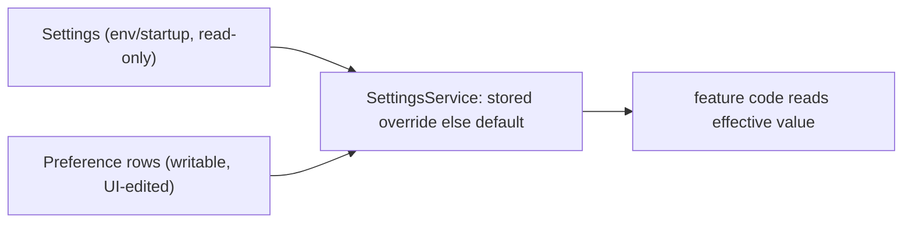

# Settings page — status and next steps

A resumable handoff for the Settings page and the per-meeting storage work. Both are merged to
`main` and `make ci` is green.

## What shipped

Merged to `main` (newest first):

- `edcb134` settings permissions panel (live TCC status + System Settings deep links)
- `a00f931` settings about panel (read-only build/runtime facts)
- `2afe557` settings storage panel (default location + usage)
- `fd9fec6` settings speakers panel (auto-refine + recognition threshold)
- `c6986b3` settings framework + recording/privacy panel
- `9d22fa9` per-meeting storage tracking + validated relocation

The Settings page (header **Settings** button, lazy-loaded overlay) has five working panels:

| Panel | Editable | Read-only |
| --- | --- | --- |
| Recording & Privacy | `record` (keep meeting audio) | — |
| Speakers | `auto_refine`, `recognition_threshold` | — |
| Storage | `output_dir` (default recordings location, validated) | DB path, tracked bytes, meeting count |
| Permissions | — | live TCC status (helper `check_permissions`) + helper version; deep links |
| About | — | app version, environment, IPC protocol version, DB path |

Per-meeting storage (separate from the Settings page): each meeting stamps a `storage_root` at
creation; `PUT /api/meetings/{id}/storage` re-points a meeting to a moved folder after validating
its artifacts (a `RelocateStorage` control in the finalized-meeting view). Artifacts are tracked in
the `meeting_assets` manifest.

## Architecture: the editable-settings overlay

The typed `Settings` object (`src/hearsay/config/settings.py`) is startup/env-driven and read-only.
The UI edits a writable overlay: one `Preference` row per section (`section` unique, `value` JSON).

Two panels are **read-only**, not editable Preference sections: **About** (static
build/runtime facts, a field on `SettingsRead` like `storage_info`) and **Permissions**
(live OS state probed from the helper — see its own note below). Neither persists anything.

Key files:

- `src/hearsay/models/preference.py` — `Preference` (section + JSON value).
- `src/hearsay/schemas/settings.py` — `RecordingSettings`, `SpeakerSettings`, `StorageSettings`,
  read-only `StorageInfo` + `AboutInfo`, live `PermissionsInfo`, and `SettingsRead` (one field per
  section; `storage_info` + `about` are read-only context fields).
- `src/hearsay/services/settings.py` — `SettingsService`: per-section `<x>()` resolver +
  `set_<x>()` + `effective_<field>()`, `read_all()`, `storage_info()`, `about()` (sync, no DB);
  `SettingsValidationError`.
- `src/hearsay/services/permissions.py` — `probe_permissions()`: spawns the helper, reads its
  `check_permissions` snapshot + `hello` version, shuts it down; never raises (degrades to
  `helper_available=false` + all `unknown`).
- `src/hearsay/api/settings.py` — `GET /api/settings`, `PUT /api/settings/{recording,speakers,storage}`,
  `GET /api/settings/permissions`. Registered in `src/hearsay/api/app.py` as `settings_routes`.
- Migration `7579f4d6db78` created the `preferences` table (the current head; speakers/storage
  added no migration — they are JSON sections in `preferences`).

Effective values are resolved at their consumption points:

- `output_dir` + `record` — `SessionManager.start_meeting` (`src/hearsay/transcript/session.py`).
- `auto_refine` — `SessionManager._maybe_auto_refine` (same file).
- `recognition_threshold` — `rediarize_meeting` (`src/hearsay/transcript/refine.py`), passed into
  `_recognize_speakers`.

Frontend: `web/src/components/SettingsPage.tsx` (overlay + `PANELS` array + one `<X>Panel`
component each), `web/src/api/hooks.ts` (`useSettings`, `useUpdate<X>` cache-patching mutations),
`web/src/api/queryKeys.ts` (`settings.all`), `web/src/App.tsx` (entry button), `web/src/index.css`
(`.settings*`). Types are codegen'd into `web/src/api/schema.ts` and aliased in `types.ts`.

## Recipe: add an editable panel

Backend:

1. Add `<X>Settings` to `schemas/settings.py`, export it in `schemas/__init__.py`, add the field to
   `SettingsRead`.
2. In `SettingsService`: add a section-key const, an `<x>()` resolver (stored override else the
   `Settings` default), a `set_<x>()`, and `effective_<field>()` for anything feature code reads;
   include the section in `read_all()`.
3. If a field drives behavior, resolve the effective value at the consumption point via
   `SettingsService` (see the wiring list above for the pattern).
4. Add `PUT /api/settings/<x>` in `api/settings.py`; map any `SettingsValidationError` to
   `status.HTTP_422_UNPROCESSABLE_CONTENT`.
5. Tests: `tests/test_settings_service.py` (default/set/effective) + `tests/test_api.py`
   (GET/PUT/validation). Run `make ci`.

Frontend:

6. `make codegen` (regenerates `web/openapi.json` + `web/src/api/schema.ts`).
7. Add the type alias in `types.ts`; add `useUpdate<X>` in `hooks.ts` (patch the settings cache).
8. In `SettingsPage.tsx`: add to `PANELS`, write an `<X>Panel`, add its render branch.
9. `make web-typecheck && make web-build`.

Finalize: `git checkout -b feat/settings-<x>-panel` -> commit -> `make ci` -> `git checkout main` ->
`git merge --no-ff`.

## Read-only panels (shipped) — the live-probe pattern

Permissions and About do not follow the editable-panel recipe above (no Preference section, no
`set_<x>()`, no cache-patching mutation). Reference points if you add another read-only panel:

- **About** is the trivial case: a `<x>()` method on `SettingsService` returning a schema, added as
  a field on `SettingsRead` and read via the existing `useSettings` query. No route, no hook.
- **Permissions** is the live-probe case: a standalone `GET /api/settings/permissions` backed by
  `services/permissions.py` (spawns the helper per request). Its `usePermissions` hook sets
  `staleTime: Infinity` + `refetchOnWindowFocus: false` because each fetch spawns a subprocess —
  it loads on panel mount and re-runs only on the explicit **Recheck** button. The probe must never
  raise: a missing/unresponsive helper returns `helper_available=false` + all `unknown`.
- Gotcha still open: only microphone has a real TCC status; `audio_capture` / `screen_recording` /
  `accessibility` / `calendar` are `undetermined` stubs in `helper/.../Permissions.swift` until
  their capture phases land. The deep-link anchors live in the frontend `PERMISSION_ROWS`
  (`Privacy_Microphone` / `Privacy_ScreenCapture` / `Privacy_Accessibility` / `Privacy_Calendars`;
  `audio_capture` falls back to the general `?Privacy` pane — no dedicated tap anchor).

## Remaining panels

### Models (large, verification-gated)

- Models are currently hard-pinned in the Swift sidecars, not configurable:
  - `helper/Sources/hearsay-live/main.swift` — `LSEENDModel.loadFromHuggingFace(variant:.ami,...)`
    (line ~72) and `AsrModels.downloadAndLoad(version:.v3)` (line ~75).
  - `helper/Sources/hearsay-asr/main.swift` — `AsrModels.downloadAndLoad(version:.v3)` (line ~40).
  - `helper/Sources/hearsay-diarize/main.swift` — `OfflineDiarizerManager()` (line ~63).
  - `helper/Sources/hearsay-me/main.swift` — `StreamingUnifiedAsrManager` + `VadManager`.
- Plan (from the design discussion): a code-defined model catalog (per phase, tier, min-RAM,
  Apple-Silicon flag), a capability probe (`sysctl hw.memsize` / `machdep.cpu.brand_string`), a
  preset (Fast/Balanced/Accurate) with per-phase advanced override, then thread the chosen model
  ids through `Settings`/overlay -> sidecar CLI args -> Swift arg parsing, and `make swift-build`.
- Verify first: FluidAudio's actual model variants per phase; whether
  `StreamingUnifiedAsrManager.loadModels()` accepts a version (live-Me may not be swappable);
  whether model-download progress is observable. Do not ship invented model names.
- Note: the Tauri `mac-app` bundle targets the separate in-progress Rust core, which does not have
  any of this Python-core settings work.

## Operational notes

- Run from source: `uv run alembic upgrade head` (DB head is `7579f4d6db78`), `make web-build`,
  then `make serve` (or `uv run hearsay serve --port 8765`) and open the printed `?token=` URL.
- The DB is at `outputs/db/hearsay.db`; timestamped backups from the migrations live beside it
  (`outputs/db/hearsay.db.bak-*`). `outputs/` is gitignored.
- Conventions that bit us: no imports inside functions; ruff line length 100 (wrap long imports);
  use `HTTP_422_UNPROCESSABLE_CONTENT`; hand-write Alembic migrations (autogenerate is flaky
  against an unknown DB state) and match enum rendering `sa.Enum(..., native_enum=False)`;
  regenerate codegen after any API change (`web-codegen-check` gates drift, separate from `make ci`).
</content>
