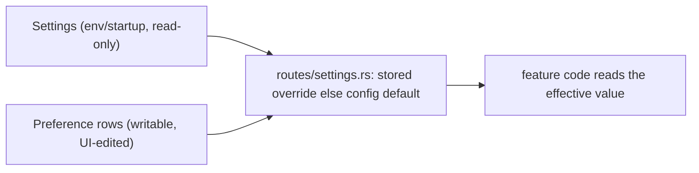

# Settings page — how it works

The Settings page (header **Settings** button, lazy-loaded overlay) is backed by the Rust core. It
has six data panels plus a Tauri-only Data & Uninstall panel:

| Panel | Editable | Read-only |
| --- | --- | --- |
| Recording & Privacy | `record` (keep meeting audio) | — |
| Speakers | `auto_refine`, `recognition_threshold` | — |
| Models | refine model path; notes toggle + notes model + prompt (with the download manager) | download catalog + progress |
| Storage | `output_dir` (default recordings location, validated) | DB path, tracked bytes, meeting count |
| Permissions | — | live TCC status (helper `check_permissions`) + helper version |
| About | — | app version, environment, IPC protocol version, DB path |
| Data & Uninstall | reveal data folder (HTTP `POST /api/settings/reveal`); erase all data + quit (Tauri IPC) | — |

## Settings take effect at runtime

The editable sections round-trip correctly — a `PUT` stores a `preferences` row, `GET /api/settings`
resolves it, and the UI reflects it — and the **live pipeline reads the effective value at its
consumption point** (stored override else the config default), so a UI change takes effect on the
next meeting without a restart:

| Setting | Read at | Resolver |
| --- | --- | --- |
| `record` | meeting start — whether to write `audio.wav` | `queries::effective_record` |
| `output_dir` | meeting start — where the new meeting folder is created | `queries::effective_output_dir` |
| `auto_refine` | stop — whether to run the offline refine | `queries::effective_speakers` |
| `recognition_threshold` | stop + `/rediarize` — cross-meeting voiceprint cutoff | `queries::effective_speakers` |

`output_dir` is resolved only for **new** meetings: each meeting pins its absolute directory
(`meetings.dir`, migration `0003_meeting_dir.sql`) at creation, so changing the recordings folder
never orphans existing recordings — playback / refine / delete locate each meeting via
`Meeting::dir_path` (the pinned dir, or `output_dir/<folder>` for pre-`0003` rows). The section-name
constants (`SECTION_RECORDING` / `SECTION_SPEAKERS` / `SECTION_STORAGE`) live in `hearsay-db`, so the
API writer (`routes/settings.rs`) and the runtime readers (the `effective_*` resolvers) share one
contract; the `effective_*` resolvers tolerate a missing/corrupt row by falling back to the default.

## Architecture: the editable-settings overlay

The resolved `Settings` (`hearsay-core/src/config.rs`) is env/startup-driven and read-only. The UI
edits a writable overlay: one `Preference` row per section (`section` unique, `value` a JSON object).

Two panels are **read-only**, not editable Preference sections: **About** (static build/runtime
facts, a field on `SettingsRead` like `storage_info`) and **Permissions** (live OS state probed from
the helper — see its own note below). Neither persists anything.

Key files:

- `hearsay-db/migrations/0002_preferences.sql` — the `preferences` table (id, unique `section`, JSON
  `value`, timestamps).
- `hearsay-db/src/models.rs` / `queries.rs` — the `Preference` row + `get_preference` / `set_preference`.
- `hearsay-core/src/schema.rs` — `RecordingSettings`, `SpeakerSettings`, `StorageSettings`, read-only
  `StorageInfo` + `AboutInfo`, live `PermissionsInfo`, and `SettingsRead` (one field per section;
  `storage_info` + `about` are read-only context fields). Registered in `openapi.rs`.
- `hearsay-core/src/routes/settings.rs` — `GET /api/settings`, `PUT /api/settings/{recording,speakers,storage}`,
  `GET /api/settings/permissions`. Per-section `resolve_<x>()` (stored override else the config
  default) + `store_section()`; `validate_output_dir()` (absolute/existing/writable) maps to a `422`
  (`ApiError::Unprocessable`).
- `hearsay-capture/src/lib.rs` — `probe_permissions()`: spawns the helper, reads its
  `check_permissions` snapshot + `hello` version, shuts it down; never raises (degrades to
  `helper_available=false` + all `unknown`).
- `hearsay-core/src/config.rs` — the section defaults (`record`, `auto_refine`, `recognition_threshold`).

Frontend: `web/src/components/SettingsPage.tsx` (overlay + `PANELS` array + one `<X>Panel` component
each), `web/src/api/hooks.ts` (`useSettings`, `usePermissions`, `useUpdate<X>` cache-patching
mutations), `web/src/api/queryKeys.ts` (`settings.all`, `settings.permissions`), `web/src/App.tsx`
(entry button), `web/src/index.css` (`.settings*`). Types are codegen'd into `web/src/api/schema.ts`
and aliased in `types.ts`.

## Recipe: add an editable panel

Backend:

1. Add `<X>Settings` to `schema.rs` (derive `Serialize, Deserialize, ToSchema`), add the field to
   `SettingsRead`, and register the schema in `openapi.rs`.
2. In `routes/settings.rs`: add a section-key const, a `resolve_<x>()` (stored override else the
   config default), a `PUT` handler that validates then `store_section`s; include the section in
   `read_settings`. Register the path in `openapi.rs`.
3. Add the config default field in `config.rs` (with an env override).
4. To make the value take effect, add an `effective_<x>` resolver in `hearsay-db` (stored override
   else the passed config default) and read it at the consumption point (the orchestrator at meeting
   start / stop, or the route) — not just the startup config, as the shipped sections do (see above).
5. Tests: add to `tests/api.rs` (GET default, PUT round-trip + persistence, validation `422`). Run `make ci`.

Frontend:

6. `make codegen` (regenerates `web/openapi.json` + `web/src/api/schema.ts` from the Rust core).
7. Add the type alias in `types.ts`; add `useUpdate<X>` in `hooks.ts` (patch the settings cache).
8. In `SettingsPage.tsx`: add to `PANELS`, write an `<X>Panel`, add its render branch.
9. `make web-typecheck && make web-build`.

## Read-only panels — the live-probe pattern

Permissions and About do not follow the editable-panel recipe (no Preference section, no `set`, no
cache-patching mutation).

- **About** is the trivial case: an `about()` helper in `routes/settings.rs` returning a schema, added
  as a field on `SettingsRead` and read via the existing `useSettings` query. No route, no hook.
- **Permissions** is the live-probe case: a standalone `GET /api/settings/permissions` backed by
  `hearsay-capture::probe_permissions` (spawns the helper per request). Its `usePermissions` hook sets
  `staleTime: Infinity` + `refetchOnWindowFocus: false` because each fetch spawns a subprocess — it
  loads on panel mount and re-runs only on the explicit **Recheck** button. The probe never raises: a
  missing/unresponsive helper returns `helper_available=false` + all `unknown`.
- The panel is status-only: it reports each grant but does not deep-link into System Settings. The
  webview navigates to the core's remote loopback origin, where Tauri app commands (`open_url`) are
  not granted (no ACL identifier for the remote context), so the `x-apple.systempreferences:` deep
  links were removed rather than left broken. Users open **System Settings > Privacy & Security**
  themselves.
- Gotcha still open: only microphone and `audio_capture` have a real TCC status (`audio_capture` via
  the private `TCCAccessPreflight` SPI in `helper/.../Permissions.swift`); `screen_recording` /
  `accessibility` / `calendar` are `undetermined` stubs until their capture phases land.

## Live-sidecar model selectors (proposed) — FluidAudio 0.15.4 verification

> Note: the **shipped** Settings > Models panel covers the whisper **refine** model and the optional
> local-LLM **notes** model (catalog + download + selection + prompt). The selectors described below
> are a *separate, still-unbuilt* idea — swapping the live FluidAudio **sidecar** models (Parakeet
> ASR version, LSEEND diarizer variant). This section is the design for that future work.

Verification is **complete** (read the pinned checkout at `helper/.build/checkouts/FluidAudio`:
`ModelNames.swift` + each manager's `load*`). No invented model names are needed. This is a Swift
sidecar concern, unaffected by the core language.

Exact load call sites today:

- `hearsay-live/main.swift` — `LSEENDModel.loadFromHuggingFace(variant: .ami, stepSize: .step500ms,
  computeUnits: .cpuOnly)`; `AsrModels.downloadAndLoad(version: .v3)`; `StreamingUnifiedAsrManager()`.
- `hearsay-me/main.swift` — `VadManager()`; `StreamingUnifiedAsrManager()`.
- `hearsay-diarize/main.swift` — `OfflineDiarizerManager()` (`.process(url)`).

Key finding: **only 2 of the 5 model slots are actually swappable.**

| Phase | Sidecar | Load API | Swappable | Real options |
| --- | --- | --- | --- | --- |
| Live Them — diarization | live | `LSEENDModel.loadFromHuggingFace(variant:stepSize:)` | yes | variant {ami, callhome, dihard2, dihard3} × step {100/200/300/400/500 ms} |
| Live — final ASR | live | `AsrModels.downloadAndLoad(version:)` | yes | Parakeet TDT `.v2` / `.v3` (`AsrModelVersion`) |
| Live — partial ASR | live, me | `StreamingUnifiedAsrManager.loadModels()` | no | fixed "Parakeet Unified 0.6B"; only latency + `encoderPrecision` int8/fp16 |
| Live Me — VAD | me | `VadManager()` | no | single Silero VAD; `VadConfig` tuning only |
| Offline refine — diarization | diarize | `OfflineDiarizerManager(config:)` | no | single pyannote community-1; `OfflineDiarizerConfig` thresholds only |

Revised plan (smaller than the original Fast/Balanced/Accurate preset idea, since 3 of 5 slots are
fixed): expose **two** real selectors — Transcription model (Parakeet TDT v2 vs v3, used by the
`hearsay-live` finals) and Live diarization (LSEEND variant × step) — and render the
fixed slots read-only. Wiring: a `models` overlay section (`schema.rs` + `routes/settings.rs` +
`config.rs`) -> sidecar CLI args (e.g. `--asr-version v3`, `--diar-variant ami --diar-step 500ms`)
parsed in the four sidecars mapping strings to the FluidAudio enums -> `make swift-build`. A download
can emit a progress NDJSON line via `progressHandler` for a future "downloading model..." UI.

## Operational notes

- Run from source: `make swift-build`, `make web-build`, then `make rust-serve` and open the printed
  `?token=` URL. `SYNTHETIC=1 make rust-serve` needs no permissions.
- The `preferences` table is created by the embedded SQLx migrator on startup (migration
  `0002_preferences.sql`); no manual migration step. The dev DB is at `outputs/db/hearsay.db`
  (`outputs/` is gitignored).
- Regenerate codegen after any API change (`make codegen`); `make codegen-check` gates drift and is
  part of `make ci`.
