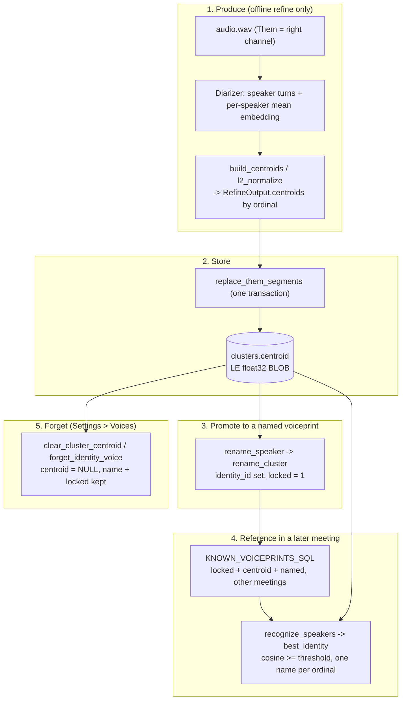

# Voiceprints

A **voiceprint** is Hearsay's cross-meeting speaker identity: a fixed-length speaker-embedding
vector that lets the app recognize a returning person in a later meeting without any manual work.
This document traces one end to end — what it is, where it comes from, how it is stored, and how it
is referenced to name speakers.

## Related documents

| Document | Scope |
|---|---|
| [architecture.md](architecture.md) | The `clusters` / `identities` schema these rows live in. |
| [design-decisions.md](design-decisions.md) | Why recognition is offline-only, and how the embedders were chosen. |
| [pipeline.md](pipeline.md) | The refine pass that produces every centroid. |
| [user-guide.md](user-guide.md) | Managing stored voices from Settings > Voices. |

Where the code lives: `hearsay-attribution` (pure matching logic), `hearsay-inference` plus the
Swift `hearsay-diarize` sidecar (production of embeddings), `hearsay-db` (storage and matching).

## What a voiceprint is

A voiceprint is a **centroid**: an L2-normalized `f32` vector that summarizes one speaker's voice
across a whole meeting. It is stored as little-endian float32 bytes in the nullable `clusters.centroid`
BLOB column. A centroid becomes a *recognizable* voiceprint only once its cluster is **named and
locked** — that is what promotes a per-meeting diarization cluster into a reusable identity.

Two facts shape everything below:

- **Voiceprints are a post-meeting artifact.** The live sidecars emit only `{speaker, text,
  start_s, end_s}` — no embeddings — so nothing during recording writes a centroid. Centroids are
  produced only by the **offline refine**. The live path creates its clusters with a `None`
  centroid:

  ```rust
  // rust/crates/hearsay-orchestrator/src/pipeline.rs
  /// Get-or-create the per-meeting cluster for a Them speaker ordinal (unlocked, no centroid live —
  /// the offline refine re-seeds centroids). ...
  queries::create_cluster(pool, meeting_id, ordinal, false, None).await
  ```

- **Only the remote ("Them") track is diarized.** The microphone is always "Me" and is never
  diarized, so Me segments carry no cluster and no voiceprint.

## Lifecycle



Step 5 is the only way a voiceprint leaves the candidate set without the meeting itself being
deleted. It clears the embedding and nothing else: the cluster row, its identity binding, its
`locked` flag, and every transcript line already labelled with that name all survive. Merging two
speakers also drops a sample, since it deletes the source cluster the embedding lived on.

The Voices roster is the set of people with a stored embedding — not the set of known names. A
person named on a meeting that was never refined has no centroid and does not appear, and clearing
someone's last sample removes them from the list (they remain an `identities` row, so past
transcripts keep their name and the rename autocomplete still offers it). Keeping such a row would
mean showing an entry that matches nothing and has nothing left to remove.

## 1. Where voiceprints come from (production)

The diarizer returns a `Diarization` of ordinal turns plus each speaker's raw mean embedding by
ordinal, and the refine normalizes those into stored centroids. The seam:

```rust
// rust/crates/hearsay-inference/src/diarizer.rs
/// A diarization result: ordinal speaker turns (start-sorted) + each speaker's raw mean voiceprint by
/// ordinal (the refine L2-normalizes these into stored centroids). ...
pub struct Diarization {
    pub turns: Vec<DiarTurn>,
    pub embeddings: HashMap<i64, Vec<f32>>,
}
```

### FluidAudio on the Apple Neural Engine

The `hearsay-diarize` Swift sidecar runs FluidAudio's `OfflineDiarizerManager` (pyannote
community-1 segmentation + **wespeaker_v2 256-d embeddings** + threshold-based agglomerative
clustering). The clustering threshold is raised from FluidAudio's 0.6 default to **0.7** (0.6
under-separates compressed meeting audio; overridable via `HEARSAY_DIARIZE_CLUSTER_THRESHOLD`). The
per-speaker mean is computed *inside* FluidAudio and exposed as `speakerDatabase`; the sidecar just
forwards it:

```swift
// helper/Sources/hearsay-diarize/main.swift
var config = OfflineDiarizerConfig.default
config.clustering.threshold = 0.7
let manager = OfflineDiarizerManager(config: config)
let result = try await manager.process(url)
let turns = result.segments.map {
    Turn(speaker: $0.speakerId, startS: ..., endS: ...)
}
// The offline pipeline populates a per-speaker mean embedding (the voiceprint);
// emit it so the Rust refine can store + match it across meetings.
let speakers = (result.speakerDatabase ?? [:]).map {
    SpeakerEmbedding(speaker: $0.key, embedding: $0.value)
}
```

The sidecar writes one JSON object to stdout (keys snake-cased): `{ sample_rate, duration_s,
speaker_count, turns: [{speaker, start_s, end_s}], speakers: [{speaker, embedding: [f32]}] }`. The
Rust side maps each speaker label to a 1-based ordinal by first appearance and keys the embedding by
that ordinal — no averaging (FluidAudio already did it):

```rust
// rust/crates/hearsay-inference/src/refine.rs
let ordinals = order_speakers(&ordering);
...
let mut embeddings: HashMap<i64, Vec<f32>> = HashMap::new();
for speaker in diarized.speakers {
    if let Some(&ord) = ordinals.get(&speaker.speaker) {
        embeddings.insert(i64::from(ord), speaker.embedding);
    }
}
```

### Final normalization

The refine L2-normalizes each raw embedding into the
stored centroid and keeps a centroid only for a speaker who actually appears in the refined
segments:

```rust
// rust/crates/hearsay-inference/src/refine.rs
let present: HashSet<i64> = segments.iter().map(|s| s.ordinal).collect();
let mut centroids = build_centroids(&diarization.embeddings);  // l2_normalize per ordinal
centroids.retain(|ordinal, _| present.contains(ordinal));
```

Whisper is not involved in embeddings at all — it only re-transcribes the track; the ASR text is
then attributed to whichever diarizer turn it most overlaps.

## 2. Where voiceprints are stored

### The column

A voiceprint lives in the nullable `centroid` BLOB on the `clusters` table — one cluster per
diarized speaker per meeting:

```sql
-- rust/crates/hearsay-db/migrations/0001_baseline.sql
CREATE TABLE clusters (
    id          BLOB    NOT NULL PRIMARY KEY,
    meeting_id  BLOB    NOT NULL REFERENCES meetings(id) ON DELETE CASCADE,
    ordinal     INTEGER NOT NULL,
    identity_id BLOB    REFERENCES identities(id) ON DELETE SET NULL,
    locked      INTEGER NOT NULL,
    centroid    BLOB,
    created_at  TEXT    NOT NULL,
    updated_at  TEXT    NOT NULL,
    UNIQUE (meeting_id, ordinal)
);
```

- `ordinal` — the 1-based "Speaker N" number within the meeting.
- `identity_id` — the bound cross-meeting `identities` row (the person's name), or NULL.
- `locked` — 1 when a manual label pins the binding (see [promotion](#3-promoting-a-centroid-to-a-named-voiceprint)).
- `centroid` — the voiceprint bytes, or NULL when the cluster has no usable embedding.

Deleting a meeting cascades its clusters (and their centroids); there is no separate voiceprint
store — a person's voiceprints are simply their locked, named clusters spread across meetings.

### The byte format

A centroid is serialized as contiguous little-endian float32 — no header, no length prefix; the
length is the byte length / 4:

```rust
// rust/crates/hearsay-attribution/src/voiceprint.rs
pub fn centroid_to_bytes(centroid: &[f32]) -> Vec<u8> {
    let mut out = Vec::with_capacity(centroid.len() * 4);
    for value in centroid {
        out.extend_from_slice(&value.to_le_bytes());
    }
    out
}

pub fn centroid_from_bytes(data: &[u8]) -> Vec<f32> {
    data.chunks_exact(4)
        .map(|c| f32::from_le_bytes([c[0], c[1], c[2], c[3]]))
        .collect()
}
```

### The write

The refine's output is carried as `RefineResult { segments, centroids: HashMap<i64, Vec<f32>> }`,
and `replace_them_segments` persists it in **one transaction**: it drops the meeting's live Them
segments and all its clusters, then creates one cluster per refined ordinal with its centroid
serialized onto the row (Me segments are untouched):

```rust
// rust/crates/hearsay-db/src/queries.rs
let centroid = result.centroids.get(&seg.ordinal).map(|c| centroid_to_bytes(c));
sqlx::query(
    "INSERT INTO clusters \
     (id, meeting_id, ordinal, identity_id, locked, centroid, created_at, updated_at) \
     VALUES (?, ?, ?, ?, ?, ?, ?, ?)",
)
```

A refine that produced no segments is a no-op — the transcript and its existing clusters are never
wiped.

## 3. Promoting a centroid to a named voiceprint

A stored centroid on an unnamed `Speaker N` cluster is not recognizable across meetings on its own.
It becomes a voiceprint when the user renames the speaker, via
`PUT /api/meetings/{id}/speakers/{cluster_id}`:

```rust
// rust/crates/hearsay-core/src/routes/speakers.rs
pub(crate) async fn rename_speaker(...) -> ApiResult<Json<SpeakerRead>> {
    let name = body.display_name.trim();
    if name.is_empty() || name.chars().count() > 255 {
        return Err(ApiError::Unprocessable("display_name must be 1..=255 characters".into()));
    }
    let row = queries::rename_cluster(&state.pool, cluster_id, name)
        .await?
        .ok_or(ApiError::NotFound("speaker not found"))?;
    Ok(Json(row.into()))
}
```

`rename_cluster` resolves the name to an identity, then **locks** the binding — all in one
transaction:

```rust
// rust/crates/hearsay-db/src/queries.rs
let identity_id = get_or_create_identity(&mut tx, name, now).await?;
sqlx::query("UPDATE clusters SET identity_id = ?, locked = 1, updated_at = ? WHERE id = ?")
    .bind(identity_id).bind(now).bind(cluster_id).execute(&mut *tx).await?;
sqlx::query("UPDATE segments SET speaker_label = ?, updated_at = ? WHERE cluster_id = ?")
    .bind(name)  // relabel that speaker's already-saved segments
```

- The rename does **not** write the centroid — that was stored earlier by the refine. It only sets
  `identity_id` + `locked = 1`, which is what qualifies the existing centroid as a known voiceprint.
- `get_or_create_identity` keys on `identities.display_name` (declared `NOT NULL UNIQUE`), so one
  person is one identity row and renaming two clusters to the same name binds both to it. The
  get-or-create is what keeps the UNIQUE constraint from ever raising.
- `GET /api/identities` lists these people (most-recently-updated first) and powers the rename
  autocomplete, so a name from one meeting is suggested in the next.

## 4. How voiceprints are referenced (cross-meeting recognition)

### The candidate set

The "known voiceprints" a refine matches against are exactly the locked, named clusters that carry a
centroid, from *other* meetings:

```rust
// rust/crates/hearsay-db/src/queries.rs
const KNOWN_VOICEPRINTS_SQL: &str = "SELECT i.display_name, c.centroid FROM clusters c \
     JOIN identities i ON i.id = c.identity_id \
     WHERE c.locked = 1 AND c.centroid IS NOT NULL AND c.meeting_id != ?";
```

### The match

During `replace_them_segments`, `recognize_speakers` scores every unclaimed ordinal's centroid
against that candidate set with `best_identity` (the score-returning form of `match_identity`), then
resolves so each known name binds to **at most one ordinal** — the highest-scoring cluster wins the
name and any runner-up stays `Speaker N`:

```rust
// rust/crates/hearsay-db/src/queries.rs
let mut candidates: Vec<(i64, &str, f64)> = Vec::new();
for (&ordinal, centroid) in centroids {
    if manual.contains_key(&ordinal) {
        continue; // a manual carry-forward name wins over auto-recognition
    }
    if let Some((name, score)) = best_identity(centroid, &known, threshold) {
        candidates.push((ordinal, name, score));
    }
}
// Highest score first (deterministic tiebreak), then each name is taken by only its top ordinal.
candidates.sort_by(/* score desc, then ordinal, then name */);
let mut used_names: HashSet<String> = HashSet::new();
for (ordinal, name, _score) in candidates {
    if used_names.insert(name.to_string()) {
        recognized.insert(ordinal, name.to_string());
    }
}
```

A recognized speaker is bound to the identity but left **unlocked** (provisional) — a later manual
rename can still override it. The per-name dedup means two clusters that both clear the threshold for
the same person never both take that name.

### Precedence

`replace_them_segments` resolves each refined ordinal's name in strict precedence order:

| Rank | Source | Binding | Lock | How |
|---|---|---|---|---|
| 1 | **Manual carry-forward** | identity | `locked = 1` | A prior *locked* name is voted onto the new ordinal its old segments most overlap (`carry_forward_locked_names`), so a re-diarize never drops a manual binding. |
| 2 | **Cross-meeting recognition** | identity | `locked = 0` | An unclaimed ordinal whose voiceprint clears the threshold (`recognize_speakers` -> `best_identity`), bound provisionally; each name binds to at most one ordinal. |
| 3 | **Fresh** | none | `locked = 0` | Otherwise a plain `Speaker N`. |

A single wrong recognition can never flip a stable manual binding: locked names carry forward first
and are skipped by recognition.

A per-line reassignment (`PATCH .../segments/{segment_id}/speaker`, `reassign_segment_speaker`) is a
finer-grained correction: it moves one segment's `cluster_id` to another cluster, or to a new locked
cluster created for a typed name. It operates on the finalized transcript and is not itself carried
forward — a full re-diarize rebuilds the Them segments from scratch, so it reconstructs speakers only
at the cluster level (via the precedence above), not per line. The reassigned line is flagged
`edited`, so the UI warns before a refine would discard it.

### The recognition threshold

Recognition uses cosine similarity against a configurable cutoff, the effective
`speakers.recognition_threshold`:

- **Default `0.6`**, set in config from `HEARSAY_RECOGNITION_THRESHOLD` (validated to `0.0..=1.0`).
  In `development` an out-of-range or non-numeric value logs a startup problem and falls back to
  `0.6`; in staging/production a bad value fails startup outright rather than silently defaulting —
  `rust/crates/hearsay-core/src/config.rs`.
- Overridable per install via `PUT /api/settings/speakers`, which rejects anything outside
  `0.0..=1.0` with a 422 — `rust/crates/hearsay-core/src/routes/settings.rs`.
- Resolved fresh on every refine by `effective_speakers` (stored override per field, else the
  config default), so a Settings change applies to the next refine with no restart —
  `rust/crates/hearsay-db/src/queries.rs`.

Both refine entry points — auto-refine at stop and the manual "Refine speakers" button
(`POST /api/meetings/{id}/rediarize`) — read this value and pass it into `replace_them_segments`, so
manual and automatic recognition never drift.

## The math

Matching is plain cosine similarity, computed in `f64`, with two safety rails: a length mismatch or
a zero-norm vector returns `0.0` (a safe non-match, never a garbage score).

```rust
// rust/crates/hearsay-attribution/src/voiceprint.rs
pub fn cosine(a: &[f32], b: &[f32]) -> f64 {
    if a.len() != b.len() {
        return 0.0;
    }
    ...
}

// rust/crates/hearsay-attribution/src/voiceprint.rs
pub fn match_identity<'a>(
    centroid: &[f32],
    known: &'a [(String, Vec<f32>)],
    threshold: f64,
) -> Option<&'a str> {
    // best score with cosine >= threshold; different-length candidates skipped; ties -> first
}
```

Cross-meeting recognition actually calls the score-returning sibling `best_identity` (same
selection, but it also returns the winning cosine) so `recognize_speakers` can rank candidates and
bind each name to one ordinal; `match_identity` is a thin wrapper that drops the score.

The length guard tolerates a model change: a stored centroid of a different dimension (the
voiceprints are 256-d) is simply skipped rather than compared, and a length mismatch is exactly the
right verdict.

## Deliberately absent

- **No live voiceprints.** The streaming diarizer works online with limited context; a whole-track
  refine is more accurate, so centroids are only ever a refine artifact. Live clusters carry a NULL
  centroid until the refine re-seeds them.
- **No "a cluster under N seconds cannot be a speaker" rule.** That reads as a tidy denoiser but is
  really a cliff that silently deletes a real participant who spoke briefly..
- **No manual centroid editing.** A user names and locks a cluster, and can remove a stored
  voiceprint outright (Settings > Voices), but the embedding itself is never hand-edited — there is
  no "adjust this vector" or "re-record my voice" path.
- **No identity merging.** Renaming a person to a name someone else already holds is a `409`, not a
  silent fold of two identities into one. Combining speakers is a per-meeting cluster operation; it
  never rewrites another meeting.
- **No re-recognition of past meetings.** Removing a voiceprint stops future matching; it does not
  revisit meetings already labelled from it. Those names stay until edited by hand or replaced by a
  re-diarize.

## Testing

- **Pure logic** (`hearsay-attribution`) is unit-tested directly: `centroid_to_bytes`/`from_bytes`
  round-trips, `cosine` (identical / orthogonal / zero / length-mismatch), `match_identity`
  (best-above-threshold, ties, skip-different-length).
- **The refine** is tested against a stub diarizer in `hearsay-orchestrator`: turn rebuild, rename
  carry-forward, voiceprint recognition, and the empty-meeting / no-turns guards — no ML deps.
- **The Swift codec / sidecar contract** is validated via `hearsay-helper selftest`. Run everything
  with `make test`.
