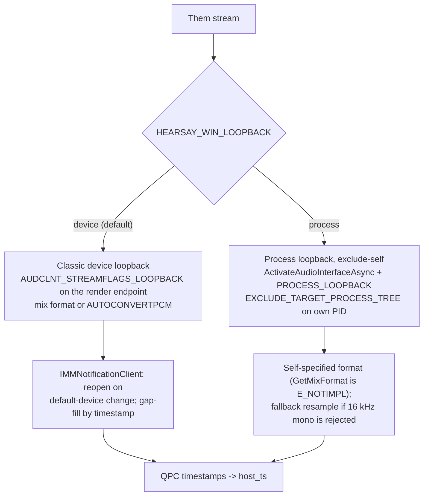

# Windows port

The plan and tracking state for the Windows build of Hearsay: the same Rust + Tauri app with
per-OS code only at the edges, delivered as a signed-later, unsigned-first NSIS installer.
Target: **x86_64 only** (`x86_64-pc-windows-msvc`, no ARM); floor **Windows 10 2004+**;
reference hardware a 16 GB Core Ultra 225U-class laptop with integrated graphics.

This document is the working tracking state: the phase checkboxes below are updated as work
lands. Design rationale and the research findings that drove each decision are recorded here so
they are not re-litigated. The canonical architecture stays in
[architecture.md](architecture.md); once the port ships, the durable parts of this document
fold into it.

## Shape of the port

Roughly 90 percent of the codebase is platform-neutral and ships unchanged. The Windows-specific
surface is capture, backend wiring, and packaging.

| Layer | macOS | Windows |
|---|---|---|
| Shell, frontend, core API, DB, orchestrator pipeline, attribution | shared | shared |
| Capture (`AudioSource`) | Swift helper over Unix sockets | in-process `WasapiSource` (WASAPI) |
| Live ASR (`Transcriber`) | FluidAudio/ANE sidecars (diarized) | `SherpaTranscriber`, both streams (exists behind the `sherpa` feature) |
| Live speakers | diarized live | "Speaker 1" live; real speakers at refine (the Windows floor) |
| Refine (`Refiner`) | whisper + `hearsay-diarize` sidecar | whisper + `SherpaDiarizer` (exists behind `sherpa`) |
| Notes (`Summarizer`) | llama.cpp (`notes` feature) | same, unchanged |
| Refine/notes GPU | `metal` feature | CPU first; `vulkan` feature on the Arc iGPU |
| AEC | shared (`aec` feature, SpeexDSP) | same code; needs an MSVC build check |
| Packaging | `.app`/`.dmg`, 5 bundled binaries | NSIS, 1 bundled binary (`hearsay-core`) + models |

There is no helper process on Windows: WASAPI needs no TCC-style privilege isolation, so capture
implements the `AudioSource` trait in-process and the socket IPC contract stays macOS-only. The
orchestrator only ever sees the `mpsc::Receiver<CaptureChunk>`.

## Capture design

Two capture threads inside `hearsay-core` (each COM-initialized), both using the
[`wasapi`](https://crates.io/crates/wasapi) crate (0.23.0, MIT, actively maintained):

- **Me**: the default capture endpoint, shared mode, requesting 16 kHz mono f32 directly via
  `AUDCLNT_STREAMFLAGS_AUTOCONVERTPCM | SRC_DEFAULT_QUALITY` (the engine inserts the channel
  matrixer and sample-rate converter).
- **Them**: system audio, with two selectable paths behind one setting
  (`HEARSAY_WIN_LOOPBACK`, values `device` | `process`, default `device`):

Why classic loopback is the default even though process-loopback-exclude is the exact
global-except-self analog of the macOS tap: there is an open, corroborated bug where process
loopback (both include and exclude modes) captures pure silence from new Teams desktop meetings,
while classic device loopback captures Teams fine
([microsoft/Windows-classic-samples#414](https://github.com/microsoft/Windows-classic-samples/issues/414),
[OBS forum report](https://obsproject.com/forum/threads/application-audio-capture-beta-doesnt-work-in-new-teams-app.171446/)).
A meeting transcriber cannot ship with Teams silent. The cost of classic loopback — no
self-exclusion — is negligible because Hearsay renders almost no audio of its own (only meeting
playback, unlikely during a recording). The process path stays implemented and selectable so it
can become the default when the bug is fixed.

Capture facts the implementation is built on (verified against Microsoft Learn and the crate
source, July 2026):

- `PROCESS_LOOPBACK_MODE_EXCLUDE_TARGET_PROCESS_TREE` with our own PID captures everything
  except our process tree; `wasapi`'s `AudioClient::new_application_loopback_client(pid, false)`
  passes EXCLUDE (its doc comment says otherwise; the code is correct — worth an upstream PR).
- Process loopback officially requires build 20348 but works on updated Windows 10 2004+ (OBS
  ships on it); many `IAudioClient` methods are broken on such clients (`GetMixFormat`,
  `IsFormatSupported`, `GetDevicePeriod`, `GetCurrentPadding`), so the format is self-specified.
- Both streams are stamped from one monotonic clock: `IAudioCaptureClient::GetBuffer`'s
  `pu64QPCPosition` (100 ns units) × 100 is the pipeline's `host_ts` in nanoseconds. The device
  position is unusable on process loopback (reported always 0). `TIMESTAMP_ERROR` and
  `DATA_DISCONTINUITY` packet flags are surfaced to the log.
- WASAPI clients get no automatic stream routing: an `IMMNotificationClient` watches for
  default-device changes and the affected client is rebuilt — the analog of the macOS
  tap-rebuild watchdog. Idle render (nothing playing) produces no packets; the pipeline's
  existing silence-padding resync absorbs the gaps.
- Microphone consent for Win32 apps is the global "Let desktop apps access your microphone"
  toggle (ConsentStore registry); there is no per-app prompt and no documented gate on loopback.
  NSIS installs are Win32, not MSIX — no capability manifest exists or is needed.

A portable `SyntheticSource` (tone generator) backs `SYNTHETIC=1` on Windows, filling the role
the helper's tone source plays on macOS, so pipeline bring-up is separable from capture
bring-up.

## Inference design

The live and refine stacks reuse the `sherpa` feature modules that already exist and are
end-to-end proven by the ignored `hearsay-backends/tests/streaming_pipeline.rs` test:

- **Live**: `SherpaTranscriber` (streaming zipformer transducer,
  `sherpa-onnx-streaming-zipformer-en-20M-2023-02-17` int8, Apache-2.0) on both streams.
  Segments are speaker-less live; the refine assigns speakers.
- **Refine**: whisper (whisper-rs, model from the Settings > Models panel as on macOS) plus
  `SherpaDiarizer` (pyannote segmentation-3.0, MIT, + TitaNet embedding, CC-BY-4.0) through the
  portable `refine_them_with` seam. Known-degraded versus FluidAudio (tends to over-split
  speakers); accepted as the cross-platform tier.
- **Voiceprints**: TitaNet embeddings are a different space than FluidAudio's, so voiceprints
  are per-platform. Each install's database is local, so nothing breaks; the recognition
  threshold default may need Windows-specific tuning (an on-device item).
- The crates.io `sherpa-onnx` crate is the official k2-fsa binding (the older `sherpa-rs` is
  archived in its favor); its `-sys` crate downloads a prebuilt native library per platform, so
  no onnxruntime build from source is expected on Windows.
- Windows default whisper model: smaller than the macOS default (no ANE/Metal; e.g. `small.en`
  as the staged default, measured on the reference hardware before being fixed).

Deliberately out of scope for this milestone: NVIDIA Nemotron cache-aware streaming ASR and
Sortformer live diarization (better quality, but non-MIT/BSD/Apache model licenses and
unconfirmed Rust-API exposure). They are the candidate upgrade tier once the floor ships.

## Backend wiring

- `hearsay-backends` splits into `#[cfg(target_os = "macos")] mod mac` and
  `#[cfg(all(target_os = "windows", feature = "sherpa"))] mod windows`, each exporting
  `build_engine`; a `compile_error!` on Windows without `sherpa` names the required feature.
- `build_engine`'s positional arguments collapse into one `EngineConfig` struct on both
  platforms, so Windows-only fields (sherpa models dir, loopback mode) do not fork the
  signature and `hearsay-core` stays platform-unconditional.
- `WindowsBackend` holds the loaded `StreamingAsr` (loaded once at startup; `sidecars_ready()`
  is true from then on — no warm pool, since there are no subprocesses to warm).
- `WindowsRefiner` mirrors `MacRefiner` (same effective-model query, same NoSpeech-to-empty
  mapping) with `SherpaDiarizer` in place of the Swift sidecar.
- The Windows `probe_permissions` fills `PermissionsSnapshot.microphone` from the ConsentStore
  registry and reports `audio_capture` granted (no OS gate); the macOS-only fields stay `None`.

## Packaging design

- Live models ship in the installer (mirroring the FluidAudio staging pattern): the streaming
  zipformer, pyannote segmentation-3.0, and the TitaNet embedding under a
  `HEARSAY_SHERPA_MODELS_DIR` the shell points into the bundle resources; a Windows-sized
  whisper GGML is staged like `stage-model`.
- `tauri.windows.conf.json` overrides the bundle for Windows: targets `["nsis"]`, `externalBin`
  reduced to `hearsay-core` only (the platform config replaces the array, dropping the four
  Swift binaries).
- Shell `cfg(windows)` arms: env wiring without `HEARSAY_HELPER_PATH`, Windows app-data paths in
  `erase_all_data` (no `tccutil`), reveal via `explorer /select,`. Graceful stop is already
  portable (the core exits on stdin EOF; the shell's kill is the backstop).
- Windows has no `make`: `scripts/build-windows.ps1` mirrors `stage-release` + `cargo tauri
  build` for the Windows machine. Build features arrive in order: `sherpa,notes` (CPU, fewest
  prerequisites), then `vulkan`, then `aec` — each has a graceful fallback (CPU inference; AEC
  no-op passthrough).

## Windows build prerequisites

On the Windows x86_64 machine:

- Visual Studio 2022 Build Tools with the "Desktop development with C++" workload (MSVC +
  Windows SDK).
- Rust via rustup (defaults to `x86_64-pc-windows-msvc`).
- CMake (whisper-rs / llama-cpp-2 build).
- Node 22 (web UI).
- Only for the `aec` feature: LLVM (libclang, for bindgen).
- Only for the `vulkan` feature: the Vulkan SDK.

## Phases

Checkboxes are the tracking state for the port.

### Phase 0 — Tracking document

- [x] `docs/windows-port.md` (this document); linked from the architecture roadmap.

### Phase 1 — Cross-platform scaffolding (verifiable on macOS)

- [x] `hearsay-capture`: macOS helper source moved behind `cfg(target_os = "macos")`
      (`swift_helper.rs`); `PermissionsSnapshot` + `LoopbackMode` platform-neutral in `lib.rs`
      with a non-macOS probe placeholder.
- [x] `hearsay-backends`: `mod mac` gated `cfg(target_os = "macos")`; `compile_error!` on
      unsupported targets (the `windows` module lands with the backend).
- [x] `hearsay-inference`: portable `refine_audio_file_with(audio, &dyn Diarizer, model)`;
      `refine_audio_file` is now the mac `SwiftDiarizer` wrapper.
- [x] `build_engine` takes `EngineConfig` (backends + `hearsay-core/main.rs` call site);
      FluidAudio seeding gated to macOS.
- [x] Settings: `sherpa_models_dir`, `win_loopback_mode` (env-backed, defaulted, validated).
- [x] `routes/settings.rs`: Windows reveal arm (`explorer`).
- [x] Cargo: `wasapi` under `[target.'cfg(windows)'.dependencies]` (license/CVE gates vetted it
      from macOS); `sherpa` feature passthrough on `hearsay-core`. Registry access lands with
      the permissions probe.
- [x] Gate: `make ci` green on macOS (also fixed two pre-existing gate breaks: Tauri shell
      rustfmt, `brace-expansion` npm advisory).

### Phase 2 — Capture

- [x] `WasapiSource` (`hearsay-capture/src/wasapi_source.rs`, `cfg(windows)`): one capture
      thread per stream; mic + classic device loopback + process-loopback-exclude; QPC packet
      timestamps × 100 → `host_ts` ns; 16 kHz mono f32 requested directly (autoconvert for
      mic/device paths, self-specified for process loopback); default-device polling + rebuild
      on change or read error (give-up cap → capture-death path); SILENT packets forwarded as
      zeros. Compiles only on Windows — first compile happens in bring-up step 1. A fallback
      resample stays out until bring-up shows a format rejection.
- [x] `SyntheticSource` (portable, unit-tested on macOS): alternating 440/660 Hz bursts, one
      monotonic clock, real-time cadence — backs `SYNTHETIC=1` where there is no helper.

### Phase 3 — Backend

- [x] `WindowsBackend` + `WindowsRefiner` + Windows `build_engine`
      (`hearsay-backends/src/windows.rs`): one shared `StreamingAsr` (no pool), synthetic ->
      `SyntheticSource`; refine = whisper + `SherpaDiarizer` through `refine_audio_file_with`,
      diarizer constructed inside the blocking task; a failed streaming-model load degrades to
      `DisabledEngine` (app serves, meetings 503) instead of failing startup. `LlamaSummarizer`
      moved to a shared module used by both platforms. Model conventions under
      `HEARSAY_SHERPA_MODELS_DIR`: `sherpa-onnx-streaming-zipformer-en-20M-2023-02-17/`,
      `sherpa-onnx-pyannote-segmentation-3-0/model.onnx`, `nemo_en_titanet_small.onnx` (the
      embedder the cluster-threshold tuning used).
- [x] Windows `probe_permissions` (`hearsay-capture/src/win_permissions.rs`): ConsentStore
      microphone state (desktop-app + user-wide toggles; Deny on either = denied),
      `audio_capture` always granted; `windows-registry` 0.6.1 (MIT OR Apache-2.0).

### Phase 4 — Packaging

- [x] `fetch-sherpa-models` / `stage-sherpa-models` Makefile targets (fetch verified against the
      live sherpa-onnx release URLs; layout matches the backend's conventions). Windows whisper
      default: `ggml-small.en.bin`, staged by the build script.
- [x] `tauri.windows.conf.json` (NSIS target; `externalBin` reduced to `hearsay-core`).
- [x] Shell `cfg(windows)` arms: env wiring without helper/FluidAudio + `HEARSAY_SHERPA_MODELS_DIR`
      at the bundled resources; `erase_all_data` removes app-data/local-data/cache (no `tccutil`);
      platform-neutral erase copy. Known limitation (documented in packaging.md): no graceful
      core stop on Windows yet — a meeting active at quit is finalized by startup reconciliation.
- [x] `scripts/build-windows.ps1` (prereq checks, model fetch/stage, web build, core build with
      `-Vulkan`/`-Aec` switches, binary staging, `cargo tauri build --bundles nsis`).
- [x] `docs/development.md` Windows section + config table; `docs/packaging.md` Windows
      installer section; `CLAUDE.md` env list.

### Phase 5 — On-Windows bring-up

Run on the Windows machine, in order; each step isolates one class of failure. Findings feed
fixes back into the phases above.

The shared inference path is already verified from macOS with the exact bundled model set
(`make fetch-sherpa-models` layout): the streaming JFK tests pass, the diarizer reproduces the
documented 3-speakers-on-a-known-2 operating point with 192-dim TitaNet voiceprints, and the
ignored `streaming_pipeline` test (WAV -> two `SherpaTranscriber`s -> `Orchestrator` -> SQLite ->
`transcript.md`) passes end-to-end. What remains untested is Windows-only: the WASAPI source, the
Windows build chain, the shell arms, and the installer.

All commands run from the repo root in PowerShell. Fetch models once (step 0) so the dev-run
defaults (`outputs\models\sherpa`) resolve:

- [ ] 0. `powershell -ExecutionPolicy Bypass -File scripts\build-windows.ps1` once, or at least
      its model-fetch stage; a full run doubles as steps 1 + 7's build.
- [ ] 1. `cargo build --manifest-path rust\Cargo.toml --features sherpa,notes`
      (surfaces any blind-written compile errors — expected in `wasapi_source.rs` /
      `win_permissions.rs` / the shell arms; report them back verbatim).
- [ ] 2. `cargo test --manifest-path rust\Cargo.toml --features sherpa,notes`.
- [ ] 3. Pipeline without real capture:
      `cargo run --manifest-path rust\Cargo.toml -p hearsay-core --features sherpa,notes -- --synthetic`,
      open the printed `?token=` URL in a browser, start a meeting — tone bursts alternate and
      both streams emit segments.
- [ ] 4. Real capture smoke test: same command without `--synthetic`; start a meeting with a
      video call (or any audio) playing; Me and Them both transcribe live. Re-run with
      `$env:HEARSAY_WIN_LOOPBACK="process"` for the alternate path. Verify the on-device
      unknowns (below) and confirm the default loopback mode.
- [ ] 5. Stop → refine produces speakers + voiceprints; notes step runs (needs a downloaded
      GGUF); whisper model size measured on the 225U; recognition-threshold sanity check.
- [ ] 6. `-Vulkan` build, then `-Aec` build (each needs its extra prerequisite).
- [ ] 7. `scripts\build-windows.ps1` → NSIS installer installs, launches, records a meeting,
      erases + uninstalls clean.

## On-device unknowns

Resolved during Phase 5 step 4; recorded here when answered.

- [ ] Process-loopback-exclude behavior in a new Teams meeting (expected: silence, per the open
      bug — confirms `device` as the default).
- [ ] Whether a process-loopback client accepts a self-specified 16 kHz mono format (else the
      fallback resample path engages).
- [ ] QPC timestamp validity/stability on both paths (drift between Me and Them under load).
- [ ] Idle-gap behavior: packet cadence when nothing is playing, on both loopback paths.
- [ ] Whether the desktop-app microphone privacy toggle also gates loopback capture.
- [ ] AEC effectiveness with speakers on the reference laptop (echo of Them in Me).
- [ ] Whisper refine wall-clock per meeting-minute on the 225U, CPU vs `vulkan`, per model size.

## Deferred follow-ups

Known gaps that ship after the floor, tracked here so they are not mistaken for unknowns:

- Graceful core stop on Windows (no SIGTERM analog today): evaluate closing the sidecar's stdin
  from the shell or an authenticated shutdown route; until then startup reconciliation finalizes
  a meeting active at quit, and its `audio.wav` may be left unfinalized.
- Permissions panel copy is macOS-shaped (five rows); on Windows only Microphone and System
  Audio carry meaning — the panel could hide the rest.
- A fallback resampler for process loopback, only if bring-up shows the engine rejecting the
  self-specified 16 kHz mono format.
- Live-quality upgrade tier: Nemotron cache-aware streaming ASR / Sortformer streaming
  diarization (model-license policy call + Rust-API verification first).
